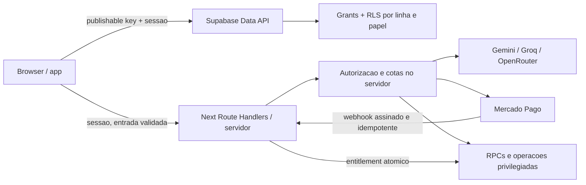

# Roadmap de consolidacao de rotas e seguranca das integracoes

> Status: proposta para implementacao futura
> Data do levantamento: 2026-07-12
> Escopo: rotas, autenticacao/autorizacao, Supabase, IA, pagamentos e APIs externas
> Regra deste documento: evidencias confirmadas sao separadas de riscos que ainda dependem de verificacao no ambiente de producao.

## 1. Resumo executivo

O BibliaLM ja possui um conjunto amplo de funcionalidades reais, mas cresceu por geracoes paralelas de paginas e por integracoes executadas diretamente no navegador. Antes de uma operacao comercial madura, duas frentes precisam ser consolidadas:

1. uma URL canonica por recurso, com aliases antigos redirecionados e contratos de acesso consistentes;
2. uma fronteira segura de servidor para segredos, pagamentos, IA, concessao de plano/creditos e operacoes administrativas.

A ordem recomendada nao e comecar pelos redirects. Primeiro devem ser contidos os segredos versionados e fechadas as mutacoes privilegiadas. Em seguida, pagamentos, IA e autorizacao devem migrar para uma fronteira de servidor. Somente depois disso as rotas podem ser consolidadas sem preservar comportamentos de acesso inseguros ou divergentes.

### Prioridades

| Prioridade | Objetivo | Bloqueia operacao comercial? |
| --- | --- | --- |
| P0 | Rotacionar credenciais expostas e impedir elevacao de plano/creditos pelo cliente | Sim |
| P1 | Colocar pagamentos, IA, admin e entitlements atras do servidor; auditar RLS | Sim |
| P2 | Consolidar rotas publicas e autenticadas com redirects permanentes | Parcialmente |
| P3 | Hardening de proxies, rate limit, logs, headers, observabilidade e limpeza documental | Nao, mas reduz risco operacional |

## 2. Limites do levantamento

- O repositorio foi analisado sem executar alteracoes no Supabase, Mercado Pago, provedores de IA ou Firebase.
- O estado real das policies, grants, funcoes e chaves no projeto Supabase remoto nao esta versionado integralmente no repositorio. Qualquer conclusao sobre o banco de producao precisa ser confirmada por export/diff e testes com papeis reais.
- A chave publishable/anon do Supabase e esperada no cliente. Ela nao deve ser tratada como segredo. A seguranca depende de grants minimos, RLS e funcoes corretamente autorizadas.
- Nao foram reproduzidos neste documento valores de tokens, senhas ou chaves encontrados no codigo.
- Rotacionar credenciais e reescrever historico Git sao acoes operacionais separadas. Apagar o valor do arquivo sem rotacao nao encerra a exposicao.

## 3. Estado-alvo



Regras do estado-alvo:

- nenhum segredo de provedor usa prefixo `NEXT_PUBLIC_`;
- o navegador nunca envia um access token privado para Mercado Pago, Gemini, Groq ou OpenRouter;
- preco, quantidade de creditos, plano e entitlement sao calculados no servidor a partir de IDs confiaveis;
- o cliente nao pode atualizar `subscription_tier`, `subscription_status`, `credits`, `profile_type`, XP ou campos administrativos;
- toda geracao de IA passa por autenticacao, capability, cota, rate limit, timeout, retry controlado e registro de custo no servidor;
- toda rota funcional tem uma unica URL canonica; aliases existem apenas como redirects de compatibilidade;
- autorizacao de dados e feita no servidor/RLS, nunca por redirect ou componente visual.

## 4. Mapa de rotas duplicadas e divergentes

### 4.1 Duplicatas confirmadas

| Dominio | Rota canonica proposta | Alias ou duplicata atual | Evidencia | Acao futura | Prioridade |
| --- | --- | --- | --- | --- | --- |
| Home | `/` | `/inicio03` | Ambas renderizam `Inicio03` em `app/page.tsx:6` e `app/inicio03/page.tsx:2` | Redirect permanente de `/inicio03` para `/`; remover o wrapper depois da janela de compatibilidade | P2 |
| Biblia | `/biblia` | `/bibliasagrada` | Ambas renderizam `ReaderPage`; links internos estao divididos entre as duas URLs | Padronizar links, estado do leitor e analytics em `/biblia`; redirect 308 preservando query | P1 |
| Biblioteca pessoal | `/estudos` | `/workspace` | Ambas renderizam `WorkspacePage` sob `ProtectedRoute` | Atualizar links; redirect permanente de `/workspace` | P2 |
| Jornada publica | `/jornada/[planId]` | `/plano/[planId]` | Ambas renderizam `PublicPlanPage`; o teste `legacyPlanRoute.test.ts` identifica `/plano/:id` como legado | Manter `/plano` para meta de leitura, mas redirecionar somente o segmento dinamico legado para `/jornada/:id` | P1 |
| Mapa | `/mapa-vivo` | `/mapa-do-app`, `/navegar` | As tres renderizam `LiveMapPage` | Atualizar links e redirecionar aliases | P2 |
| Igreja publica | `/igreja/[churchSlug]` | `/social/igreja/[churchSlug]` | Ambas renderizam `ChurchProfilePage`; links filhos variam pelo prefixo | Unificar links e canonical SEO na rota curta; redirect permanente da arvore social | P1 |
| Gestao/solicitacao da igreja | Decisao pendente | `/igreja/[slug]/gerir`, `/social/igreja/[slug]/gerir`, `/social/igreja/gerir` | As tres usam `ChurchContractPage`, mas o nome `gerir` conflita com `/gestao-igreja` | Renomear conforme intencao real, por exemplo solicitacao/cadastro, antes de criar redirects | P2 |
| Perfil publico | `/u/[username]` | `/[username]`, `/social/u/[username]` | As tres renderizam `PublicUserProfilePage`; `/social/u` exige login, as demais nao | Tornar `/u/:username` publica conforme privacidade; redirecionar aliases e remover o catch-all raiz | P1 |
| Conta pessoal | `/minha-conta` | `/perfil`; auditar `/social/profile` | `/perfil` e `/minha-conta` usam a view publica; `/social/profile` usa outra view | Separar conta privada de perfil publico, exigir sessao e escolher uma implementacao | P1 |
| Lista de igrejas | `/social/igrejas` | `/social/church` | Ja existe redirect, mas nao permanente | Trocar por redirect permanente e remover referencias residuais | P3 |

### 4.2 Rotas com comportamento divergente

Estas rotas nao devem receber redirects automaticos antes de uma decisao funcional:

| Familia | Divergencia confirmada | Decisao necessaria |
| --- | --- | --- |
| `/grupo/[cellSlug]` e `/social/grupo/[cellSlug]` | A rota curta usa `ProtectedRoute`; a social nao. A propria view possui regras para grupos publicos e privados | Definir se grupos publicos aceitam visitante e privados exigem login/convite. Depois, centralizar a regra e escolher `/grupo/:slug` como URL curta |
| `/perfil`, `/minha-conta`, `/social/profile` | Guardas e componentes diferentes para o mesmo dominio de identidade | Separar configuracoes privadas, visualizacao do proprio perfil e perfil publico |
| `/estudio-criativo` e `/?tab=criar` | A rota semantica redireciona para uma aba da home | Decidir se o Estudio e modulo com deep link proprio ou apenas uma aba; manter somente um contrato publico |
| `/estudo/modulo/[moduleId]` | Redireciona silenciosamente para a home | Usar destino substituto que preserve contexto, ou responder 404/410; nao mascarar conteudo removido |

### 4.3 Versoes paralelas, nao aliases

`/criar-conteudo`, `/criar-conteudo-v2` e `/criar-conteudo-v3` usam implementacoes diferentes. `/intro` e `/intro-v2` tambem usam landings diferentes. Nao devem ser redirecionadas apenas por semelhanca de nome.

Acao recomendada:

1. criar uma matriz de paridade funcional e de persistencia;
2. escolher a versao candidata a producao;
3. colocar versoes experimentais atras de feature flag e fora do sitemap/navegacao;
4. migrar dados e deep links;
5. remover as versoes antigas somente apos teste de regressao.

### 4.4 Inconsistencias estruturais relacionadas

- `components/Layout.tsx:186` e `components/Layout.tsx:198` ainda publicam `/social/ferramentas` e `/pulpito`, enquanto `middleware.ts:3-11` responde 404 para essas rotas.
- `generate-routes.cjs` ainda conhece aliases e rotas removidas e grava diretamente em `app/**/page.tsx`. Deve ser arquivado ou reescrito para nao sobrescrever a arvore atual.
- A lista de slugs removidos esta duplicada entre `middleware.ts` e `app/[username]/page.tsx`.
- O catch-all `/[username]` ocupa o namespace raiz e pode transformar URLs desconhecidas em uma tela de perfil inexistente, em vez de 404.
- `scripts/lib/routeCatalog.mjs` usa heuristica de prefixo para acesso e ja diverge dos wrappers reais.
- `components/SEO.tsx` deriva canonical da URL atual. Sem redirect, paginas duplicadas podem declarar a si mesmas como canonicas.
- `public/sitemap.xml` inclui `/dashboard`, que nao existe, e nao representa o conjunto atual de rotas publicas.
- `services/paymentService.ts:64` envia o retorno da assinatura para `/dashboard`, tambem inexistente.

### 4.5 Registro central proposto

Criar uma unica fonte de verdade, por exemplo `utils/appRoutes.ts`, com:

```ts
type RouteDefinition = {
  canonical: string;
  aliases?: string[];
  access: 'public' | 'authenticated' | 'church-role' | 'admin';
  status: 'active' | 'preview' | 'deprecated' | 'removed';
  replacement?: string;
  sitemap?: boolean;
};
```

Esse registro deve alimentar:

- navegacao desktop e mobile;
- redirects e lista de rotas removidas;
- mapa do app;
- sitemap e canonical;
- catalogo de rotas e testes;
- validacao de links internos.

O registro organiza URLs, mas nao substitui RLS nem autorizacao no servidor.

## 5. Mapa de seguranca das integracoes

### Legenda

- **Confirmado:** o risco pode ser demonstrado no repositorio.
- **Pendente de verificacao:** a superficie existe, mas o impacto depende do estado remoto, grants, RLS ou configuracao do provedor.

| ID | Severidade | Estado | Achado | Evidencia principal | Correcao futura |
| --- | --- | --- | --- | --- | --- |
| SEC-01 | Critica | Confirmado | Ha uma credencial privada do Mercado Pago versionada e uma connection string de banco com senha como fallback em script rastreado | `constants.ts:305`; `scripts/execute_cover_migration.cjs:5` | Revogar/rotacionar primeiro; remover valores do codigo; usar Secret Manager/variaveis somente no servidor; fazer varredura do historico Git e decidir limpeza coordenada |
| SEC-02 | Critica | Confirmado | Chaves de Gemini, Groq, OpenRouter e outros provedores sao configuradas como `NEXT_PUBLIC_*` e usadas no navegador | `apphosting.yaml:13-20`; `services/aiConfig.ts:10`; `services/geminiService.ts:62,89` | Criar endpoints de IA no servidor; renomear secrets sem `NEXT_PUBLIC_`; rotacionar chaves; aplicar restricoes por API/projeto |
| SEC-03 | Critica | Confirmado no codigo; banco remoto pendente | O cliente monta updates para `credits`, XP, `subscription_tier`, `profile_type`, status e uso. O contexto tambem oferece `upgradeSubscription` e `buyCredits` no cliente | `services/supabase.ts:409-437`; `contexts/AuthContext.tsx:494-520` | Separar `profiles` de `entitlements`; proibir updates de colunas privilegiadas; conceder plano/credito apenas por webhook/RPC transacional autorizada |
| SEC-04 | Critica | Confirmado | A compra de creditos e concluida no cliente depois de polling e chama `buyCredits`; preco e quantidade nascem no cliente | `components/BuyCreditsModal.tsx:63-106` | Criar pedido no servidor por `packageId`; verificar pagamento no servidor; webhook assinado e idempotente; creditar via transacao unica |
| SEC-05 | Alta | Confirmado | `paymentService` envia token privado no browser para `/api/mp`, mas o proxy existe apenas em `server.js`; `npm start` executa `next start`; nao ha `app/api/mp` | `services/paymentService.ts:11-105`; `server.js:54-82`; `package.json` | Substituir por Route Handlers reais e restritos; nunca aceitar Authorization do cliente; remover proxy generico e `server.js` legado |
| SEC-06 | Alta | Confirmado | O webhook legado apenas registra o body e responde 200, sem assinatura, idempotencia ou processamento confiavel | `server.js:42-49` | Implementar endpoint HTTPS no runtime ativo; validar assinatura; buscar estado no provedor; persistir event ID; processar retries sem duplicar entitlement |
| SEC-07 | Alta | Confirmado no repositorio; producao pendente | Nao existe `supabase/migrations`; schema/RLS estao espalhados por scripts. O estado aplicado nao e reproduzivel | ausencia de `supabase/migrations`; varios `scripts/*.sql` | Importar/diffar o schema remoto; criar baseline e migrations versionadas; validar grants, RLS, views, Storage e funcoes por papel |
| SEC-08 | Alta | Pendente de verificacao | Existem funcoes `SECURITY DEFINER` no schema `public`; algumas nao declaram `search_path` e o repositorio nao demonstra revogacao sistematica de `EXECUTE` de `PUBLIC` | `scripts/create_culto_plus.sql:268-308`; `scripts/create_mana_gamification.sql:111-114`; demais scripts SQL | Inventariar funcoes; `REVOKE EXECUTE FROM PUBLIC`; grants explicitos; `search_path` seguro; checagem `auth.uid()`; mover helpers privilegiados para schema nao exposto quando possivel |
| SEC-09 | Alta | Confirmado | Capability e contadores de IA sao avaliados/incrementados no cliente e nao formam uma barreira contra uso direto dos provedores | `contexts/AuthContext.tsx:400-430`; `services/geminiService.ts` | Aplicar capability, cota diaria, rate limit e custo no endpoint servidor antes de cada chamada; cliente apenas exibe o resultado |
| SEC-10 | Alta | Confirmado no cliente; RLS pendente | O painel admin decide acesso por tier, username ou e-mail no cliente e usa o mesmo `dbService` do navegador | `app/admin/page.tsx`; `views/AdminPage.tsx:153`; `services/supabase.ts:639-644` | Manter guard visual, mas exigir papel imutavel no servidor/RLS para cada operacao; remover identificadores pessoais hardcoded |
| SEC-11 | Alta | Confirmado | O proxy de imagens valida hostname com `endsWith` e segue redirects sem revalidar o destino; tambem nao limita tamanho ou timeout | `app/api/image-proxy/route.ts:16-53` | Usar host exato ou subdominio com fronteira; validar cada redirect; bloquear IP privado; limitar bytes, tipo e tempo; preferir `next/image` quando possivel |
| SEC-12 | Media | Confirmado | Busca de igrejas e proxy de imagem sao publicos e nao possuem rate limit; podem consumir cota de provedores ou banda | `app/api/churches/search/route.ts:119-140`; `app/api/image-proxy/route.ts` | Limitar tamanho/formato de entrada; cache; rate limit por IP/usuario; budget por provedor; metricas e circuit breaker |
| SEC-13 | Media | Confirmado | A busca de igrejas aceita fallback `NEXT_PUBLIC_GOOGLE_MAPS_API_KEY`, enfraquecendo a separacao de segredo | `app/api/churches/search/route.ts:16-21` | Aceitar apenas chave privada do servidor; restringir a Google Places API e ao ambiente de producao |
| SEC-14 | Media | Confirmado | Ha telemetria temporaria para `127.0.0.1` dentro de `services/supabase.ts`, incluindo identificadores e dados de curtidas | `services/supabase.ts:1647-1667` | Remover o codigo de diagnostico; usar logger central com redacao e nivel por ambiente |
| SEC-15 | Media | Confirmado | O build ignora erros TypeScript, reduzindo a garantia da fronteira cliente/servidor e de contratos de auth | `next.config.ts:8-11` | Fazer `typecheck` bloqueante no CI e remover `ignoreBuildErrors` depois de zerar o backlog |
| SEC-16 | Informativa | Confirmado | Supabase usa URL e chave publishable/anon no navegador, sem `service_role` no runtime do app | `services/supabase.ts:28-29,67` | Manter publishable no cliente; migrar o nome para `NEXT_PUBLIC_SUPABASE_PUBLISHABLE_KEY`; nunca introduzir secret/service role no browser |
| SEC-17 | Critica | Confirmado no schema local; producao pendente | A policy de `profiles` permite leitura publica da linha inteira, que inclui e-mail, telefone, CPF, atividade, uso e dados de igreja | `scripts/apply_schema.cjs:12-44,462-475`; `services/supabase.ts:561-612` | Tornar a tabela base privada; expor somente uma view/RPC de perfil publico com projecao minima e `is_profile_public`; dono le o perfil privado completo |
| SEC-18 | Critica | Confirmado | Conteudo de IA/UGC e renderizado com `dangerouslySetInnerHTML` sem camada de sanitizacao identificada; a sessao Supabase persiste no navegador | `components/NotebookAnalysis.tsx:412-415`; `components/ObreiroIAChatbot.tsx:193-196`; `views/public/PublicStudyPage.tsx:121-124`; `components/Builder/blocks/StudyContentBlock.tsx:33-36` | Preferir formato estruturado; sanitizar por allowlist no write e no render; CSP, `nosniff` e testes de XSS armazenado/refletido |
| SEC-19 | Alta | Confirmado no schema local; producao pendente | A policy base permite SELECT de todos os posts, enquanto visibilidade privada/seguidores/igreja/grupo e filtrada no JavaScript | `scripts/apply_schema.cjs:487-490`; `services/supabase.ts:1542-1550`; `utils/kingdomFeedRules.ts` | Implementar a visibilidade na policy/RPC, incluindo dono, follows, membership e grupo; o filtro cliente fica apenas como UX |
| SEC-20 | Critica | Confirmado no schema local; producao pendente | Pedido de papel aceita INSERT do proprio usuario sem forcar `status='pending'`; a autorizacao confia em pedidos aprovados. Igreja/membership tambem aceitam campos sensiveis definidos pelo cliente | `scripts/create_churches.sql:225-236,318-342,409-413`; `scripts/create_church_management.sql:69-111` | RPCs devem construir campos server-owned; pedido sempre nasce pending; membership sempre nasce member; aprovacao/papel apenas por ator autorizado e transacao |
| SEC-21 | Alta | Confirmado no schema local; producao pendente | QR Forms ativos sao todos legiveis, nao apenas o token solicitado; submissao publica pode escolher campos internos; contador `SECURITY DEFINER` nao demonstra revoke/grant minimo | `scripts/create_church_management.sql:215-266,583-606` | Lookup RPC por hash/token com projecao minima; RPC de submissao define status/prioridade/campos internos; CAPTCHA/rate limit; contador por trigger ou grant restrito |
| SEC-22 | Alta | Confirmado | `.env.example` contem uma chave Google nao-placeholder; a API de busca de igrejas e aberta e pode consumir cota | `.env.example:17`; `app/api/churches/search/route.ts:16-21,119-140` | Rotacionar e remover do historico; manter secret server-only com restricao de API/ambiente; rate limit, cache e budget |
| SEC-23 | Media/Alta | Confirmado no repositorio; producao pendente | O script configura bucket `uploads` publico, mas nao ha migration canonica de policies de `storage.objects`; uploads usam caminhos amplos e `upsert` | `scripts/setup_storage.mjs:34-46`; `services/supabase.ts:231-235` | Separar buckets publico/privado; policy por bucket, pasta e `auth.uid()`/owner; MIME/tamanho; signed URLs para privado; testar INSERT/SELECT/UPDATE de upsert |
| SEC-24 | Media | Confirmado no schema local; producao pendente | Funcao de convite `SECURITY DEFINER` valida autenticacao, mas nao demonstra ownership/RBAC do conteudo convidado | `scripts/create_content_privacy.sql:52-137` | Validar ownership/papel por tipo e ID; restringir execute; adicionar expiracao/integridade e testes entre usuarios |
| SEC-25 | Media | Confirmado no schema local; producao pendente | `image_bank` permite INSERT autenticado com `WITH CHECK (true)`, embora possua `user_id` | `scripts/setup_image_bank.sql:19-28` | Forcar `user_id = auth.uid()`, validar URL/tipo, limitar quota e impedir spoof de autoria |
| SEC-26 | Media | Confirmado | Os validadores atuais verificam principalmente existencia/nome de policies e SELECT; ha um arquivo SQL com caractere invalido no final | `scripts/validate_church_management_rls.mjs:58-82`; `scripts/test_church_management_rls_profiles.mjs:55-80`; `scripts/church_role_requests_admin_policies.sql` | Testar expressoes e writes maliciosos, validar SQL em CI e interromper deploy se migration/teste adversarial falhar |

## 6. Plano de execucao

### Fase 0 - Contencao imediata

Objetivo: reduzir o risco atual sem ampliar refatoracao.

- [ ] Revogar e rotacionar a credencial do Mercado Pago encontrada no repositorio.
- [ ] Rotacionar a senha/connection string de banco encontrada no script rastreado.
- [ ] Rotacionar chaves de IA publicadas no bundle e restringi-las por API/projeto durante a transicao.
- [ ] Rotacionar a chave Google encontrada em `.env.example` e restringir a nova chave ao uso server-side necessario.
- [ ] Remover os valores hardcoded de `constants.ts` e `scripts/execute_cover_migration.cjs`.
- [ ] Desabilitar por feature flag checkout e compra de creditos ate o fluxo servidor estar pronto.
- [ ] Remover a telemetria temporaria de `services/supabase.ts:1647-1667`.
- [ ] Procurar os segredos no historico Git e nos artefatos de deploy. Se houver repositorio remoto, coordenar a limpeza de historico sem executar rewrite destrutivo de forma isolada.
- [ ] Registrar data, responsavel e evidencias de cada rotacao sem registrar o valor novo.

Saida da fase:

- tokens antigos recusam chamadas;
- nenhum segredo privado conhecido permanece em arquivos rastreados ou bundle novo;
- pagamentos/client credits ficam indisponiveis ou claramente em manutencao ate a Fase 1.

### Fase 1 - Pagamentos e entitlements no servidor

Objetivo: fazer o provedor, e nao o navegador, ser a fonte de verdade financeira.

1. Criar Route Handlers no App Router, por exemplo:
   - `POST /api/payments/pix`
   - `POST /api/payments/subscriptions`
   - `GET /api/payments/[id]`
   - `POST /api/webhooks/mercado-pago`
2. Marcar modulos de secrets com `server-only`.
3. Receber `packageId` ou `planId`, nunca preco, creditos ou tier livres do cliente.
4. Carregar catalogo e preco no servidor.
5. Validar sessao Supabase no servidor e vincular o pedido ao `user_id` autenticado.
6. Enviar idempotency key ao criar o pagamento.
7. Validar assinatura do webhook e consultar o objeto no Mercado Pago antes de conceder beneficio.
8. Persistir evento/pagamento com chave unica e processar retries de forma idempotente.
9. Conceder creditos/plano em funcao transacional que nao aceite valores arbitrarios do cliente.
10. Remover `server.js`, `DONATION_CONFIG.mercadoPagoAccessToken`, `upgradeSubscription` e `buyCredits` como mutacoes client-side.
11. Corrigir o retorno inexistente `/dashboard` para uma rota real que apenas exiba o estado confirmado pelo servidor.

### Fase 2 - IA no servidor e controle de custo

Objetivo: proteger chaves e tornar quotas efetivas.

1. Criar uma fachada de servidor unica para Gemini, Groq e OpenRouter.
2. Manter `pastorAgent` como contrato de dominio, mas mover chamadas e secrets para codigo server-only.
3. Antes de chamar o provedor, validar:
   - sessao ou limite anonimo explicitamente definido;
   - capability do plano;
   - uso diario e cooldown;
   - tamanho do prompt e anexos;
   - rate limit por usuario/IP;
   - budget/circuit breaker do provedor.
4. Registrar provider, modelo, latencia, tokens/custo estimado, status e correlacao, sem armazenar texto pastoral sensivel por padrao.
5. Implementar timeout, retry com backoff apenas para erros transitorios e fallback controlado.
6. Rotacionar definitivamente as chaves antigas e remover variaveis `NEXT_PUBLIC_*` de README, `.env.example` e `apphosting.yaml`.
7. Testar que o bundle do navegador nao contem chaves nem headers `Authorization` de provedores.

### Fase 3 - Baseline Supabase, RLS e privilegios

Objetivo: tornar o banco remoto reproduzivel e provar autorizacao por papel.

1. Exportar/diffar schema, grants, policies, views, funcoes e Storage do projeto remoto.
2. Criar baseline em `supabase/migrations` usando o fluxo oficial da CLI; nao inventar migration names manualmente.
3. Revisar cada objeto exposto no Data API:
   - grants minimos para `anon` e `authenticated`;
   - RLS habilitada;
   - `USING` e `WITH CHECK` coerentes;
   - sem autorizacao baseada em `user_metadata`;
   - views com `security_invoker` ou fora do schema exposto;
   - funcoes privilegiadas com execute restrito.
4. Separar campos editaveis pelo membro de campos controlados pelo sistema. Opcao recomendada:
   - `profiles`: identidade e preferencias editaveis;
   - `user_entitlements`: tier, status, expiracao e capabilities;
   - `user_balances`/ledger: creditos e eventos financeiros;
   - `mana_events`: XP auditavel e idempotente.
5. Substituir updates genericos de perfil por DTOs/servicos com allowlist de campos.
6. Mover alteracao de tier, papel, credito, XP e configuracoes globais para RPC/servidor com verificacao explicita.
7. Expor perfil publico por view/RPC com colunas minimas; manter e-mail, telefone, CPF, atividade, uso e dados internos fora do SELECT anonimo.
8. Implementar visibilidade do Feed nas policies/RPCs, nao somente em `kingdomFeedRules.ts`.
9. Forcar pedidos de papel, criacao de igreja, memberships, QR submissions e convites a nascerem com campos server-owned.
10. Separar buckets publicos e privados e versionar policies de `storage.objects` por owner/pasta.
11. Rodar testes com `anon`, usuario A, usuario B, membro, lider, pastor, gestor e admin.
12. Rodar advisors de seguranca e performance e registrar as excecoes aceitas.

Bloqueador: se o banco remoto nao puder ser exportado, a fase deve parar como "estado de producao nao comprovado". Scripts locais nao devem ser presumidos como aplicados.

### Fase 4 - Consolidacao de rotas

Objetivo: uma URL canonica por recurso sem quebrar links compartilhados.

1. Criar o registro central de rotas e testes de consistencia.
2. Corrigir primeiro os contratos de acesso de grupo, perfil e conta.
3. Padronizar todos os links internos para as canonicas propostas.
4. Implementar redirects permanentes no servidor, preservando query string.
5. Adicionar canonical explicita e regenerar sitemap.
6. Remover aliases dos componentes e do gerador legado somente apos uma janela de compatibilidade.
7. Manter telemetria temporaria de hits nos aliases, sem PII, para decidir quando remove-los.
8. Responder 404/410 para rotas removidas sem substituto; nao redirecionar tudo para a home.

Ordem dos lotes:

- Lote A: `/biblia`, `/jornada`, `/u`, `/igreja`.
- Lote B: grupos, conta/perfil e Estudio Criativo apos decisao funcional.
- Lote C: `/estudos`, `/mapa-vivo`, `/` e aliases de baixa criticidade.
- Lote D: retirar V1/V2/V3 e landings antigas apos paridade e migracao.

### Fase 5 - Hardening de APIs, deploy e observabilidade

- [ ] Corrigir o proxy de imagens contra SSRF, redirect externo, payload grande e content-type inesperado.
- [ ] Adicionar rate limit e validacao de entrada nas APIs publicas.
- [ ] Centralizar dominios publicos (`biblialm.com.br`) e URLs de callback por ambiente.
- [ ] Adicionar CSP, `frame-ancestors`, `Referrer-Policy`, `Permissions-Policy` e headers adequados ao produto.
- [ ] Redigir tokens, e-mails, payloads financeiros e conteudo pastoral nos logs.
- [ ] Substituir HTML livre de IA/UGC por schema estruturado quando possivel; sanitizar os casos restantes e adicionar CSP/testes de XSS.
- [ ] Criar alertas para falha de webhook, aumento de custo de IA, erro de RLS e abuso de API.
- [ ] Tornar `npm run typecheck`, testes e build bloqueantes no CI.
- [ ] Planejar runtime Node suportado pelo Firebase App Hosting e dependencias; o projeto ainda declara Node 20.
- [ ] Atualizar README, DEPLOYMENT e `_ARCHITECT_AGENT.md` para refletirem a fronteira server-side real.

## 7. Testes obrigatorios

### Rotas

- cada alias retorna 307/308 para a canonical esperada;
- query string e parametros dinamicos sao preservados;
- nenhuma navegacao interna gera URL legada;
- perfil/grupo publico e privado obedecem ao mesmo contrato em desktop e mobile;
- sitemap contem apenas rotas publicas ativas e nao inclui `/dashboard`;
- URLs desconhecidas respondem 404 real;
- o catalogo de rotas deriva acesso do registro central, nao de prefixos heurísticos.

### Segredos e bundle

- varredura do repositorio nao encontra padroes de access token, senha de banco ou provider secret;
- bundle do cliente nao contem chaves Gemini, Groq, OpenRouter, Google Places privada ou Mercado Pago;
- modulos server-only falham o build quando importados por Client Components;
- logs e respostas de erro nao retornam credenciais nem payloads sensiveis.

### Pagamentos

- cliente nao consegue escolher preco, tier ou quantidade de creditos;
- webhook com assinatura invalida recebe 401/403;
- evento repetido nao duplica creditos ou assinatura;
- pagamento pendente/rejeitado nao concede beneficio;
- retorno do navegador sem webhook confirmado nao altera entitlement;
- conciliacao encontra e corrige eventos perdidos sem duplicacao.

### Supabase/RLS

- usuario A nao le nem altera dados privados do usuario B;
- visitante nao enumera e-mail, telefone, CPF, activity log, uso ou dados internos por perfil publico;
- membro nao altera tier, role, credits, XP ou settings globais;
- membro nao cria pedido ja aprovado, igreja verificada, membership privilegiada ou admin arbitrario;
- visitante/outsider nao le post privado, de seguidores, igreja ou grupo sem o vinculo exigido;
- submissao QR publica nao define status, prioridade, sensibilidade, resumo interno ou responsavel;
- pastor/gestor atua somente na igreja e escopo autorizados;
- admin visual sem claim/papel servidor nao executa operacao privilegiada;
- funcoes `SECURITY DEFINER` nao sao executaveis por `PUBLIC` sem necessidade;
- updates possuem policy de select, `USING` e `WITH CHECK` quando aplicavel;
- Storage testa insert, select, update/upsert e delete por bucket/pasta.

### IA e APIs externas

- chamada sem sessao/capability/cota e recusada antes do provedor;
- retries nao multiplicam cobranca em erro nao transitorio;
- rate limit funciona por usuario e IP;
- proxy rejeita hosts parecidos, redirects para host nao permitido, IP privado, MIME inesperado e arquivo acima do limite;
- payloads HTML com `script`, event handlers, `javascript:` e SVG ativo nao executam em chat, estudo, notebook ou builder;
- falha de um provedor aciona fallback permitido sem expor detalhes internos.

## 8. Criterios de aceite

O roadmap pode ser considerado concluido quando:

- [ ] todas as credenciais expostas foram rotacionadas e removidas do codigo/bundle;
- [ ] pagamentos e IA operam somente por endpoints server-side autenticados;
- [ ] concessao de plano, credito e XP privilegiado nao pode ser feita por update do cliente;
- [ ] schema, grants e RLS de producao possuem baseline versionada e testes por papel;
- [ ] perfil publico e Feed nao expõem PII ou conteudo privado por acesso direto ao Data API;
- [ ] HTML de IA/UGC possui schema/sanitizacao e testes de XSS;
- [ ] cada familia de recurso tem uma URL canonica e aliases testados;
- [ ] rotas removidas nao continuam na navegacao;
- [ ] webhook e idempotencia financeira estao cobertos por testes;
- [ ] APIs publicas possuem validacao, rate limit e observabilidade;
- [ ] typecheck, testes e build sao bloqueantes;
- [ ] README, deploy e documentos de arquitetura descrevem o estado real.

## 9. Rollout e reversao

### Rollout

1. aplicar contencao e rotacao;
2. publicar endpoints server-side com feature flags;
3. validar pagamentos/IA em ambiente de teste;
4. aplicar migrations e testes RLS;
5. migrar o cliente para os novos endpoints;
6. ativar redirects de um lote por vez;
7. observar erros, aliases acessados, custos e webhooks;
8. remover codigo legado apenas apos estabilidade.

### Reversao

- manter feature flag para desligar pagamentos e IA sem novo deploy;
- migrations devem ter plano de forward fix; nao depender de rollback destrutivo de dados;
- redirects devem poder voltar temporariamente a 307 durante validacao;
- nunca reativar credencial comprometida como forma de rollback;
- entitlement financeiro confirmado nao deve ser apagado em rollback de interface.

## 10. Decisoes em aberto

1. Grupo publico pode ser visitado sem login? A resposta define o contrato de `/grupo/[slug]`.
2. `/minha-conta` concentrara configuracoes e `/u/[username]` apenas identidade publica?
3. O Estudio Criativo merece rota propria ou continuara como aba da home?
4. Qual versao do criador de conteudo possui paridade suficiente para se tornar canonica?
5. Pagamentos e IA ficarao em Next Route Handlers, Supabase Edge Functions ou uma divisao explicita entre ambos?
6. Qual e o estado real das policies/grants do Supabase remoto e quais scripts locais foram aplicados?
7. O historico Git e publico ou foi distribuido a terceiros? Isso define o alcance da resposta a incidentes.

## 11. Arquivos inicialmente impactados

Rotas e navegacao:

- `app/**/page.tsx`
- `components/Layout.tsx`
- `components/Sidebar/Sidebar.tsx`
- `components/MobileBottomNav.tsx`
- `utils/router.tsx`
- `scripts/lib/routeCatalog.mjs`
- `generate-routes.cjs`
- `middleware.ts`
- `components/SEO.tsx`
- `public/sitemap.xml`

Seguranca e integracoes:

- `constants.ts`
- `.env.example`
- `apphosting.yaml`
- `services/aiConfig.ts`
- `services/geminiService.ts`
- `services/paymentService.ts`
- `services/supabase.ts`
- `contexts/AuthContext.tsx`
- `components/BuyCreditsModal.tsx`
- `components/NotebookAnalysis.tsx`
- `components/ObreiroIAChatbot.tsx`
- `components/Builder/blocks/StudyContentBlock.tsx`
- `views/SubscriptionPage.tsx`
- `views/AdminPage.tsx`
- `views/public/PublicStudyPage.tsx`
- `app/api/image-proxy/route.ts`
- `app/api/churches/search/route.ts`
- `server.js`
- `scripts/*.sql`
- `scripts/setup_storage.mjs`
- futuro `supabase/migrations/**`

## 12. Referencias tecnicas atuais

- [Next.js - Environment Variables](https://nextjs.org/docs/pages/guides/environment-variables): variaveis `NEXT_PUBLIC_` sao incorporadas ao bundle do navegador.
- [Next.js - Data Security](https://nextjs.org/docs/app/guides/data-security): separacao server-only e protecao de dados no App Router.
- [Supabase - Securing your API](https://supabase.com/docs/guides/api/securing-your-api): grants e RLS sao camadas complementares.
- [Supabase - Product Security](https://supabase.com/docs/guides/security/product-security): indice oficial de hardening para Auth, Database, Storage e Realtime.
- [Supabase - Storage Access Control](https://supabase.com/docs/guides/storage/security/access-control): policies necessarias para upload, leitura e upsert.
- [Supabase - Migrating to publishable and secret keys](https://supabase.com/docs/guides/getting-started/migrating-to-new-api-keys): publishable no cliente; secret apenas no backend.
- [Mercado Pago - API Authentication](https://www.mercadopago.com.br/developers/pt/reference): access token privado nao deve ser usado no cliente.
- [Mercado Pago - Webhooks](https://www.mercadopago.com.br/developers/en/docs/linx/additional-content/your-integrations/notifications/webhooks): assinatura, ambiente de teste e notificacoes.
- [Google Cloud - API key best practices](https://docs.cloud.google.com/docs/authentication/api-keys-best-practices): restricao, rotacao e proibicao de chave em cliente/repositorio.
- [OWASP - SSRF Prevention Cheat Sheet](https://cheatsheetseries.owasp.org/cheatsheets/Server_Side_Request_Forgery_Prevention_Cheat_Sheet.html): allowlist, DNS/IP e redirects em proxies server-side.

## 13. Proxima acao recomendada

Abrir uma entrega exclusiva de P0, sem misturar consolidacao visual ou novas funcionalidades. Essa entrega deve conter apenas rotacao, remocao de segredos hardcoded, desativacao temporaria do checkout inseguro, retirada da telemetria local e testes de ausencia de credenciais. A Fase 1 comeca somente depois que a contencao estiver comprovada.
