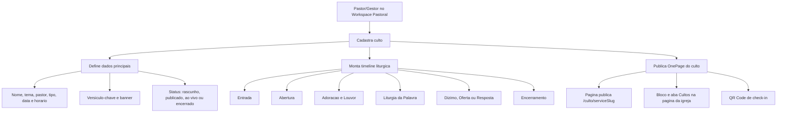
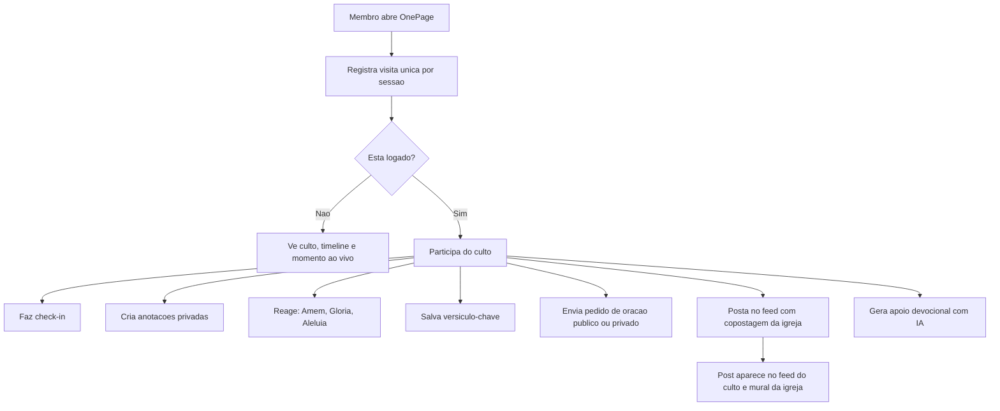
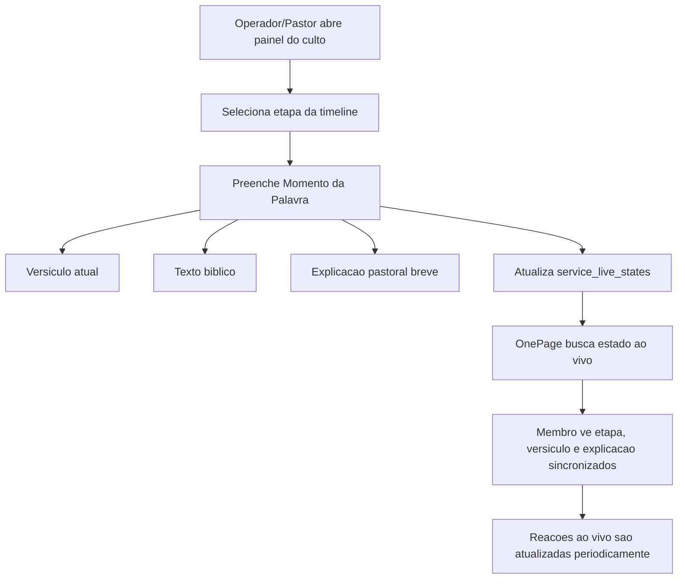
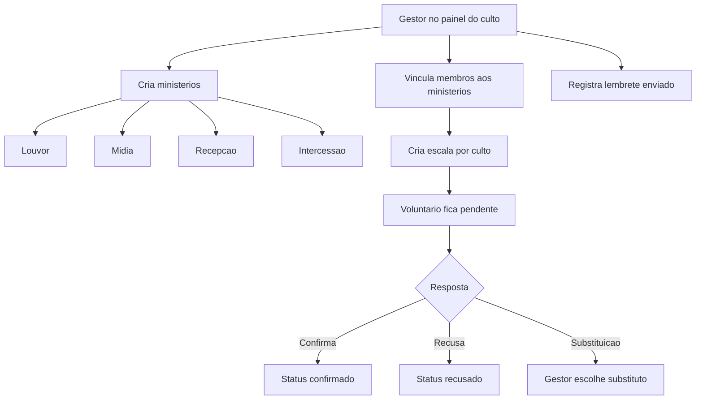
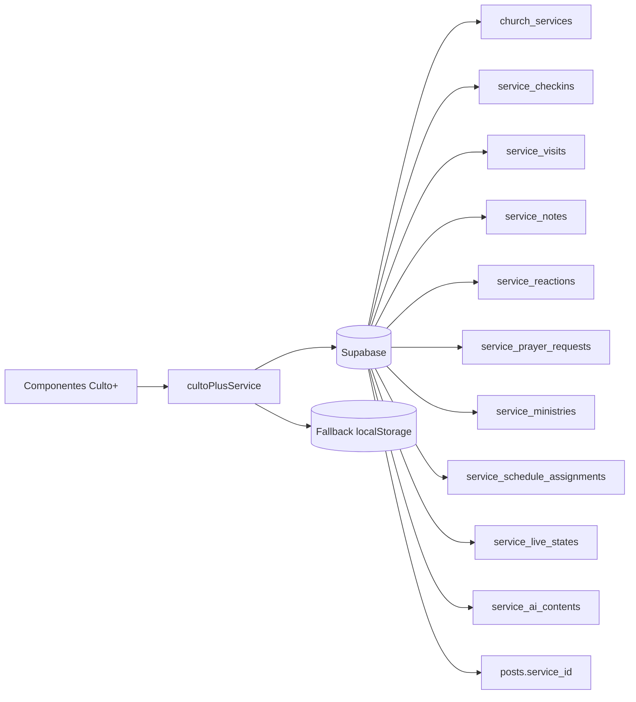
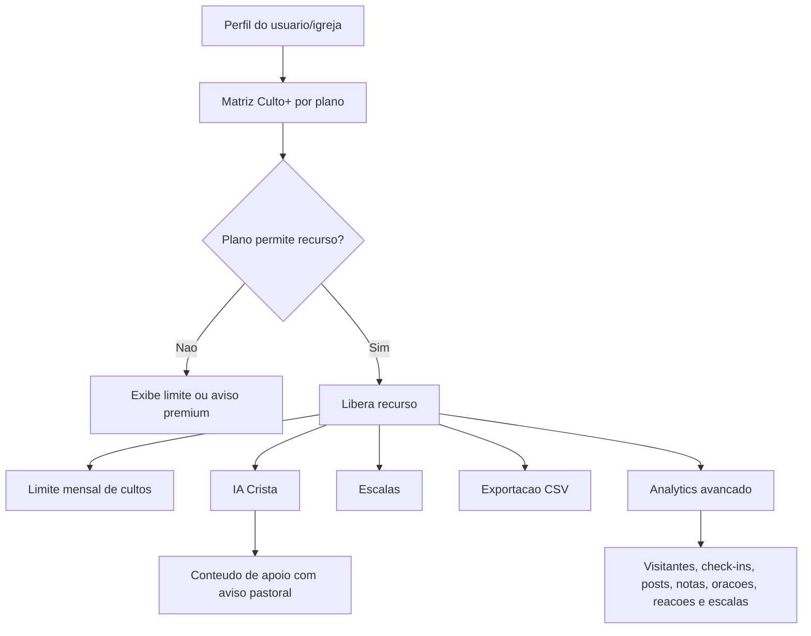

# Culto+ - Acompanhamento de Implementacao

## Visao

O Culto+ adiciona ao BibliaLM uma experiencia digital completa para o culto: o pastor ou gestor cria o culto, monta a timeline liturgica, publica uma OnePage e permite que membros facam check-in, anotem a mensagem e criem postagens vinculadas a igreja.

Objetivo do MVP: permitir que uma igreja crie um culto e que o membro participe digitalmente dele por uma pagina unica, com check-in, anotacoes e feed.

## Principios do Produto

- Integrar com o modulo de Igreja ja existente, sem criar uma area isolada.
- Reaproveitar Feed/Reino, perfil, mural de oracao e Workspace Pastoral.
- Manter gamificacao saudavel: incentivar constancia sem criar culpa ou vigilancia.
- Notas do usuario sao privadas por padrao.
- Dados sensiveis de presenca devem ser agregados em dashboards, evitando exposicao individual desnecessaria.
- Toda funcionalidade com IA deve passar por controle de acesso e cotas.

## Status Geral

Status atual: roadmap principal implementado no app.

Legenda:
- `[ ]` Pendente
- `[~]` Em andamento
- `[x]` Concluido
- `[!]` Bloqueado ou exige decisao

## Melhoria 2026-05-20 - Culto+ em Pagina Dedicada

Objetivo: deixar `/workspace-pastoral` mais leve e transformar o acompanhamento completo do Culto+ em uma pagina propria, preservando o MVP no plano gratuito do Supabase.

### Escopo

- [x] Substituir o painel completo do Culto+ em `/workspace-pastoral` por um resumo leve de cultos criados.
- [x] Criar CTA premium `Novo Culto+` com identidade visual propria, usando verde-jade/esmeralda e acento champagne para diferenciar das outras areas.
- [x] Criar pagina dedicada `/workspace-pastoral/cultos` para a gestao completa do Culto+.
- [x] Criar rota `/workspace-pastoral/cultos/novo` abrindo o gestor diretamente em modo de criacao.
- [x] Manter `/culto/[serviceSlug]` como pagina publica do culto.
- [x] Evitar consultas pesadas no dashboard pastoral: o preview busca apenas uma lista limitada de cultos e usa contadores cacheados.
- [x] Reutilizar o padrao do app para auto pesquisa de versiculo-chave, preenchendo o texto biblico automaticamente.
- [x] Aplicar visual premium aos CTAs do Culto+ e a previa do versiculo no formulario.
- [x] Adicionar painel `Planejamento IA` no Criar Culto+ para gerar titulo, tema e timeline a partir do versiculo-chave ou do versiculo do dia.
- [x] Categorizar momentos da timeline liturgica com campos especificos para louvor, Palavra, dizimos/ofertas, oracao, encerramento e outros momentos.
- [x] Aplicar identidade visual premium do Culto+ na rota publica `/culto` e na OnePage `/culto/[serviceSlug]`.

### Comportamento Esperado

- `/workspace-pastoral` mostra os cultos criados mais recentes, status, data, numero de etapas, check-ins e posts cacheados.
- O botao `Novo Culto+` leva para `/workspace-pastoral/cultos/novo`.
- O botao `Ver todos` leva para `/workspace-pastoral/cultos`.
- A acao `Acompanhar` leva para a pagina dedicada de gestao.
- A pagina dedicada continua concentrando formulario, edicao, painel, escalas, live state, analytics e exportacao.
- Ao informar uma referencia como `Joao 15:5`, o formulario busca o texto biblico e mostra uma previa refinada antes da publicacao.
- O botao `Abrir prompt` mostra um campo para o pastor orientar a IA; ao gerar, o Culto+ aplica a sugestao no formulario para revisao humana antes de publicar.
- A timeline permite selecionar o tipo do momento e abre campos contextuais: musicas no louvor, texto biblico na Palavra, mensagem/PIX em ofertas, mensagem de oracao e encerramento.
- Os textos gerados pela IA para a timeline devem ser conteudo final para membros na OnePage, nunca instrucoes internas para o pastor ou operador.

### Arquivos Impactados

- `components/workspace/WorkspaceOnePage.tsx`: remove o painel pesado do dashboard e exibe o preview leve.
- `components/culto-plus/CultoPlusWorkspacePreview.tsx`: novo resumo premium do Culto+ no Workspace Pastoral.
- `components/culto-plus/CultoPlusManager.tsx`: aceita modo inicial de criacao e titulos customizados para a pagina dedicada.
- `services/bibleService.ts`: padrao de busca biblica reutilizado pelo formulario do Culto+.
- `services/geminiService.ts`, `services/pastorAgent.ts` e `services/cultoPlusService.ts`: geracao estruturada do planejamento IA do Culto+.
- `types.ts`: campos opcionais para dados estruturados da timeline, preservados em JSONB.

### Categorias Futuras Recomendadas

- [ ] Santa Ceia: mesa, leitura, orientacao pastoral e responsaveis.
- [ ] Avisos da igreja: titulo, descricao curta e link/QR Code.
- [ ] Testemunhos: nome autorizado, resumo e moderacao.
- [ ] Apelo/Resposta: orientacao, equipe responsavel e proximo passo.
- [ ] Consagracao/Apresentacao: pessoa/familia, motivo e oracao.
- `views/CultoPlusWorkspacePage.tsx`: shell visual da pagina dedicada.
- `app/workspace-pastoral/cultos/page.tsx`: rota da gestao completa.
- `app/workspace-pastoral/cultos/novo/page.tsx`: rota de novo Culto+.

### Criterios de Aceite

- `/workspace-pastoral` nao renderiza o `CultoPlusManager` completo.
- O dashboard pastoral faz somente consulta leve de listagem para Culto+.
- O botao `Novo Culto+` fica visualmente premium e distinto de Planos, Jogos e Oracoes.
- `/workspace-pastoral/cultos` renderiza o gestor completo.
- `/workspace-pastoral/cultos/novo` abre o formulario de criacao.
- TypeScript passa sem novos erros.

## Fluxo das Mudancas Implementadas

Manual de uso: `docs/culto-plus-manual-utilizacao.md`

### Fluxo Geral do Culto+

### Fluxo do Membro na OnePage

### Fluxo do Culto Ao Vivo

### Fluxo de Escalas e Ministerios

### Fluxo de Dados e Persistencia

### Fluxo Premium, IA e Analytics

### Arquivos Mais Impactados

- `components/culto-plus/CultoPlusManager.tsx`: painel do pastor/gestor, dashboard, escalas, culto ao vivo, IA, analytics e exportacao.
- `components/culto-plus/CultoPlusOnePage.tsx`: experiencia publica do membro, check-in, anotacoes, reacoes, feed, oracao, IA e modo ao vivo.
- `components/culto-plus/ChurchServicesPreview.tsx`: listagem de cultos na pagina da igreja.
- `views/public/ChurchProfilePage.tsx`: aba Cultos, proximos cultos e posts vinculados.
- `components/social/FeedPostCard.tsx`: selo/compatibilidade com posts vinculados ao culto.
- `services/cultoPlusService.ts`: camada de dados, fallback local, analytics, IA, premium, live state e escalas.
- `scripts/create_culto_plus.sql`: schema Supabase, indices, triggers e RLS.
- `types.ts`: contratos TypeScript do Culto+.

## Fase 1 - MVP

### 1. Modelo de Dados

- [x] Criar tabela `church_services`.
- [~] Criar tabela `service_liturgy_items`.
- [x] Criar tabela `service_checkins`.
- [x] Criar tabela `service_notes`.
- [x] Adicionar suporte a `service_id` em posts do Reino, se a estrutura atual permitir.
- [x] Criar tipos TypeScript correspondentes.
- [x] Criar mappers entre Supabase e modelos do app.
- [x] Definir politicas de RLS por papel: pastor/admin da igreja, membro e visitante.

Implementado em:
- `types.ts`
- `services/cultoPlusService.ts`
- `scripts/create_culto_plus.sql`

Nota tecnica: no MVP, `liturgy_items` fica em JSONB dentro de `church_services` para reduzir o numero de joins e acelerar a primeira entrega. A tabela dedicada `service_liturgy_items` segue planejada para a fase de edicao avancada/realtime.

Campos principais de `church_services`:
- `id`
- `church_id`
- `title`
- `theme`
- `preacher_name`
- `service_type`
- `starts_at`
- `ends_at`
- `key_verse_ref`
- `key_verse_text`
- `banner_url`
- `status`
- `slug`
- `created_by`
- `created_at`

Campos principais de `service_liturgy_items`:
- `id`
- `service_id`
- `title`
- `type`
- `starts_at`
- `order_index`
- `responsible_name`
- `bible_ref`
- `notes`
- `resource_url`
- `visibility`

Critérios de aceite:
- Pastor/admin consegue salvar culto e timeline.
- Membro comum nao consegue editar culto de outra igreja.
- Visitante consegue acessar culto publicado, se a pagina for publica.

### 2. Services e Repositorio de Dados

- [x] Adicionar metodos em `dbService` para criar culto.
- [x] Listar cultos por igreja.
- [x] Buscar culto por `slug`.
- [x] Atualizar culto.
- [x] Excluir ou arquivar culto.
- [x] Criar/editar/remover itens de liturgia.
- [x] Criar check-in.
- [x] Verificar se usuario ja fez check-in.
- [x] Criar e atualizar anotacoes do culto.
- [x] Vincular postagem do Reino ao culto.

Implementado em:
- `services/cultoPlusService.ts`
- `services/supabase.ts`
- `utils/kingdomPostPayload.ts`

Critérios de aceite:
- Services nao dependem diretamente de componentes de tela.
- Erros de Supabase sao tratados com mensagens claras.
- Metodos preservam padroes existentes do projeto.

### 3. Workspace Pastoral - Gestao de Cultos

Rotas sugeridas:
- `/workspace-pastoral/cultos`
- `/workspace-pastoral/cultos/novo`
- `/workspace-pastoral/cultos/[id]/editar`

Tarefas:
- [x] Criar listagem de cultos.
- [x] Criar formulario de novo culto.
- [x] Criar edicao de culto.
- [x] Permitir upload ou selecao de banner.
- [x] Permitir definir status: rascunho, publicado, ao vivo, encerrado.
- [x] Permitir montar timeline liturgica.
- [x] Permitir reordenar etapas.

Campos do formulario:
- Nome do culto
- Igreja vinculada
- Tipo do culto
- Tema da mensagem
- Pastor ou pregador
- Data
- Horario inicial
- Horario final
- Versiculo-chave
- Banner

Tipos de culto:
- Domingo
- Jovens
- Mulheres
- Celula
- Conferencia
- Vigilia
- Santa Ceia

Etapas iniciais:
- Liturgia de Entrada
- Abertura
- Adoracao e Louvor
- Liturgia da Palavra
- Dizimo / Oferta / Resposta
- Encerramento

Critérios de aceite:
- Pastor cria culto em ate 3 minutos.
- Timeline pode ser salva mesmo com observacoes simples.
- Culto publicado gera URL compartilhavel.

### 4. OnePage do Culto

Rota sugerida:
- `/culto/[slug]`

Tarefas:
- [x] Criar pagina publica do culto.
- [x] Exibir banner, tema, igreja, pregador e horario.
- [x] Exibir contador: "Comeca em", "Ao vivo agora" ou "Encerrado".
- [x] Exibir timeline liturgica.
- [x] Exibir versiculo-chave.
- [x] Adicionar check-in.
- [x] Adicionar anotacoes privadas.
- [x] Adicionar feed do culto.
- [x] Adicionar reacoes simples.
- [x] Adicionar compartilhamento da pagina.

Critérios de aceite:
- Usuario logado consegue fazer check-in uma unica vez.
- Visitante pode ser direcionado para login ou check-in visitante, conforme regra definida.
- Usuario consegue escrever notas sem perder conteudo ao navegar.
- Posts do culto aparecem na pagina do culto.

### 5. Feed do Culto e Copostagem com Igreja

Tarefas:
- [x] Adicionar criacao de postagem na OnePage.
- [x] Vincular `service_id`.
- [x] Vincular `church_id`.
- [x] Permitir "mostrar tambem no mural/feed da igreja".
- [x] Exibir selo visual de copostagem com a igreja.
- [x] Reaproveitar cards existentes do Feed quando possivel.

Tipos de postagem:
- Foto
- Testemunho
- Frase da pregacao
- Reflexao

Critérios de aceite:
- Post criado no culto aparece no feed do culto.
- Se copostagem estiver ativa, aparece tambem no contexto da igreja.
- A autoria do usuario e a marca da igreja ficam claras.

### 6. Pagina da Igreja

Tarefas:
- [x] Adicionar bloco "Proximos Cultos" na pagina da igreja.
- [x] Adicionar destaque para culto ao vivo.
- [x] Adicionar historico simples de cultos.
- [x] Adicionar CTA "Participar do culto".
- [x] Exibir ultimos posts vinculados ao culto, se houver.

Critérios de aceite:
- Membro encontra o proximo culto em ate um clique.
- Igreja sem cultos cadastrados nao mostra area vazia quebrada.
- Culto ao vivo tem destaque visual discreto e claro.

## Fase 2 - Engajamento e Gestao

### Dashboard Basico

- [x] Total de check-ins.
- [x] Quantidade de visitantes.
- [x] Posts criados.
- [x] Reacoes por tipo.
- [x] Versiculos mais salvos.
- [x] Anotacoes totais agregadas, sem expor texto privado.

Critérios de aceite:
- Gestor ve resultado do culto sem acessar dados privados de notas.
- Numeros carregam com estados de loading e vazio.

### QR Code

- [x] Gerar QR Code para OnePage do culto.
- [x] Gerar QR Code especifico para check-in.
- [x] Permitir baixar imagem do QR Code.

Critérios de aceite:
- QR Code abre corretamente em celular.
- Check-in via QR Code identifica o culto correto.

### Pedidos de Oracao do Culto

- [x] Permitir pedido publico.
- [x] Permitir pedido privado.
- [x] Permitir acompanhamento por intercessores autorizados.
- [x] Vincular pedido ao culto e igreja.

Critérios de aceite:
- Pedido privado nao aparece publicamente.
- Pedido publico pode aparecer na OnePage, se aprovado ou permitido.

## Fase 3 - Escalas e Ministerios

Tarefas:
- [x] Criar ministerios da igreja.
- [x] Vincular membros a ministerios.
- [x] Criar escalas por culto.
- [x] Confirmar participacao.
- [x] Enviar lembrete.
- [x] Permitir substituicao.

Ministerios iniciais:
- Louvor
- Midia
- Intercessao
- Infantil
- Recepcao
- Jovens
- Danca

Critérios de aceite:
- Gestor monta escala de um culto.
- Voluntario confirma ou recusa.
- Gestor visualiza pendencias antes do culto.

## Fase 4 - Culto Ao Vivo

Tarefas:
- [x] Criar status "ao vivo".
- [x] Permitir operador avancar etapa atual.
- [x] Sincronizar etapa atual na OnePage.
- [x] Criar "Momento da Palavra".
- [x] Enviar versiculo atual para participantes.
- [x] Exibir reacoes ao vivo.

Tecnologia sugerida:
- Supabase Realtime inicialmente.

Critérios de aceite:
- Mudanca feita pelo operador aparece no celular do membro em poucos segundos.
- Falha de realtime nao quebra a pagina; usuario ainda ve timeline estatica.

## Fase 5 - IA Crista

Para membros:
- [x] Resumo do sermão.
- [x] Devocional baseado na mensagem.
- [x] Oracao baseada na pregacao.
- [x] Plano semanal.
- [x] Perguntas para reflexao.

Para pastor:
- [x] Gerar estrutura de culto.
- [x] Sugerir liturgia.
- [x] Sugerir versiculos.
- [x] Estimar duracao.
- [x] Gerar resumo pos-culto.

Critérios de aceite:
- Toda chamada de IA passa por `checkFeatureAccess`.
- Conteudo gerado diferencia resumo, interpretacao e aplicacao pastoral.
- Usuario entende que IA apoia, mas nao substitui direcao pastoral.

## Fase 6 - Premium para Igrejas

Possiveis limites:
- Gratuito: X cultos por mes, check-in basico e feed basico.
- Premium: dashboard, IA, escalas, QR Code avancado, multi-campus e branding.

Tarefas:
- [x] Definir matriz de recursos por plano.
- [x] Adicionar limites de cultos por igreja.
- [x] Adicionar branding da igreja na OnePage.
- [x] Criar exportacoes.
- [x] Criar analytics avancado.

## Impactos no App Atual

Areas afetadas:
- Workspace Pastoral
- Pagina publica da Igreja
- Feed/Reino
- Perfil do usuario
- Notificacoes
- Mural de oracao
- Sistema de gamificacao
- Supabase/RLS
- Storage de banners
- Futuras cotas de IA

Componentes provaveis:
- `views/public/ChurchProfilePage.tsx`
- `components/social/FeedPostCard.tsx`
- `contexts/AuthContext.tsx`
- `services/supabase.ts`
- `types.ts`
- novas telas em `app/` ou `views/`

## Riscos e Decisoes Pendentes

- [!] Definir se visitante pode fazer check-in sem login.
- [!] Definir nivel de privacidade de presenca individual.
- [!] Definir quem pode ver pedidos privados de oracao.
- [!] Definir se a timeline liturgica fica publica inteira ou parcialmente.
- [!] Definir se posts no culto precisam de moderacao previa.
- [!] Definir limite gratuito de cultos por igreja.
- [!] Definir se `Culto+` fica dentro do plano Pastor ou vira plano separado para igrejas.

## Checklist de Qualidade

- [x] Mobile-first na OnePage.
- [x] Estados vazios bem tratados.
- [x] Loading e erro em todas as chamadas async.
- [~] RLS validada com usuario pastor, membro e visitante.
- [~] Teste de criacao de culto.
- [x] Teste de publicacao.
- [~] Teste de check-in duplicado.
- [~] Teste de anotacoes privadas.
- [x] Teste de feed vinculado ao culto.
- [~] Teste de exibicao na pagina da igreja.

## Definicao de Pronto do MVP

O MVP sera considerado pronto quando:

- Pastor/admin cria e publica um culto.
- Culto aparece na pagina da igreja.
- OnePage do culto abre por slug publico.
- Usuario logado faz check-in.
- Usuario cria anotacoes privadas.
- Usuario cria post vinculado ao culto.
- Gestor consegue ver lista de check-ins do culto.
- TypeScript e build passam.
- RLS impede edicao por usuario sem permissao.

Status de fechamento do MVP:
- Implementado no app: criacao, listagem, OnePage, check-in, anotacoes, reacoes, QR, feed vinculado, aba na pagina da igreja, painel basico, dashboard, pedidos de oracao, escalas, ministerios, culto ao vivo, IA Crista, premium, analytics e exportacao.
- Dependente de ambiente: aplicar `scripts/create_culto_plus.sql` no Supabase para persistencia compartilhada e validar RLS com usuarios reais.
- Futuro produto: evoluir realtime nativo, moderacao, multi-campus, streaming e regras comerciais definitivas de planos.

## Nota de Otimizacao MVP

- A listagem do Workspace Pastoral usa os contadores cacheados em `church_services` e so carrega estatisticas completas quando o gestor abre um culto especifico.
- A OnePage publica evita contagens redundantes na primeira renderizacao e consulta o estado ao vivo a cada 30 segundos apenas quando o culto esta marcado como `live`.
- Analytics e exportacao foram mantidos sob demanda para reduzir consumo no plano gratuito do Supabase durante validacao do MVP.

## Incremento UX - Anotacoes e Navegacao Mobile

- [x] Transformar o CTA de anotacoes da OnePage em campo flutuante recolhivel.
- [x] Permitir multiplos comentarios/anotacoes do usuario durante o culto.
- [x] Exibir cada anotacao salva na OnePage do culto.
- [x] Ajustar a barra mobile para manter Igreja ativa em `/igreja/*`.
- [x] Fazer o item Igreja da barra mobile apontar para a igreja vinculada ao usuario quando houver `churchSlug`.
- [!] Aplicar novamente `scripts/create_culto_plus.sql` no Supabase para remover a restricao antiga de uma anotacao por usuario/culto em `service_notes`.
