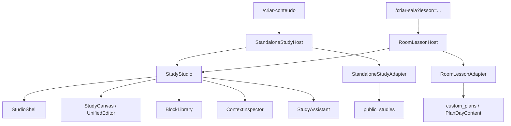

# Roadmap — Estúdio da Palavra: editor unificado de estudos e aulas

> Status: proposta para implementação futura  
> Data do levantamento: 2026-07-27  
> Rotas analisadas: `/criar-conteudo` e `/criar-sala?lesson=:lessonId&type=nova-aula-*`  

> **Status em 28/07/2026 — v2.8.0 concluída:** o `StudyStudio` é o único editor ativo para estudos e aulas. Documento canônico, renderer, grade, autosave, revisão otimista, recuperação local, RLS, biblioteca pesquisável, cinco modelos, comando `/`, IA com revisão e aceite parcial, responsividade e redirecionamento das rotas antigas estão implementados. A auditoria de segurança das demais tabelas do ecossistema permanece em um programa separado e não faz parte deste roadmap editorial.
> Escopo desta etapa: diagnóstico, arquitetura, experiência e plano de migração. Nenhuma implementação do editor foi realizada.
>
> Conceito visual revisado: [imagem](assets/estudio-da-palavra-ui-concept-v2.png) · [fonte HTML](assets/estudio-da-palavra-ui-concept-v2.html)

## 1. Resumo executivo

O produto já possui boa parte da base necessária para oferecer um editor que combine escrita livre e composição visual:

- edição rica com TipTap;
- blocos arrastáveis com `dnd-kit`;
- canvas responsivo para mobile, tablet, desktop e largura total;
- templates de estudo;
- busca de referência bíblica;
- geração estruturada com IA;
- preview e publicação;
- blocos de capa, texto, Bíblia, vídeo, slides, sumário, referências, perguntas, CTA, autor e rodapé;
- configuração contextual de cada bloco;
- ferramentas específicas para mobile.

O principal problema não é falta de funcionalidades. É a existência de duas implementações de página grandes e divergentes:

- `/criar-conteudo` renderiza `CreateLandingPage`;
- a aula de `/criar-sala` embute `CreateContentV3Page`;
- as duas usam `UnifiedEditor`, mas duplicam shell, estado, histórico, geração por IA, metadados, seleção de blocos, preview e salvamento.

A recomendação é criar um único componente de produto, chamado neste roadmap de **Estúdio da Palavra**, com dois adaptadores:

1. **Estudo avulso:** salva e publica um documento em `public_studies`, com privacidade e compartilhamento no Reino.
2. **Aula de sala:** salva o mesmo documento como `PlanDayContent` dentro de uma sala, retornando depois para a estrutura de unidades e aulas.

A sala não deve ser fundida ao editor. Ela continua responsável por dados da sala, unidades, aulas, participantes, avaliação e publicação. A unificação acontece somente na experiência de criação do documento.

## 2. Diagnóstico confirmado

### 2.1. Mapa das implementações atuais

| Experiência | Rota | Componente principal | Editor interno | Persistência |
| --- | --- | --- | --- | --- |
| Estudo avulso | `/criar-conteudo` | `CreateLandingPage` | `UnifiedEditor` | `public_studies` |
| Aula de uma sala | `/criar-sala?lesson=...` | `CreateRoomStudioPage` → `CreateContentV3Page` | `UnifiedEditor` | `PlanDayContent.blocksConfig` dentro de `custom_plans` |
| Editor experimental | `/criar-conteudo-v3` | `CreateContentV3Page` | `UnifiedEditor` | `public_studies` ou callback embutido |

### 2.2. Reuso já disponível

O `UnifiedEditor` já suporta:

- documento TipTap e modo legado baseado em array de blocos;
- texto livre, títulos, listas, citações, links, sublinhado e alinhamento;
- inserção de blocos pelo canvas;
- drag-and-drop e ordenação por teclado;
- larguras `1/1`, `2/3`, `1/2` e `1/3`;
- propriedades contextuais;
- undo e redo;
- modo de leitura;
- visualização mobile, tablet, desktop e full;
- adição de seção no fim do documento;
- slots vazios para completar uma grade.

Blocos disponíveis:

1. texto livre e texto rico;
2. hero e hero editorial;
3. versículo em destaque;
4. conteúdo pastoral;
5. sumário automático;
6. versículos relacionados;
7. referências encadeadas;
8. pergunta de reflexão;
9. vídeo;
10. slides;
11. CTA;
12. perfil do autor;
13. rodapé;
14. espaçador de layout.

### 2.3. Problemas estruturais confirmados

#### A. Duplicação extensa

- `CreateLandingPage.tsx` possui aproximadamente 2.073 linhas.
- `CreateContentV3Page.tsx` possui aproximadamente 1.728 linhas.
- As duas páginas repetem quase toda a experiência do editor, mas já apresentam centenas de linhas divergentes.

Essa duplicação faz uma correção aplicada em uma rota não chegar automaticamente à outra.

#### B. Paridade funcional divergente

`CreateLandingPage` possui recursos mais recentes de:

- níveis de privacidade;
- PDF;
- usuários e grupos autorizados;
- contexto de igreja/grupo;
- compartilhamento no Reino;
- registro de atividade.

`CreateContentV3Page` possui:

- recuperação em `localStorage`;
- controle explícito de alteração;
- guard de plano para o auto-builder com IA;
- comportamento específico de aula embutida.

Nenhuma das duas deve ser escolhida integralmente como solução final. O componente compartilhado precisa combinar os comportamentos válidos das duas.

#### C. Contrato de documento inconsistente

O estado local declara `blocks` como `Block[]`, mas em alguns fluxos recebe também um documento JSON do TipTap. Além disso:

- `ContentData` é redeclarado localmente em mais de um arquivo;
- `PlanDayContent.blocksConfig` usa `any[]`;
- metadados de privacidade diferem entre as versões;
- HTML e blocos podem disputar o papel de fonte de verdade.

#### D. Salvamento da aula é frágil

Ao concluir uma aula, `saveLessonContent` atualiza o estado React da sala e fecha o editor. A persistência remota da sala só ocorre quando o usuário salva a sala posteriormente.

Riscos:

- fechar ou atualizar a página antes de salvar a sala;
- editar uma aula por URL sem a sala já possuir um ID persistido;
- perder a diferença entre o rascunho local do editor e o estado do plano;
- sobrescrever alterações de outra sessão ao salvar o JSON completo da sala.

#### E. Recuperação de rascunho não é uniforme

O V3 possui cache local; o editor usado em `/criar-conteudo` não possui o mesmo contrato de recuperação. O usuário recebe comportamentos diferentes para a mesma atividade.

#### F. Guard de IA divergente

O V3 verifica `checkFeatureAccess('aiDeepAnalysis')` antes do auto-builder. O fluxo atual de `CreateLandingPage` chama `generateAIOnePage` sem a mesma verificação local.

O estado-alvo deve colocar autorização, cota e auditoria de custo no serviço/servidor, com uma indicação de capability na interface.

#### G. Excesso de interface simultânea

No desktop podem coexistir:

- menu global;
- barra do editor;
- painel esquerdo com referência, metadados e todos os blocos;
- canvas;
- painel direito de propriedades;
- menus flutuantes do TipTap;
- assistente flutuante.

O editor é poderoso, mas a hierarquia fica parecida com um painel técnico. A nova experiência precisa ser orientada ao conteúdo e revelar ferramentas conforme o contexto.

#### H. Cobertura fragmentada

Os testes atuais cobrem partes importantes, como:

- layout de blocos;
- canvas mobile;
- seletor de blocos;
- slots de grade;
- estrutura da sala;
- criação de aula;
- avaliação.

Ainda falta um contrato compartilhado que execute o mesmo conjunto de comportamentos nos modos `standalone` e `roomLesson`.

### 2.4. Auditoria funcional completa

O levantamento detalhado muda a orientação do projeto: o Culto+ já possui um estúdio de conteúdo avançado. O trabalho não deve recomeçar com um editor reduzido; deve consolidar, proteger e organizar as capacidades atuais.

#### Escrita e composição já implementadas

- TipTap com parágrafo, títulos, listas, citação, link, sublinhado, alinhamento e contagem de caracteres;
- toolbar contextual e menu flutuante;
- rich text com níveis de título, negrito, itálico, sublinhado, tachado, tamanho, alinhamento, listas, linha horizontal, link, cor do texto, marca-texto, undo e redo;
- inserções pastorais prontas no texto rico: abertura, destaque bíblico, passo prático, contexto histórico, perguntas de reflexão e oração;
- drag-and-drop por ponteiro e teclado;
- duplicação, remoção, configuração, alinhamento e largura de blocos;
- composição em grade com `1/1`, `2/3`, `1/2` e `1/3`;
- slots vazios, linha de inserção e preenchimento de espaços da grade;
- movimento alternativo para cima e para baixo no mobile;
- undo/redo do documento;
- visualização mobile, tablet, desktop e largura total;
- visibilidade de bloco por viewport;
- preview em modo de leitura.

#### Os 16 tipos de bloco existentes

| Tipo técnico | Capacidade atual | Destino no Estúdio da Palavra |
| --- | --- | --- |
| `free-text` | Texto livre e compatibilidade com documentos antigos | Preservar e normalizar |
| `rich-text` | Editor completo e inserções pastorais | Preservar como bloco principal de escrita |
| `hero` | Abertura visual com conteúdo e imagem | Preservar |
| `hero-split` | Capa editorial dividida, imagem, CTA e inversão de layout | Preservar |
| `biblical` | Texto bíblico, imagem, link e cinco estilos visuais | Preservar e conectar à busca bíblica |
| `study-content` | Estrutura pastoral legada | Manter leitura; não priorizar como nova inserção |
| `study-outline` | Sumário automático de títulos com navegação e scroll spy | Preservar |
| `related-verses` | Referências editáveis, comentários, grid e slider mobile | Preservar |
| `references-chain` | Cadeia interativa de referências e abertura da Bíblia | Preservar |
| `reflection-question` | Pergunta pública, resposta privada, login e salvamento em Notas | Preservar como interação do leitor |
| `video` | Vídeo incorporado e chamada para ação | Preservar |
| `slide` | Vários slides, imagem/vídeo, autoplay, intervalo, navegação e gerenciador | Preservar integralmente |
| `cta` | Ações primária e secundária | Preservar |
| `authority` | Foto, nome, biografia e ação do autor | Preservar |
| `footer` | Encerramento, links e presença social | Preservar |
| `spacer` | Controle explícito de respiro e composição | Preservar como ferramenta de layout |

#### Bíblia e fundamentação

- busca por referência exata;
- busca por capítulo/referência como fallback;
- preenchimento do bloco bíblico com o texto localizado;
- abertura de referências na Bíblia;
- referência principal e texto-base enviados como contexto para a IA;
- estilos editoriais próprios para o texto bíblico.

Essas funções devem aparecer em uma área `Bíblia` do estúdio, não ficar escondidas entre metadados. A busca continua sendo uma fonte confiável do app; a IA não substitui o texto vindo da base bíblica.

#### Publicação e distribuição

A interface atual do estudo avulso expõe:

- rascunho, preview e publicação;
- capa, título, descrição, categoria, tags e slug;
- link por slug ou ID;
- download/PDF;
- opções de acesso público, privado, por convite, igreja, grupo ou grupos da igreja;
- seleção de usuários e grupos autorizados;
- permissão de download;
- compartilhamento no Reino/Feed;
- registro de atividade e Mana;
- histórico de acesso;
- contadores de visualização e compartilhamento;
- ações posteriores à publicação.

A auditoria de prontidão mostrou que parte dessas opções ainda é apenas uma capacidade de interface ou serviço isolado: o renderer público não cobre todos os blocos, as regras de audiência não são aplicadas integralmente pelo banco, não foi encontrado produtor ativo para o histórico de acesso e os contadores não são atômicos. Portanto, essas capacidades devem ser preservadas no desenho, mas só podem ser tratadas como concluídas depois da paridade entre preview e publicação, da revisão de RLS e de testes de ponta a ponta.

Essas capacidades não devem ocupar o canvas. Devem ser organizadas em um fluxo de `Revisar e publicar`, com resumo de prontidão, audiência, distribuição e resultado.

#### Sala, aulas e avaliação

O `PlanStudio` já entrega:

- título, descrição, frequência, datas, acesso e capa;
- unidades e aulas;
- criar, renomear, excluir e reordenar unidades;
- criar, renomear, excluir e mover aulas entre unidades;
- drag-and-drop com suporte de teclado;
- preview da experiência pública;
- checklist de publicação;
- avaliação final com perguntas, alternativas e nota mínima;
- privacidade e compartilhamento da sala;
- salvar rascunho e publicar;
- retorno para editar, compartilhar ou adicionar conteúdo.

Essas capacidades pertencem ao organizador da sala. O editor unificado entra somente quando uma aula é aberta.

### 2.5. Matriz de preservação e melhoria

| Área | Situação real hoje | Decisão |
| --- | --- | --- |
| `UnifiedEditor` | Compartilhado, porém com dois modelos internos concorrentes: array de blocos e documento TipTap | Preservar comandos e renderers; consolidar um documento canônico antes do novo shell |
| Texto rico | Muito mais completo que um textarea comum | Preservar todos os comandos e agrupar os avançados em `Mais` |
| Biblioteca de 16 blocos | Funcional, porém apresentada como uma lista extensa | Agrupar por Texto, Bíblia, Mídia, Interação e Layout |
| Grade e slots | Parcial: usa flex/encaixe visual, possui interpretações divergentes de `2/3` e não é uma grade canônica de 12 colunas | Criar `TwelveColumnFlow`, normalizar spans `12/8/6/4` e migrar conteúdo legado |
| Mobile | Canvas, largura total, controles de mover e bottom sheets já existem | Preservar; corrigir descoberta e adicionar acesso à IA |
| Busca bíblica | Serviço de busca funciona, mas o comando atual pode tentar atualizar o tipo do bloco como se fosse seu ID | Corrigir o contrato de comando e promover a Bíblia a ferramenta de primeira classe |
| Modelo padrão de nove blocos | Funcional | Transformar em um dos modelos curados, sem torná-lo obrigatório |
| Upload de capa e imagens | Funcional | Centralizar no inspector e nos blocos relevantes |
| Slides | Gerenciador maduro | Preservar integralmente e carregar sob demanda |
| Reflexão do leitor | Salva a resposta em Notas e trata login | Preservar no renderer público e testar autorização |
| Preview | Existe, mas não usa um renderer único em todas as rotas e modos | Criar renderer compartilhado e usá-lo no preview, público, leitura, PDF e cards |
| PDF e link | Ações existem no estudo avulso, sem paridade comprovada com todos os blocos e audiências | Preservar no fluxo e validar com o renderer e as policies reais |
| Audiência e permissões | Interface rica, porém sem correspondência integral em colunas e policies de `public_studies` | Tornar contrato único, persistido e protegido por RLS |
| Publicação no Reino | Funcional no estudo avulso | Preservar como opção após publicar |
| Histórico de acesso | Interface e serviço existem, mas não foi encontrado fluxo ativo que grave os acessos | Implementar gravação atômica e preservar em `Resultados` |
| Recuperação local | Existe apenas no V3 | Levar para os dois modos com contrato versionado |
| Persistência do estudo | Funciona, mas usa contratos `any` e fallback ambíguo | Tipar, separar adaptador e validar ownership/RLS |
| Persistência da aula | Atualiza estado local e depende de salvar a sala depois | Corrigir antes da unificação visual |
| Estrutura da sala | Funcional | Continuar fora do editor |
| Avaliação da sala | Funcional | Preservar fora do editor |
| Área de alunos | Interface comunica conexão futura | Tratar como parcial; não apresentar como pronta |
| `Gerar com IA` da sala | Hoje apenas exibe uma notificação | Ocultar ou marcar claramente como futuro até existir fluxo real |
| `Importar aulas` | Hoje apenas exibe uma notificação | Ocultar ou marcar claramente como futuro |
| Capa “gerada” da sala | SVG local baseado no título, sem IA | Renomear para `Criar capa padrão` ou conectar a uma IA real |
| V2 e componentes órfãos | Experimentos/legado sem paridade | Manter apenas durante migração e remover depois de validar tráfego |

### 2.6. Auditoria específica da IA

A IA atual não é uma funcionalidade única. Há experiências diferentes que precisam de destinos próprios.

#### A. Auto-builder de documento

Já existe um modal que recebe referência bíblica e tema, chama `generateAIOnePage` e gera uma composição de nove blocos:

1. hero editorial;
2. bloco bíblico;
3. sumário do estudo;
4. texto rico;
5. slides;
6. versículos relacionados;
7. autor;
8. rodapé;
9. pergunta de reflexão.

Problemas confirmados:

- a interface descreve apenas parte do que é realmente gerado;
- o resultado é aplicado diretamente ao documento, sem comparação ou aceite parcial;
- o guard de `aiDeepAnalysis` existe no V3, mas não no fluxo canônico de `/criar-conteudo`;
- não há um contrato uniforme de incremento de uso, cancelamento e auditoria;
- o prompt ainda contém nome, marca e linguagem legados;
- a saída usa estrutura `any`;
- a chamada não possui retry padronizado;
- chaves `NEXT_PUBLIC_GROQ_API_KEY` e `NEXT_PUBLIC_OPENROUTER_API_KEY` aparecem no serviço chamado pelo cliente e precisam sair do navegador.

Decisão: o auto-builder é uma capacidade valiosa e deve continuar disponível desde a entrada do estúdio, mas somente depois de passar por gateway seguro, capability, cota, schema validado e preview do resultado.

#### B. Obreiro IA

O assistente streaming já:

- responde pesquisa bíblica, contexto, referências e dúvidas de uso;
- verifica `aiChatAccess`;
- incrementa uso do chat;
- registra atividade;
- oferece ações posteriores para Nota, Imagem, Podcast e Quiz.

Situação das ações:

- `Nota`: encaminha o texto para Notas;
- `Quiz`: encaminha o tema para o Quiz;
- `Imagem` e `Podcast`: apontam para `/estudio-criativo`, rota que hoje redireciona para outra tela e perde o estado enviado;
- o assistente é flutuante/global em uma experiência e embutido novamente no V3, sem contexto estruturado do bloco ou seleção atual.

Decisão: preservar o Obreiro IA como painel contextual do estúdio, não como sobreposição genérica. Ele deve receber referência, título, estrutura e seleção atual por um contrato explícito. As ações externas só permanecem visíveis quando o destino consumir corretamente o contexto.

#### C. IA contextual do editor

Ainda não existe de forma integrada. É a evolução recomendada:

- melhorar, encurtar ou expandir seleção;
- sugerir título;
- criar contexto bíblico;
- propor aplicação;
- criar perguntas;
- transformar trecho em slides;
- revisar clareza;
- indicar referências relacionadas.

Toda sugestão deve abrir um diff simples com `Aplicar`, `Aplicar como novo bloco` e `Descartar`. Nenhuma ação modifica o documento silenciosamente.

#### D. IA da sala

Os botões `Gerar com IA` e `Importar aulas` da sala são placeholders. A proposta futura é:

- gerar apenas a estrutura da sala a partir de objetivo, público, duração e frequência;
- permitir revisar unidades e títulos antes de criar;
- depois abrir cada aula no mesmo Estúdio da Palavra;
- reutilizar o auto-builder de documento para uma aula específica;
- nunca gerar e publicar uma sala inteira sem revisão.

### 2.7. Modelo de exposição das funcionalidades

Para manter a interface clean sem esconder capacidade:

| Camada | O que aparece | Recursos |
| --- | --- | --- |
| Sempre visível | Contexto e ações essenciais | Voltar, título, salvamento, undo/redo, preview e ação final |
| Rail principal | Cinco destinos reconhecíveis | Estrutura, Inserir, Modelos, Bíblia e IA |
| Painel contextual | Conteúdo do destino ativo | Biblioteca completa, busca, modelos ou assistente |
| Toolbar de texto | Edição mais frequente | Estilo, negrito, itálico, sublinhado, listas, link e alinhamento |
| `Mais` da toolbar | Comandos avançados existentes | Tamanho, tachado, cor, marca-texto, linha e inserções pastorais |
| Toolbar do bloco | Composição rápida | Mover, duplicar, largura, alinhamento, ocultar por viewport e excluir |
| Inspector | Propriedades específicas | Estilo bíblico, CTA, imagens, slides, autoplay, links e visibilidade |
| Revisar e publicar | Distribuição | Capa, SEO, slug, audiência, PDF, link, Reino e histórico/resultados |

Regra: nenhuma funcionalidade madura é removida apenas para simplificar a tela. A simplificação acontece por agrupamento, contexto e revelação progressiva.

### 2.8. Funcionalidades aparentes que não podem ser tratadas como prontas

Até serem concluídas, a interface deve evitar prometer:

- geração de estrutura da sala por IA;
- importação real de aulas;
- gestão real de alunos dentro do novo `PlanStudio`;
- capa de sala gerada por IA;
- ações de Imagem e Podcast do Obreiro IA usando o contexto atual;
- autosave remoto uniforme;
- salvamento independente e imediato de aula;
- IA com aplicação parcial e diff;
- paridade completa entre estudo avulso e aula.

Essa distinção evita que o novo layout dê mais destaque a botões que terminam apenas em notificações ou fluxos incompletos.

### 2.9. Cobertura automatizada encontrada

Há testes para:

- slots de grade e linha de inserção;
- blocos de meia largura na mesma linha;
- canvas mobile;
- slider mobile de versículos relacionados;
- visibilidade por viewport;
- modal de compartilhamento no preview;
- abertura do novo estúdio da sala;
- criação de aula na mesma rota;
- área de avaliação;
- privacidade e compartilhamento;
- edição de estudo e sala a partir do perfil;
- publicação de estudo no Reino.

Faltam testes de contrato para:

- todos os 16 blocos;
- comandos completos do rich text;
- busca bíblica e sincronização com o bloco;
- auto-builder com capability, cota, erro, retry e cancelamento;
- Obreiro IA recebendo contexto do editor;
- ações Nota, Imagem e Quiz de ponta a ponta;
- reflexão pública salva em Notas;
- PDF e audiência no fluxo completo;
- autosave e recuperação do modo standalone;
- salvar uma aula diretamente no servidor;
- conflito de versões;
- paridade funcional entre `standalone` e `roomLesson`.

## 3. Visão de produto

### Nome recomendado

**Estúdio da Palavra**

Subtítulo:

> Escreva, organize e apresente estudos bíblicos em um único lugar.

### Princípio central

O usuário deve poder começar escrevendo como em um editor de texto e, quando desejar, transformar trechos em uma página visual composta por blocos — sem trocar de ferramenta ou perder conteúdo.

### Objetivos

1. Oferecer uma única experiência para criar estudo avulso e aula.
2. Reduzir a sensação de sistema técnico e priorizar o conteúdo.
3. Reaproveitar todas as capacidades válidas já desenvolvidas.
4. Preservar templates que orientam a montagem de um bom estudo.
5. Garantir salvamento e recuperação confiáveis.
6. Manter a sala como organizador, sem duplicar editor.

### Fora do escopo

- transformar o produto em editor gráfico livre de qualquer tipo;
- criar formas vetoriais, desenho manual ou posicionamento absoluto;
- fundir gestão de alunos, avaliação e publicação da sala dentro do editor;
- substituir o editor da Bíblia ou a página pública de leitura;
- migrar todos os conteúdos persistidos de uma vez sem compatibilidade de leitura.

## 4. Experiência proposta

### 4.1. Estrutura do workspace

```text
┌───────────────────────────────────────────────────────────────────────┐
│ Voltar  Título do documento     Salvo agora    Undo/Redo   Preview   │
│                                                     [Ação principal] │
├───────────────┬───────────────────────────────────────┬───────────────┤
│ Estrutura     │                                       │ Propriedades  │
│ Blocos        │                CANVAS                 │ do documento  │
│ Modelos       │       texto + composição visual       │ ou do bloco   │
│ Bíblia        │                                       │ selecionado   │
│ IA            │                                       │               │
├───────────────┴───────────────────────────────────────┴───────────────┤
│ Mobile: ações essenciais no rodapé; painéis abrem como bottom sheet  │
└───────────────────────────────────────────────────────────────────────┘
```

### 4.2. Cabeçalho

O cabeçalho deve ser único e compacto:

- voltar para a origem correta;
- título editável;
- contexto discreto: `Estudo avulso` ou `Sala › Unidade › Aula`;
- estado do rascunho: `Salvando`, `Salvo agora`, `Sem conexão`, `Erro ao salvar`;
- undo/redo;
- alternância de viewport;
- preview;
- uma ação principal dependente do contexto:
  - `Publicar estudo`;
  - `Concluir aula`.

Configurações de audiência e publicação entram em um modal/drawer próprio, não na área principal de escrita.

### 4.3. Painel esquerdo

Usar uma barra compacta com cinco seções:

1. **Estrutura:** visão ordenada dos blocos do documento.
2. **Blocos:** catálogo agrupado por conteúdo, Bíblia, mídia, interação e layout.
3. **Modelos:** estruturas prontas.
4. **Bíblia:** busca de referência e inserção direta.
5. **Assistente:** geração ou melhoria contextual por IA.

O painel pode ser recolhido. No primeiro acesso, `Modelos` é priorizado; durante a escrita, `Estrutura` assume a navegação.

### 4.4. Canvas

O canvas permanece baseado em TipTap + blocos e ganha:

- carregamento inicial do template editorial premium já existente;
- escrita imediata dentro dos blocos do template;
- comando `/` para inserir elementos;
- conversão de texto selecionado em título, citação, versículo ou destaque;
- inserção entre blocos sem depender apenas de slots vazios;
- zoom e centralização;
- grade editorial de 12 colunas, em fluxo, inspirada no editor de blocos do WordPress;
- combinações `1/1`, `2/3 + 1/3`, `1/2 + 1/2` e `1/3 + 1/3 + 1/3`;
- linhas de inserção claras;
- arraste com teclado e mouse;
- largura do bloco controlada no próprio bloco;
- encaixe automático na linha seguinte quando a soma de colunas ultrapassar 12;
- slots vazios visíveis para completar uma linha incompleta;
- navegação por estrutura sem perder a posição;
- indicação visual de conteúdo oculto em determinados viewports;
- preview fiel usando o mesmo renderer público.

A grade é de fluxo, não de posicionamento absoluto. O documento continua legível, reordenável e responsivo, sem exigir precisão de uma ferramenta gráfica.

### 4.5. Painel direito

O painel é contextual:

- sem bloco selecionado: propriedades do documento;
- bloco selecionado: propriedades apenas daquele bloco;
- seleção de texto: toolbar flutuante;
- nada relevante: painel recolhido para ampliar o canvas.

### 4.6. Template inicial premium e modelos orientadores

O template inicial atual é uma das partes mais maduras da experiência e deve ser tratado como referência canônica, não substituído por uma página simplificada.

Estrutura preservada:

1. hero editorial em `1/1`;
2. texto bíblico em `2/3`;
3. sumário automático em `1/3`, na mesma linha do texto bíblico;
4. desenvolvimento em texto rico em `1/1`;
5. slides;
6. versículos relacionados;
7. perfil do autor;
8. rodapé;
9. pergunta de reflexão.

Melhoria proposta sem descaracterizar o template:

- manter hero, texto bíblico, sumário e desenvolvimento exatamente com a hierarquia atual;
- permitir uma linha editorial de três colunas para blocos compactos, como slides, referências e autor/ação;
- manter desenvolvimento longo, vídeo e pergunta de reflexão em largura total quando a leitura ou interação pedir mais espaço;
- exibir discretamente a largura de cada bloco durante a edição;
- oferecer `Restaurar composição do modelo` sem apagar o conteúdo do usuário;
- salvar composições personalizadas como novo modelo.

Comportamento responsivo:

| Viewport | Grade |
| --- | --- |
| Desktop amplo | Até três blocos por linha |
| Desktop compacto/tablet horizontal | Até dois blocos por linha quando o conteúdo exigir |
| Tablet vertical | Duas colunas apenas para blocos compactos |
| Mobile | Uma coluna, preservando a ordem sem alterar os dados |

O MVP deve usar os blocos existentes e oferecer:

| Modelo | Estrutura inicial |
| --- | --- |
| Estudo bíblico | Capa, texto-base, contexto, desenvolvimento, aplicação, reflexão e oração |
| Aula de discipulado | Objetivo, texto-base, ensino, atividade, pergunta e próximo passo |
| Devocional | Versículo, reflexão, aplicação e oração |
| Sermão | Tema, texto-base, introdução, pontos, aplicação, apelo e referências |
| Em branco | Documento textual sem blocos obrigatórios |

O modelo `Estudo bíblico` deve partir do template premium existente. Os demais reutilizam o mesmo sistema de grade, blocos e propriedades. Cada modelo é somente um ponto de partida: o usuário pode remover, reorganizar, redimensionar ou acrescentar blocos.

### 4.7. Assistente por IA

A IA deve auxiliar o editor, não competir com ele:

- gerar estrutura a partir de tema e referência;
- sugerir contexto bíblico;
- enriquecer um trecho selecionado;
- resumir;
- criar perguntas de reflexão;
- sugerir aplicação prática;
- revisar clareza;
- propor slides a partir do estudo.

Regras:

- nenhuma alteração é aplicada sem preview/aceite;
- o usuário visualiza quais blocos serão criados ou alterados;
- toda chamada passa por capability, cota e auditoria;
- a geração deve ser cancelável;
- o texto gerado é identificado como sugestão editável;
- referências bíblicas devem ser conferidas com a base bíblica local.

### 4.8. Mobile

No mobile:

- canvas em largura total;
- cabeçalho com título, status e ação principal;
- barra inferior com `Estrutura`, `Adicionar`, `IA` e `Propriedades`;
- painéis laterais viram bottom sheets;
- seleção de bloco abre toolbar compacta;
- drag-and-drop possui alternativa de mover para cima/baixo;
- preview usa uma nova tela, não reduz o editor dentro do viewport.

### 4.9. Conceito visual: uma mesa de estudo, não um painel administrativo

A interface deve transmitir concentração, autoria e cuidado editorial. O usuário precisa sentir que está preparando um estudo, e não configurando registros em um sistema.

Princípios:

1. **Canvas primeiro:** o documento ocupa a maior área e começa acima da dobra.
2. **Ferramentas sob demanda:** controles aparecem quando há seleção ou intenção clara.
3. **Uma decisão principal por vez:** salvar é automático; o cabeçalho destaca apenas `Publicar estudo` ou `Concluir aula`.
4. **Profundidade suave:** bordas, superfícies e sombras discretas substituem caixas pesadas.
5. **Identidade Culto+ com moderação:** roxo, laranja, verde e dourado funcionam como sinais, não como grandes massas de cor.
6. **Leitura confortável:** texto, passagem bíblica e estrutura editorial têm mais destaque que configurações.
7. **Consistência entre contextos:** estudo avulso e aula parecem o mesmo produto; somente contexto e ação final mudam.

### 4.10. Linguagem visual proposta

| Elemento | Direção |
| --- | --- |
| Fundo do workspace | Neutro quente e muito claro, separando o ambiente da folha sem aumentar o contraste |
| Canvas | Superfície de papel clara, centralizada e com sombra mínima |
| Texto principal | Azul-marinho/tinta da identidade Culto+, com alto contraste |
| Ação principal | Verde institucional ou cor primária já definida no design system |
| Bíblia e referências | Dourado envelhecido apenas em ícones, filetes, labels e seleções |
| IA | Roxo Culto+ em detalhes e estados de sugestão, nunca em grandes fundos |
| Alertas | Cores semânticas suaves acompanhadas por ícone e texto |
| Tipografia funcional | Família sans-serif já usada no novo layout Culto+ |
| Texto bíblico e citações | Família serifada editorial já usada nas experiências de Bíblia e Pão Diário |
| Bordas | Neutras, finas e com contraste baixo; foco recebe contorno evidente |
| Cantos | Médios e consistentes; evitar misturar muitos raios diferentes |
| Sombras | Somente para indicar elevação real: painel flutuante, modal e bloco arrastado |

Antes da implementação, essas decisões devem ser mapeadas para tokens existentes. Novos valores só devem ser criados quando não houver equivalente no design system.

### 4.11. Layout responsivo detalhado

#### Desktop amplo — a partir de 1440px

- workspace utiliza toda a largura e toda a altura disponível;
- topbar fixa de aproximadamente 64px;
- rail de ferramentas com aproximadamente 56px;
- painel contextual esquerdo entre 256px e 288px quando aberto;
- canvas fluido, com folha de leitura entre 760px e 960px;
- inspector direito entre 288px e 320px apenas quando necessário;
- em monitores amplos, os dois painéis podem coexistir, mas o canvas continua sendo o elemento dominante.

#### Desktop compacto e tablet horizontal — 1024px a 1439px

- somente um painel lateral pode permanecer aberto;
- abrir o inspector recolhe o painel esquerdo, e vice-versa;
- o canvas ocupa o espaço liberado;
- ações secundárias migram para um menu de overflow;
- preview abre em tela própria.

#### Tablet vertical — 768px a 1023px

- rail lateral permanece compacto ou vira barra inferior;
- biblioteca, estrutura e propriedades abrem como drawer;
- o documento mantém largura de leitura e não simula uma miniatura de desktop;
- controles de largura do bloco usam opções explícitas, não drag de precisão.

#### Mobile — 320px a 767px

- topbar de 56px com voltar, título abreviado, estado de salvamento e ação principal;
- canvas ocupa 100% da largura útil;
- barra inferior fixa com quatro ações: `Estrutura`, `Adicionar`, `IA` e `Propriedades`;
- painéis usam bottom sheet em dois estágios: parcial e tela cheia;
- mover bloco possui botões `Subir` e `Descer`;
- não há rolagem horizontal nem controles importantes escondidos fora da viewport.

Regra de comportamento: o `body` não deve competir com o editor. A área de trabalho usa `100dvh`, o canvas controla a rolagem principal e painéis possuem rolagem interna apenas quando necessário.

### 4.12. Hierarquia da informação

Ordem visual da tela:

1. conteúdo sendo criado;
2. título do documento e contexto;
3. estado de salvamento;
4. ferramenta relacionada à seleção atual;
5. preview e ação final;
6. configurações avançadas.

Regras:

- não repetir o título do documento como título de etapa ou de página;
- metadados como categoria, tags, audiência e permissões ficam em `Configurações do documento`;
- a barra de formatação aparece perto do texto selecionado;
- o inspector não mostra opções de um bloco que não está selecionado;
- nenhuma tela inicial deve exibir simultaneamente templates, biblioteca completa, formulário de metadados e assistente;
- dicas de onboarding desaparecem após a primeira ação e podem ser reabertas em `Ajuda`.

### 4.13. Entrada limpa e primeiros passos

Ao criar um documento, mostrar uma abertura compacta dentro do próprio canvas:

```text
Comece seu estudo

[ Escrever em branco ]
[ Usar um modelo ]
[ Criar estrutura com IA ]

Referência bíblica opcional: [ Buscar livro, capítulo ou versículo ]
```

Comportamento:

- `Escrever em branco` posiciona o cursor imediatamente;
- `Usar um modelo` abre uma galeria visual curta, com preview da estrutura;
- `Criar estrutura com IA` solicita apenas tema, público e referência opcional;
- selecionar uma opção remove a abertura e entrega o canvas;
- um documento existente nunca volta a mostrar essa etapa.

O usuário deve conseguir produzir o primeiro conteúdo útil em menos de 15 segundos.

### 4.14. Fluxos principais de UX

#### Fluxo A — escrever sem aprender a ferramenta

1. Abrir o Estúdio.
2. Escolher `Escrever em branco`.
3. Digitar título e conteúdo.
4. Usar `/` somente se quiser adicionar um elemento especial.
5. Preview.
6. Publicar ou concluir.

#### Fluxo B — começar com um modelo

1. Abrir `Modelos`.
2. Escolher entre no máximo cinco modelos principais.
3. Ver uma prévia simples da sequência de seções.
4. Aplicar o modelo.
5. Substituir os textos orientadores diretamente no canvas.

#### Fluxo C — compor visualmente

1. Selecionar `Adicionar`.
2. Buscar ou escolher um bloco por categoria.
3. Arrastar para uma linha de inserção ou clicar para adicionar após o bloco atual.
4. Ajustar propriedades no inspector contextual.
5. Reordenar pelo canvas ou pela estrutura.

#### Fluxo D — usar IA sem perder autoria

1. Selecionar um trecho, seção ou documento.
2. Escolher uma ação curta, como `Aprofundar`, `Resumir` ou `Criar perguntas`.
3. Visualizar comparação entre conteúdo atual e sugestão.
4. Aceitar tudo, aceitar parte ou descartar.
5. Registrar a alteração no histórico para permitir desfazer.

#### Fluxo E — publicar ou concluir

1. Acionar `Publicar estudo` ou `Concluir aula`.
2. Abrir um resumo final compacto.
3. Exibir somente os campos ainda obrigatórios ou inconsistentes.
4. Confirmar.
5. Mostrar resultado e próximo passo correto para o contexto.

### 4.15. Componentes e interações

#### Topbar

- marca Culto+ compacta ou botão de retorno para o contexto de origem;
- breadcrumb curto para aula: `Sala / Unidade / Aula`;
- título editável sem aparência de input tradicional;
- status de salvamento ao lado do título;
- undo/redo agrupados;
- viewport e preview como ações secundárias;
- apenas uma ação primária.

#### Rail de ferramentas

Ícones com tooltip e label acessível:

1. Estrutura;
2. Inserir;
3. Modelos;
4. Bíblia;
5. Assistente.

O rail permanece visível no desktop; o conteúdo da seção abre somente quando solicitado.

#### Canvas

- folha com largura de leitura confortável;
- handle de arraste surge no hover/foco;
- botão `+` aparece entre blocos, não o tempo todo;
- linha dourada/verde indica o destino do drop;
- seleção usa contorno discreto e não altera as dimensões do bloco;
- toolbar de texto flutua acima da seleção sem cobrir o parágrafo;
- zoom é um recurso secundário, não um controle dominante.

#### Inspector

- título identifica claramente o bloco selecionado;
- propriedades agrupadas em `Conteúdo`, `Aparência` e `Comportamento`;
- grupos longos usam acordeões, com apenas o grupo relevante aberto;
- ações destrutivas ficam no final e exigem confirmação somente quando não houver undo;
- alterações visuais refletem no canvas imediatamente.

#### Assistente

- não usar um chatbot flutuante permanente;
- abrir como painel contextual;
- oferecer ações sugeridas de acordo com a seleção;
- mostrar progresso cancelável;
- apresentar diff ou preview antes de alterar o documento.

### 4.16. Estados da interface

| Estado | Resposta visual |
| --- | --- |
| Novo e vazio | Três opções de início e cursor disponível |
| Carregando documento | Skeleton da topbar e da folha; não usar spinner isolado |
| Editando | Canvas em foco, ferramentas silenciosas |
| Bloco selecionado | Contorno sutil, handle visível e inspector contextual |
| Salvando | Texto discreto `Salvando…`, sem bloquear a edição |
| Salvo | `Salvo agora` com ícone curto; desaparece gradualmente |
| Offline | Barra compacta persistente e rascunho local identificado |
| Falha ao salvar | Aviso acionável com `Tentar novamente` e cópia local preservada |
| Conflito | Comparação entre versões; nunca sobrescrever silenciosamente |
| IA processando | Progresso no painel, cancelamento e canvas ainda navegável |
| Preview | Renderer real, sem controles de edição |
| Publicação concluída | Confirmação, link e próximo passo; sem tela comemorativa excessiva |

### 4.17. Microinterações, acessibilidade e critérios de qualidade

Microinterações:

- transições entre 160ms e 220ms;
- expansão de painel sem deslocamento brusco do cursor;
- autosave com feedback textual, sem toast repetitivo;
- drag mostra origem, destino e resultado;
- inserção posiciona o foco no novo conteúdo;
- feedback de sucesso aparece perto da ação realizada.

Acessibilidade:

- alvos de toque com pelo menos 44px;
- navegação completa por teclado;
- foco sempre visível;
- atalhos possuem alternativa na interface;
- tooltips não são a única fonte de informação;
- `aria-live` para salvamento, erro e geração;
- contraste WCAG AA;
- preferência por movimento reduzido respeitada;
- drag-and-drop possui comandos de mover para cima/baixo.

Critérios objetivos de aceite:

- o canvas ocupa pelo menos 65% da largura útil no estado padrão em desktop;
- em 1366px, no máximo um painel contextual permanece expandido;
- existe somente uma ação primária visível no cabeçalho;
- bloco, Bíblia e modelo são encontrados em até dois comandos;
- o primeiro campo editável fica acima da dobra;
- não há rolagem horizontal em 320px;
- nenhum modal é usado para uma ação simples e reversível;
- o fluxo completo funciona sem mouse;
- documentos longos mantêm topbar e contexto sem esconder o conteúdo;
- a interface usa os mesmos tokens, logo e padrões de menu do novo Culto+.

### 4.18. O que evitar

- barra lateral global duplicada dentro do modo foco;
- três colunas permanentemente abertas;
- excesso de cards dentro do canvas;
- grandes gradientes ou fundos escuros competindo com o documento;
- botões com o mesmo peso visual;
- configurações técnicas antes do primeiro texto;
- chatbot sobreposto ao conteúdo;
- autosave comunicado por notificações sucessivas;
- templates com dezenas de opções sem curadoria;
- separar “modo texto” e “modo canvas” em ferramentas diferentes;
- esconder ações essenciais apenas em menus de reticências.

### 4.19. Organização corrigida do workspace

O conceito visual deve representar as capacidades reais do produto.

#### Estado padrão

- rail com `Estrutura`, `Inserir`, `Modelos`, `Bíblia` e `IA`;
- canvas dominante;
- nenhum inspector aberto sem seleção;
- título, salvamento e ação final no cabeçalho;
- toolbar textual somente durante a edição;
- botão `+` entre seções.

#### `Inserir`

A biblioteca apresenta todos os blocos suportados, agrupados:

- **Texto:** texto rico, texto livre e conteúdo pastoral legado;
- **Abertura:** hero e hero editorial;
- **Bíblia:** texto bíblico, sumário, relacionados e cadeia de referências;
- **Mídia:** vídeo e slides;
- **Interação:** reflexão e CTA;
- **Identidade:** autor e rodapé;
- **Layout:** espaçador.

Busca, recentes e favoritos podem acelerar o uso sem eliminar nenhuma opção.

#### `Bíblia`

- campo único de referência;
- resultado conferido na base;
- opções `Inserir versículo`, `Atualizar bloco selecionado`, `Adicionar relacionados` e `Abrir na Bíblia`;
- histórico curto de referências usadas no documento;
- versão bíblica identificada.

#### `IA`

O painel possui três modos, sem competir com o canvas:

1. **Criar estrutura:** auto-builder do documento com preview dos nove blocos.
2. **Ajudar neste trecho:** ações contextuais sobre seleção ou bloco.
3. **Pesquisar com o Obreiro:** conversa streaming com contexto do documento.

O painel mostra a origem do contexto enviado, custo/cota aplicável, progresso, cancelar e histórico local da sessão.

#### Inspector

O inspector reutiliza as propriedades maduras de cada bloco:

- estilo visual;
- imagem e mídia;
- CTA e links;
- largura, alinhamento e visibilidade;
- gerenciador de slides;
- autoplay e intervalo;
- estilos do bloco bíblico;
- configurações da pergunta;
- dados de autor e rodapé.

Campos já editáveis diretamente no canvas não devem ser duplicados no inspector sem necessidade.

#### Revisar e publicar

Organizar em quatro passos compactos:

1. **Conteúdo:** título, descrição, capa, categoria, tags e validações.
2. **Acesso:** audiência, usuários, igreja, grupos e PDF.
3. **Distribuição:** slug, link e publicação no Reino.
4. **Resultado:** publicação concluída, copiar, abrir, compartilhar e acompanhar acessos.

No modo `roomLesson`, esse fluxo é substituído por `Concluir aula`; audiência e publicação continuam herdadas da sala.

### 4.20. Entrada do estúdio

O comportamento padrão de novo estudo continua abrindo o template premium completo. A primeira tela não deve trocar essa experiência por um documento vazio.

Ações secundárias ficam disponíveis de forma compacta:

- **Continuar rascunho:** quando houver recuperação disponível;
- **Trocar modelo:** abre as estruturas curadas;
- **Começar em branco:** ação explícita para quem deseja remover o template;
- **Criar com IA:** preenche ou propõe uma nova composição usando o mesmo sistema de blocos e grade.

O auto-builder precisa respeitar as larguras do template e pode produzir até três divisões por linha. Nenhum resultado de IA é aplicado sem prévia. Para usuários recorrentes, uma preferência explícita de modelo pode ser lembrada.

## 5. Arquitetura proposta

### 5.1. Composição



### 5.2. Componente único

Contrato sugerido:

```ts
type StudyStudioMode = 'standalone' | 'roomLesson';

type StudyStudioCapabilities = {
  canPublish: boolean;
  canShareToFeed: boolean;
  canEditAudience: boolean;
  canFinishLesson: boolean;
  canUseAI: boolean;
};

type StudyStudioAdapter = {
  load(): Promise<EditorDocument>;
  save(document: EditorDocument): Promise<SaveResult>;
  publish?(document: EditorDocument): Promise<PublishResult>;
  close(): void;
};

type StudyStudioProps = {
  mode: StudyStudioMode;
  adapter: StudyStudioAdapter;
  capabilities: StudyStudioCapabilities;
  context?: {
    roomId?: string;
    roomTitle?: string;
    unitId?: string;
    unitTitle?: string;
    lessonId?: string;
  };
};
```

O componente não conhece tabelas do Supabase. Ele chama o adaptador; os adaptadores usam serviços.

### 5.3. Documento canônico

Criar em `types.ts` um contrato versionado e discriminado para os 16 blocos:

```ts
type StudyLayoutSpan = 12 | 8 | 6 | 4;

type EditorBlock =
  | HeroBlock
  | RichTextBlock
  | BiblicalBlock
  | VideoBlock
  | ImageBlock
  | QuoteBlock
  | CalloutBlock
  | ReflectionBlock
  | SlidesBlock
  | SpacerBlock
  | FooterBlock
  | AuthorityBlock
  | RelatedBlock
  | ReferencesBlock
  | SummaryBlock
  | CustomBlock;

type StudyDocumentV2 = {
  schemaVersion: 2;
  id?: string;
  revision: number;
  context: 'standalone' | 'roomLesson';
  title: string;
  description: string;
  category: string;
  tags: string[];
  bibleReference?: {
    reference: string;
    text?: string;
    version?: string;
  };
  blocks: Array<EditorBlock & {
    layout: { span: StudyLayoutSpan };
  }>;
  status: 'draft' | 'published';
  updatedAt: string;
};
```

Regras:

- `blocks` é a única fonte de verdade da composição;
- o TipTap permanece dentro dos blocos de texto rico, não como um segundo documento concorrente;
- HTML público é sempre derivado pelo renderer compartilhado;
- `layout.span` substitui `block.layoutWidth`, `block.data.layoutWidth` e atributos TipTap duplicados;
- o normalizador converte `1/1 → 12`, `2/3 → 8`, `1/2 → 6` e `1/3 → 4`;
- a composição legada específica `bloco bíblico 1/2 + esboço 1/3` migra para `8 + 4`;
- slots vazios são estado de interface e não são persistidos;
- dados legados são convertidos ao carregar e só são gravados no novo formato depois de validação;
- `schemaVersion` e `revision` permitem migração e controle de concorrência;
- tipos locais duplicados deixam de existir;
- `PlanDayContent.blocksConfig` recebe o mesmo contrato explícito.

### 5.4. Serviços

Criar uma camada dedicada:

```text
services/studyStudio/
├── studyDocumentNormalizer.ts
├── standaloneStudyAdapter.ts
├── roomLessonAdapter.ts
├── studyDraftRecovery.ts
├── studyPublishing.ts
└── studyAIService.ts
```

Responsabilidades:

- normalização e migração;
- leitura e gravação;
- debounce de autosave;
- controle de versão otimista;
- recuperação local;
- publicação;
- capability e auditoria de IA;
- mensagens de erro normalizadas.

### 5.5. Persistência da aula

Fluxo recomendado:

1. antes de abrir a primeira aula, garantir que a sala tenha um ID de rascunho;
2. salvar a aula no servidor sem depender de um segundo clique em `Salvar sala`;
3. atualizar o estado local do plano depois da confirmação;
4. manter fallback local se a conexão falhar;
5. usar `updatedAt` ou versão para evitar sobrescrita silenciosa;
6. ao voltar, mostrar a aula atualizada na estrutura.

No futuro, aulas podem migrar para uma tabela própria. Isso não é obrigatório para o MVP, mas o adaptador deve impedir que o editor dependa do formato físico atual.

### 5.6. Fronteira Supabase

Antes de alterar a persistência:

- auditar as policies de `public_studies` e `custom_plans` com usuários reais de papéis diferentes;
- garantir que somente o autor ou um papel de igreja explicitamente autorizado possa editar cada documento;
- manter RLS habilitado em toda tabela exposta pela Data API;
- criar policies de `UPDATE` com `SELECT`, `USING` e `WITH CHECK`;
- não usar `user_metadata` como fonte de autorização;
- nunca colocar `service_role` no cliente;
- manter chamadas de persistência nos serviços/adaptadores, não no componente `StudyStudio`;
- validar o retorno da atualização para distinguir sucesso de zero linhas alteradas por RLS;
- se uma futura tabela `plan_lessons` for criada, gerar migration pela CLI, aplicar grants mínimos e testar RLS antes de migrar tráfego.

O cache local é apenas recuperação temporária. Conteúdo privado deve poder ser descartado ao sair da conta e nunca deve ser tratado como a persistência principal.

## 6. Roadmap de implementação

### Trilha transversal — Layout, UI e UX

Esta trilha acompanha as fases técnicas e impede que a modernização visual seja tratada apenas no final.

| Marco | Entregas de UI/UX | Validação |
| --- | --- | --- |
| UX0 — Fundamentos | Inventário de componentes, mapeamento de tokens Culto+, hierarquia e fluxos críticos | Revisão de consistência com o novo layout do app |
| UX1 — Protótipo clean | Wireframes responsivos, entrada vazia, canvas, biblioteca completa, Bíblia, IA, inspector e publicação | Teste rápido com criação manual, por modelo e por IA |
| UX2 — Shell funcional | Topbar, rail, painel único, canvas dominante e estados de salvamento | Validação em 1366px, 1024px, 768px e 320px |
| UX3 — Interação editorial | Comando `/`, inserção entre blocos, toolbar contextual, estrutura e templates | Testes de descoberta e conclusão sem orientação |
| UX4 — Refinamento | Microinterações, acessibilidade, conteúdo longo, offline, erro e conflito | Auditoria WCAG AA e regressão visual |

Critérios para aprovar o protótipo antes da implementação visual:

- um usuário entende onde começar sem explicação;
- título, conteúdo e ação final possuem hierarquia inequívoca;
- criar um estudo simples não exige abrir nenhum painel;
- ferramentas avançadas são descobertas sem poluir a primeira tela;
- o mesmo protótipo cobre estudo avulso e aula apenas trocando contexto e ação final;
- desktop compacto e mobile não apresentam uma versão “espremida” da interface ampla.

### Gate 0 — Segurança, contratos, persistência e baseline

**Prioridade:** P0  
**Objetivo:** impedir que a modernização consolide comportamentos inseguros ou inconsistentes.

Entregas:

- inventariar todos os recursos das duas páginas em uma matriz de paridade;
- criar `StudyDocumentV2`, união discriminada dos 16 blocos e normalizadores;
- criar a grade canônica de 12 colunas e os adapters de layout legado;
- tipar `EmbeddedContext.onSave` como assíncrono;
- unificar níveis de privacidade;
- definir blocos permitidos por modo;
- criar um renderer compartilhado para preview, rotas públicas, modo leitura, PDF e cards;
- salvar uma aula no servidor no momento de `Concluir aula`, com `revision` esperada;
- parar de serializar uma string JSON dentro da coluna JSONB de `custom_plans`;
- criar migration para normalizar os documentos já gravados, sem alterar o conteúdo visual;
- criar um gateway de IA no servidor e retirar chaves `NEXT_PUBLIC_*` de provedores;
- garantir capability, cota, incremento de uso e auditoria antes de toda geração por IA;
- aplicar timeout, retry com backoff, cancelamento e erro normalizado;
- validar a resposta do auto-builder com schema explícito antes de chegar ao editor;
- atualizar prompt, autoria e identidade do auto-builder para Culto+;
- corrigir a descrição visual para os nove blocos realmente gerados;
- corrigir ou ocultar ações quebradas de Imagem e Podcast no Obreiro IA;
- corrigir ownership, grants e RLS de `public_studies` e `custom_plans`;
- restringir leitura anônima de `public_studies` a documentos efetivamente publicados e públicos;
- tornar slug publicado único e adicionar índices de autor, status e atualização;
- registrar testes baseline das duas rotas;
- registrar fixtures de todos os 16 tipos de bloco;
- decidir a origem canônica de cada campo.

Critérios de saída:

- nenhum recurso válido das duas versões fica sem destino;
- documento legado carrega e salva sem perda;
- IA não é acionada sem autorização;
- nenhuma chave de provedor de IA é enviada ao navegador;
- erro ou resposta inválida da IA não altera o documento;
- contrato de editor não usa `any` nos campos centrais;
- uma aula concluída permanece salva após recarregar a página;
- preview e rota pública renderizam as mesmas fixtures;
- as combinações `12`, `8 + 4`, `6 + 6` e `4 + 4 + 4` são determinísticas;
- rascunhos não são legíveis anonimamente;
- a suíte baseline está verde com fixtures autenticadas dos dois contextos.

### Fase 1 — Núcleo compartilhado

**Prioridade:** P0/P1  
**Objetivo:** eliminar duplicação sem redesenhar tudo de uma vez.

Entregas:

- extrair `StudyStudio`;
- extrair header, biblioteca, canvas e inspector;
- criar `StandaloneStudyAdapter`;
- criar `RoomLessonAdapter`;
- mover histórico, seleção, viewport e dirty state para hooks compartilhados;
- manter os 16 tipos, renderers, toolbars, propriedades e interações atuais;
- incorporar recuperação local, publicação, audiência, PDF, Reino e logs no núcleo por capabilities;
- manter o Obreiro IA em uma única instância integrada ao estúdio;
- colocar a nova implementação atrás de uma feature flag interna durante a migração.

Critérios de saída:

- as duas rotas renderizam o mesmo `StudyStudio`;
- ações diferentes são controladas por capabilities;
- uma correção no canvas aparece nas duas rotas;
- não existe import de `CreateContentV3Page` em `CreateRoomStudioPage`.

### Fase 2 — Novo shell do Estúdio da Palavra

**Prioridade:** P1  
**Objetivo:** modernizar a hierarquia e reduzir a aparência de painel técnico.

Entregas:

- cabeçalho único com status de salvamento;
- rail compacto com `Estrutura`, `Inserir`, `Modelos`, `Bíblia` e `IA`;
- biblioteca completa agrupada por intenção, com busca e recentes;
- canvas central com zoom e inserção;
- inspector contextual;
- painel do Obreiro IA sem sobreposição sobre o documento;
- ações de publicação em um fluxo de quatro passos;
- integração com o shell e a identidade Culto+;
- retirada de navegações duplicadas durante o modo foco;
- mapeamento de cores, tipografia, espaçamento, bordas e elevação para tokens existentes;
- abertura limpa com recuperação de rascunho, `Escrever em branco`, `Usar um modelo` e `Criar com IA`;
- comportamento de painel único em larguras intermediárias;
- skeletons e feedback contextual sem excesso de toasts;
- atalhos de teclado documentados;
- estados vazio, carregando, erro e offline.

Critérios de saída:

- o conteúdo é o elemento visual dominante;
- o canvas ocupa pelo menos 65% da largura útil no estado padrão;
- no máximo um painel lateral fica expandido em larguras intermediárias;
- o usuário encontra bloco, template e Bíblia em até dois cliques;
- o usuário encontra o auto-builder e o Obreiro IA em um único destino `IA`;
- todos os 16 tipos continuam acessíveis;
- salvar/publicar/concluir possuem nomes coerentes com o contexto;
- a identidade Culto+ é reconhecível sem competir com a leitura;
- existe somente uma ação primária visível no cabeçalho.

### Fase 3 — Escrita + composição visual

**Prioridade:** P1  
**Objetivo:** tornar real a experiência híbrida de editor de texto e canvas.

Entregas:

- template premium atual como composição inicial;
- opção explícita de iniciar em branco;
- comando `/`;
- transformar texto em bloco;
- adicionar bloco entre seções;
- expor no canvas a grade editorial de 12 colunas estabilizada no Gate 0;
- linhas com um, dois ou três blocos;
- combinações `1/1`, `2/3 + 1/3`, `1/2 + 1/2` e três vezes `1/3`;
- slots e encaixe automático ao estilo WordPress;
- cinco modelos orientadores;
- preservar todos os comandos atuais do rich text;
- preservar as seis inserções pastorais prontas;
- preservar o gerenciador completo de slides;
- preservar estilos bíblicos, relacionados, cadeia de referências e sumário automático;
- preservar a resposta privada da pergunta de reflexão;
- painel de estrutura com navegação;
- drag-and-drop aprimorado;
- preview usando o mesmo renderer público;
- validação de blocos incompatíveis.

Critérios de saída:

- é possível criar um estudo simples sem abrir painéis;
- é possível montar uma one-page visual sem sair da rota;
- o template atual mantém sua riqueza visual depois da migração;
- três blocos de `1/3` permanecem na mesma linha em desktop e empilham corretamente no mobile;
- alternar viewport não altera os dados;
- preview e publicação apresentam a mesma composição.

### Fase 4 — Salvamento, recuperação e colaboração segura

**Prioridade:** P0/P1  
**Objetivo:** eliminar risco de perda.

Entregas:

- autosave remoto com debounce;
- fallback local versionado;
- indicador de estado;
- recuperação após atualização ou fechamento;
- salvar aula imediatamente no plano;
- detecção de conflito;
- retry controlado;
- confirmação antes de sair com erro de salvamento;
- telemetria de falhas sem conteúdo sensível.

Critérios de saída:

- atualizar a página não perde o último rascunho confirmado;
- concluir uma aula não depende de salvar novamente a sala;
- falha de rede preserva uma cópia recuperável;
- conflitos nunca são sobrescritos silenciosamente.

### Fase 5 — Evolução da IA contextual e padrões de estudo

**Prioridade:** P1/P2  
**Objetivo:** evoluir a IA já estabilizada na Fase 0 para um copiloto contextual, sem retirar autoria.

Entregas:

- auto-builder existente dentro do painel `IA`;
- preview dos nove blocos antes de aplicar;
- aceite total, parcial ou como cópia;
- ações sobre seleção;
- sugestões por bloco;
- criação de perguntas e slides;
- Obreiro IA recebendo título, referência, estrutura, bloco e seleção por contexto explícito;
- ações Nota, Imagem e Quiz com deep links funcionais e testados;
- geração assistida da estrutura de uma sala, somente depois da revisão do usuário;
- verificação da referência bíblica;
- auditoria pastoral quando aplicável;
- custo, cota e cancelamento;
- histórico mínimo das sugestões aceitas.

Critérios de saída:

- IA nunca altera o conteúdo automaticamente;
- usuário consegue aceitar parcialmente;
- todas as chamadas respeitam capability e cota;
- o auto-builder mantém paridade nos modos estudo e aula;
- uma ação externa nunca perde o texto/contexto enviado;
- texto bíblico e sugestão de IA ficam claramente diferenciados.

### Fase 6 — Mobile, acessibilidade e desempenho

**Prioridade:** P1  
**Objetivo:** garantir qualidade de produto.

Entregas:

- bottom sheets no mobile;
- toolbar acessível;
- drag por teclado e controles alternativos;
- foco e leitura por screen reader;
- alvos de toque de pelo menos 44px;
- contraste WCAG AA;
- carregamento dinâmico de blocos pesados;
- debounce de renderização e autosave;
- teste com documentos longos.

Critérios de saída:

- sem rolagem horizontal em 320px;
- ações críticas disponíveis por teclado;
- editor de documento longo mantém interação fluida;
- nenhum botão depende somente de `title` para possuir nome acessível.

### Fase 7 — Migração e limpeza

**Prioridade:** P2  
**Objetivo:** remover versões paralelas depois da paridade.

Entregas:

- migrar `/criar-conteudo`;
- migrar aula em `/criar-sala`;
- validar conteúdos existentes;
- redirecionar `/criar-conteudo-v3` para a rota canônica;
- manter `/criar-conteudo-v2` somente durante janela de compatibilidade;
- remover páginas e estados duplicados;
- atualizar mapa vivo, documentação e testes.

Critérios de saída:

- uma única implementação de editor em produção;
- nenhuma navegação ativa aponta para versões antigas;
- conteúdos antigos continuam editáveis;
- bundle não carrega duas páginas completas de editor.

## 7. Matriz de capabilities

| Capability | Estudo avulso | Aula da sala |
| --- | --- | --- |
| Editar texto e blocos | Sim | Sim |
| Templates | Sim | Sim |
| Referência bíblica | Sim | Sim |
| IA | Conforme plano | Conforme plano/papel |
| Preview | Sim | Sim |
| Salvar rascunho | Sim | Sim |
| Publicar documento individual | Sim | Não |
| Compartilhar no Reino | Sim, se público | Não diretamente |
| Configurar audiência | Sim | Herdada da sala |
| Concluir aula | Não | Sim |
| Voltar para estrutura da sala | Não | Sim |
| Avaliação/participantes | Não | Fora do editor |

## 8. Cobertura de testes recomendada

### Contrato compartilhado

Executar para os dois modos:

- carregar template;
- preservar o template premium inicial;
- editar título;
- editar texto;
- adicionar, duplicar, mover e remover bloco;
- mudar largura;
- compor uma linha `2/3 + 1/3`;
- compor uma linha com três blocos `1/3`;
- empilhar a grade corretamente em tablet e mobile;
- mover um bloco entre linhas sem perder conteúdo;
- undo/redo;
- trocar viewport;
- preview;
- autosave;
- recuperação;
- erro de rede;
- teclado;
- mobile.

### Estudo avulso

- criar rascunho;
- editar conteúdo existente;
- publicar;
- privacidade;
- copiar link;
- compartilhar no Reino;
- impedir compartilhamento público de item restrito;
- capability da IA.

### Aula

- criar sala de rascunho antes da primeira aula;
- abrir aula por URL;
- concluir e retornar à unidade;
- reabrir com conteúdo persistido;
- atualizar uma aula sem alterar as demais;
- manter audiência herdada;
- sair com falha de salvamento;
- impedir publicação individual.

## 9. Métricas de sucesso

- redução de pelo menos 60% da lógica duplicada entre as duas experiências;
- queda de erros de salvamento e recuperação;
- tempo até primeiro conteúdo digitado inferior a 15 segundos;
- criação de uma aula sem troca de rota funcional;
- pelo menos 80% das sessões usando template chegam a uma edição efetiva;
- redução do abandono antes do primeiro salvamento;
- paridade de bugs do editor entre estudo e aula;
- nenhuma chamada de IA fora do fluxo autorizado.

## 10. Riscos e mitigação

| Risco | Mitigação |
| --- | --- |
| Perder recursos exclusivos de uma das versões | Matriz de paridade antes da extração |
| Quebrar conteúdo já salvo | Normalizador versionado e fixtures reais |
| Sobrescrever sala inteira ao salvar aula | Adaptador com versão/`updatedAt`; futuramente tabela de aulas |
| Editor ficar ainda mais complexo | Revelação progressiva e canvas como prioridade |
| IA aumentar custo | Capability, cota, cancelamento e auditoria no servidor |
| Preview diferir da publicação | Mesmo renderer e mesmas fixtures |
| Drag inacessível | Keyboard sensor e ações mover para cima/baixo |
| Bundle pesado | Dynamic import por bloco e carregamento sob demanda |

## 11. Ordem recomendada de execução

1. Corrigir contrato e segurança da IA.
2. Criar documento canônico e normalizadores.
3. Extrair adaptadores.
4. Fazer as duas rotas usarem o mesmo núcleo sem redesenho.
5. Aplicar o novo shell.
6. Melhorar escrita, modelos e IA contextual.
7. Fortalecer autosave e conflitos.
8. Validar mobile e acessibilidade.
9. Migrar rotas experimentais e remover duplicação.

## 12. Definição de pronto

O projeto estará concluído quando:

- `/criar-conteudo` e a edição de aula de `/criar-sala` renderizarem o mesmo componente;
- cada contexto possuir apenas seu adaptador e suas capabilities;
- estudo avulso e aula preservarem seus fluxos específicos;
- o usuário puder escrever livremente e compor visualmente no mesmo canvas;
- templates orientarem sem bloquear;
- autosave e recuperação forem uniformes;
- IA estiver protegida e contextual;
- preview for fiel;
- testes cobrirem os dois modos;
- versões antigas deixarem de receber tráfego.

## 13. Revisão de prontidão para implementar o mockup — 27/07/2026

### 13.1. Parecer arquitetural

**Parecer:** o mockup está aprovado como direção de produto e UI, mas a implementação visual definitiva está **condicionada ao Gate 0**.

O app já possui recursos suficientes para compor o Estúdio da Palavra sem uma reescrita completa. Entretanto, começar pelo novo shell criaria uma terceira camada visual sobre contratos inconsistentes. A implementação deve primeiro estabilizar documento, layout, persistência, renderer, IA e autorização; depois aplicar o mockup sobre esse núcleo.

Não são bloqueios para prototipação isolada de componentes visuais. São bloqueios para colocar o novo editor em produção com dados reais.

### 13.2. Baseline verificado

#### Interface e código

- `/criar-conteudo` usa `CreateLandingPage`;
- a edição de aula usa `CreateContentV3Page` dentro de `CreateRoomStudioPage`;
- existe ainda uma rota V3 experimental, formando três experiências concorrentes;
- o `UnifiedEditor` alterna entre array de blocos e documento TipTap conforme o conteúdo recebido;
- os 16 tipos de bloco, toolbars, propriedades, DnD com teclado, slides e controles mobile devem ser reaproveitados;
- o documento inteiro não deve continuar alternando entre TipTap e array; TipTap deve permanecer como editor interno de rich text;
- o shell global e o shell de edição possuem comportamentos diferentes entre estudo e sala;
- no viewport auditado de `1280 × 720`, o editor atual mantém o menu global, painel lateral do editor, canvas e assistente flutuante simultaneamente, reduzindo a área útil;
- a busca bíblica encontra referências, mas o comando atual pode enviar o tipo `biblical` onde o editor espera o ID real do bloco;
- o `UnifiedEditorRef` implementa comandos que não estão integralmente descritos em sua interface pública.

#### Layout

- `layoutWidth` aceita `1/1`, `1/2`, `1/3` e `2/3`, mas controles, renderer e node views não interpretam todos da mesma maneira;
- o template legado usa tanto `1/2 + 1/3` com proporção visual especial quanto `2/3 + 1/3`;
- o layout atual usa flex e regras especiais, não uma grade canônica de 12 colunas;
- slots fantasmas devem continuar como auxílio visual, mas não podem fazer parte do documento persistido.

#### Persistência e banco

Auditoria realizada no projeto Supabase ativo:

- `public_studies`: 22 registros, sendo 2 publicados e 20 não publicados;
- os 22 documentos possuem JSON válido, mas há 19 documentos em array de blocos e 3 no formato de documento TipTap;
- os documentos salvos usam larguras legadas distintas, incluindo `1/2`, `2/3` e largura ausente;
- `public_studies.blocks` e `public_studies.meta` ainda são texto, sem `schema_version` ou `revision`;
- `public_studies` não possui índice único para slug;
- as policies de leitura atuais permitem `SELECT` público de todos os registros, inclusive rascunhos;
- `custom_plans`: 7 planos; em 6 deles a coluna JSONB `weeks` contém uma string JSON, não o array JSONB canônico;
- a ação `Concluir aula` atualiza o estado React e fecha o editor, mas não persiste imediatamente a aula;
- não há controle otimista de revisão, portanto duas edições podem se sobrescrever;
- a policy de leitura de salas considera principalmente `is_public` e não materializa toda a matriz de igreja, grupo, convite e autoria;
- o fluxo de atualização de estudo possui fallback ambíguo entre `public_studies` e `studies`;
- o histórico de acesso tem interface e serviço, mas não foi localizado um produtor ativo;
- contadores são atualizados por leitura e escrita no cliente, sujeitos a corrida.

#### IA

- a rota canônica de criação não aplica `checkFeatureAccess` antes de toda geração;
- não existe uso do `retryWithBackoff` exigido pelo projeto;
- há provedores configurados por chaves `NEXT_PUBLIC_*`, expondo a fronteira de IA ao navegador;
- o resultado do auto-builder não passa por validação de schema em runtime;
- a resposta é aplicada diretamente, sem diff ou confirmação granular;
- o Obreiro IA é global e não recebe um contrato explícito de documento, bloco, seleção e contexto;
- prompts e rótulos ainda possuem referências de identidade legada.

#### Testes executados

- `npm run typecheck`: aprovado;
- suíte focada de editor e sala: **5 aprovados e 6 reprovados**;
- os 5 testes de layout atuais passaram;
- 3 testes de slots procuram a estrutura TipTap enquanto a rota canônica está no modo array;
- 3 testes de sala não possuem fixture de autenticação pastoral e param no gate de acesso;
- não há baseline verde para salvar/reabrir aula, todos os 16 blocos públicos, RLS por persona, conflito, quota/retry de IA, PDF, feed e logs.

Conclusão do baseline: a tipagem global do projeto está íntegra, mas a suíte de aceitação do domínio ainda não representa o produto real e não pode proteger a troca do editor.

### 13.3. Mapeamento do mockup para a arquitetura

| Área do mockup | Reuso confirmado | Componente/ação necessária | Dependência |
| --- | --- | --- | --- |
| Cabeçalho com título, estado, undo/redo, viewport e ação final | estados atuais de salvar, histórico e viewport | `StudioHeader` | contrato assíncrono de salvamento |
| Rail compacto `Estrutura`, `Inserir`, `Modelos`, `Bíblia`, `IA` | rótulos, biblioteca, templates e busca existentes | `StudioToolRail` | modo foco do shell |
| Biblioteca organizada | catálogo dos 16 blocos e `blockLabels` | `BlockLibraryPanel` com busca, grupos e recentes | registry tipado |
| Canvas central | renderers e comandos atuais | `StudyCanvas` | documento canônico |
| Linhas de até três divisões | DnD, width controls e slots atuais | `TwelveColumnFlow` | spans `12/8/6/4` e normalizador |
| Inspector contextual | `BlockProperties` e formulários existentes | `ContextInspector`; bottom sheet no mobile | schema por tipo de bloco |
| IA contextual | auto-builder e padrões do Obreiro | `StudyAssistantPanel` e gateway server-side | feature, cota, schema e auditoria |
| Preview e publicação | telas e ações existentes | `PublishFlow` + `StudyDocumentRenderer` | RLS, audiência e renderer único |
| Aula de sala | `PlanStudio` e estrutura de unidades/aulas | `RoomLessonAdapter` | persistência imediata e revisão |
| Estudo avulso | metadados, capa, Feed, PDF e link | `StandaloneStudyAdapter` | contrato de publicação |

O `PlanStudio` continua responsável por unidades, aulas, avaliação e audiência da sala. Somente o editor da aula é substituído pelo `StudyStudio`.

### 13.4. Bloqueios P0 e portas de saída

| Bloqueio | Evidência | Decisão | Porta de saída |
| --- | --- | --- | --- |
| Documento concorrente | array de blocos, TipTap e tipos locais duplicados | `StudyDocumentV2` e `EditorBlock` discriminado em `types.ts` | fixtures legadas normalizam sem perda |
| Grade inconsistente | `2/3` não é aceito por todos os controles/renderers | spans `12/8/6/4` em `TwelveColumnFlow` | testes para `12`, `8+4`, `6+6`, `4+4+4` |
| Aula não salva ao concluir | apenas estado local do plano é alterado | adapter assíncrono com revisão esperada | recarregar preserva só a aula alterada |
| Preview diferente do público | rotas públicas possuem switches parciais | um `StudyDocumentRenderer` compartilhado | 16 blocos iguais em preview e público |
| Rascunhos expostos | policy de `public_studies` permite leitura pública irrestrita | migration e policies por status/audiência | testes anon, autor, membro, líder e gestor |
| IA no cliente e sem contrato | chaves públicas, sem retry/schema/diff | gateway server-side | negação, quota, retry, cancelamento e schema testados |
| Baseline E2E vermelho | 5/11 testes focados passam | fixtures autenticadas e seletores do modo canônico | suíte crítica 100% verde |

### 13.5. Arquitetura alvo

```text
components/study-studio/
├── StudyStudio.tsx
├── StudioShell.tsx
├── StudioHeader.tsx
├── StudioToolRail.tsx
├── BlockLibraryPanel.tsx
├── StudyCanvas.tsx
├── TwelveColumnFlow.tsx
├── ContextInspector.tsx
├── StudyAssistantPanel.tsx
├── PublishFlow.tsx
└── StudyDocumentRenderer.tsx

hooks/studyStudio/
├── useStudyHistory.ts
├── useStudyAutosave.ts
├── useStudyViewport.ts
└── useStudyDirtyState.ts

services/studyStudio/
├── studyDocumentService.ts
├── standaloneStudyService.ts
├── roomLessonService.ts
├── studioAIService.ts
└── studyPublishingService.ts

utils/studyDocument/
├── normalizeStudyDocument.ts
├── resolveStudyLayout.ts
└── validateStudyDocument.ts

app/api/ai/studio/route.ts
tests/fixtures/studyDocuments.ts
```

Regras de dependência:

1. páginas montam contexto e capabilities;
2. `StudyStudio` coordena a experiência, sem consultar tabelas;
3. hooks controlam estado de interface;
4. adapters chamam serviços;
5. serviços concentram Supabase, IA e efeitos externos;
6. normalizadores e layout são funções puras;
7. renderer não depende do editor;
8. interfaces globais ficam em `types.ts` e constantes em `constants.ts`.

### 13.6. Contratos obrigatórios antes do shell

#### Comando do editor

O editor deve expor uma API única, tipada e independente de DOM:

```ts
type StudyEditorCommandApi = {
  getDocument(): StudyDocumentV2;
  replaceDocument(document: StudyDocumentV2): void;
  insertBlock(block: EditorBlock, position?: InsertPosition): void;
  updateBlock(blockId: string, patch: EditorBlockPatch): void;
  updateFirstBlockByType(type: EditorBlock['type'], patch: EditorBlockPatch): void;
  moveBlock(blockId: string, target: LayoutTarget): void;
  removeBlock(blockId: string): void;
  undo(): void;
  redo(): void;
};
```

Isso corrige a busca bíblica sem acoplá-la ao ID aleatório de um template.

#### Persistência

```ts
type StudySaveInput = {
  document: StudyDocumentV2;
  expectedRevision: number;
};

type StudySaveResult =
  | { ok: true; document: StudyDocumentV2 }
  | { ok: false; reason: 'conflict' | 'forbidden' | 'offline' | 'invalid' };
```

O adaptador standalone salva o documento individual. O adaptador de aula atualiza somente a aula alvo e retorna o plano/documento confirmado pelo servidor.

#### IA

Toda operação recebe `documentId`, `context`, `selection`, `action` e `requestId`. O servidor:

1. autentica;
2. verifica capability/plano;
3. reserva ou valida cota;
4. remove dados que não devem sair do domínio;
5. aplica timeout e retry com backoff;
6. valida resposta com schema;
7. devolve uma proposta, nunca uma mutação automática;
8. registra atividade, uso e erro sem conteúdo pastoral sensível.

### 13.7. Migrações e segurança necessárias

#### `public_studies`

- transformar `blocks` e `meta` em JSONB canônico ou introduzir uma coluna `document jsonb` durante migração compatível;
- adicionar `schema_version`, `revision`, `privacy_level`, `church_id`, `group_id`, listas de audiência, `invite_required` e `allow_pdf_download`;
- criar índice único de slug publicado e índices de autor, status e atualização;
- permitir leitura anônima somente quando `status = 'published'` e a audiência for pública;
- permitir ao autor ler seus próprios rascunhos;
- aplicar `USING` e `WITH CHECK` em update;
- validar zero linhas atualizadas como falha, não como sucesso.

#### `custom_plans`

- converter as seis strings JSON armazenadas em `weeks` para arrays JSONB;
- impedir nova dupla serialização;
- adicionar `revision`;
- criar serviço/RPC transacional para atualizar uma aula com revisão esperada;
- alinhar RLS a autor, papel autorizado, igreja, grupo, convite e status;
- não permitir que `is_public` contorne uma audiência mais restrita.

#### Métricas e logs

- registrar acesso por função/RPC atômica;
- incrementar visualizações e compartilhamentos sem read-modify-write no cliente;
- restringir leitura de logs ao autor ou papel autorizado;
- não armazenar conteúdo privado do estudo em telemetria.

Toda mudança deve nascer em uma migration da Supabase CLI, ser validada em ambiente de desenvolvimento e receber testes de policies antes do rollout.

### 13.8. Sequência de implementação revisada

#### Corte 0 — Congelar o comportamento atual

- criar fixtures reais anonimizadas dos dois formatos de `public_studies` e dos dois formatos de `custom_plans.weeks`;
- corrigir autenticação e seletores dos testes atuais;
- registrar screenshots baseline das duas rotas;
- documentar os 16 blocos e capabilities por contexto.

#### Corte 1 — Contrato e dados

- introduzir `StudyDocumentV2`, registry dos blocos e normalizadores;
- implementar grade canônica;
- criar migrations, policies, índices e revisão otimista;
- criar renderer compartilhado;
- tornar o gateway de IA seguro.

#### Corte 2 — Núcleo compartilhado sem mudança visual

- extrair `StudyStudio`, commands, hooks e adapters;
- migrar primeiro `/criar-conteudo`;
- migrar depois a edição de aula;
- validar paridade funcional antes de remover código.

#### Corte 3 — Aplicar o mockup

- ativar `StudioShell` em modo foco;
- implementar topbar, rail, biblioteca, canvas, inspector e painel de IA;
- manter no máximo um painel auxiliar aberto em larguras intermediárias;
- transformar inspector e biblioteca em sheets no mobile;
- usar tokens Culto+ e preservar o template premium.

#### Corte 4 — Publicação e IA contextual

- conectar audiência, Feed, PDF, link e resultados ao renderer e policies definitivos;
- integrar auto-builder e Obreiro ao mesmo painel;
- adicionar diff e aceite total/parcial;
- habilitar somente ações implementadas e autorizadas.

#### Corte 5 — Rollout

- feature flag por usuário interno;
- piloto com documentos novos;
- piloto de leitura de documentos legados;
- ativação gradual do modo standalone;
- ativação posterior das aulas;
- remoção das rotas e componentes antigos apenas depois da janela de rollback.

### 13.9. Matriz mínima de testes

| Camada | Cobertura obrigatória |
| --- | --- |
| Unitário | normalização dos formatos legados; spans; schema dos 16 blocos; comandos; conflito |
| Componente | biblioteca; inspector por bloco; rail; sheets; undo/redo; busca bíblica; estados de save |
| Integração | criar, salvar, recarregar, publicar, atualizar aula alvo, PDF, Feed e logs |
| Renderer | fixtures dos 16 blocos em editor, preview, `/l`, `/v`, leitura e PDF |
| RLS | anônimo, autor, membro da igreja, líder, gestor e usuário de outra igreja |
| IA | sem acesso, sem cota, timeout, retry, cancelamento, JSON inválido, diff e aceite |
| E2E standalone | em branco, template, IA, Bíblia, layout em três colunas, publicar e reabrir |
| E2E aula | abrir sala, editar aula, concluir, recarregar, preservar outras aulas e impedir publicação individual |
| Acessibilidade | teclado, foco de modal/sheet, labels, contraste, anúncio de salvamento e DnD alternativo |
| Responsividade | 320, 768, 1024, 1366 e 1920 px; sem painel cobrindo ação primária |
| Performance | documento máximo atual e fixture ampliada; lazy load de slides/mídia; ausência de autosave em cascata |
| Regressão visual | template premium, documento simples, três colunas, mobile e modo foco |

Critério de liberação do mockup:

- typecheck e suíte crítica 100% verdes;
- todos os 16 blocos preservados;
- zero leitura anônima de rascunho;
- nenhuma chave de IA no bundle do cliente;
- nenhuma perda ao normalizar e salvar fixtures legadas;
- concluir aula persiste sem salvar a sala inteira;
- preview e público usam o mesmo renderer;
- WCAG AA nos fluxos principais;
- nenhuma regressão visual relevante nos cinco viewports.

### 13.10. Rollback, telemetria e entrega

- manter leitura dos formatos legados durante toda a migração;
- gravar somente V2 depois que o normalizador e as migrations estiverem validados;
- feature flag separada para standalone e aula;
- rollback troca o shell, sem reverter dados já migrados;
- medir falha de save, conflito, recuperação local, tempo até primeira edição, abandono antes do save, uso de template e falha de IA;
- não enviar título, conteúdo bíblico anotado, oração, reflexão ou resposta privada à telemetria;
- atualizar `constants.ts` e `_RELEASENOTES.md` quando a entrega significativa for ativada;
- considerar `recordActivity` e `earnMana` somente em ações concluídas e idempotentes.

### 13.11. Checklist para autorizar a implementação visual

- [ ] `StudyDocumentV2` aprovado e sem `any` central;
- [ ] fixtures reais legadas cobertas;
- [ ] `TwelveColumnFlow` determinístico;
- [ ] `StudyDocumentRenderer` cobre os 16 blocos;
- [ ] aula persiste imediatamente com revisão;
- [ ] policies impedem acesso indevido;
- [ ] gateway de IA está no servidor;
- [ ] testes baseline autenticados estão verdes;
- [ ] feature flags e rollback definidos;
- [ ] somente então: aplicar o mockup ao `StudioShell`.
