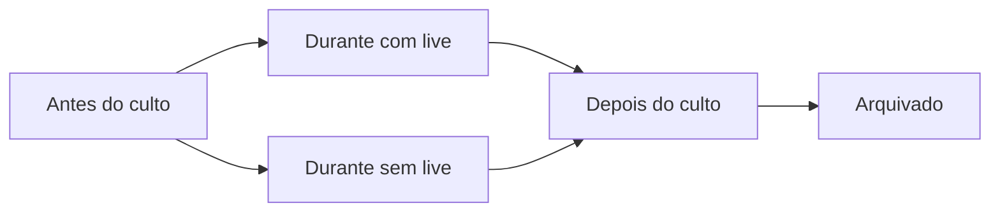

# Jornada Digital do Culto - Roadmap Consolidado BibliaLM

## Visao

A Jornada Digital do Culto transforma a pagina publica `/culto/[serviceSlug]` em uma experiencia viva, orientada a estado, capaz de acompanhar o membro antes, durante e depois do culto.

O culto continua sendo o centro da experiencia. A transmissao ao vivo e apenas um recurso opcional. Mesmo sem live, a pagina deve valorizar liturgia, Biblia, check-in, anotacoes, oracao, participacao, escala, memoria e continuidade comunitaria.

Este roadmap consolida:

- O roadmap anexo `Roadmap_Jornada_Digital_do_Culto_BibliaML.docx`.
- A analise da OnePage atual do Culto+ no BibliaLM.
- O estado real do codigo em `components/culto-plus/CultoPlusOnePage.tsx`, `services/cultoPlusService.ts`, `types.ts` e `docs/roadmaps/culto-plus-implementation-tracker.md`.

## Diagnostico atual

A OnePage atual ja entrega uma boa base de produto:

- Pagina publica do culto.
- Hero com titulo, tema, igreja, data e horario.
- Contador regressivo.
- Check-in e QR de check-in.
- Adicionar ao calendario.
- Timeline liturgica.
- Momento atual.
- Reacoes: Amem, Gloria e Aleluia.
- Anotacoes privadas.
- Pedidos de oracao publicos ou privados.
- Feed do culto.
- Convite com link pronto.
- Oferta, quando houver PIX configurado.
- Escala, quando houver equipes publicadas.
- Estado ao vivo via `ServiceLiveState`.

Mas a experiencia ainda esta muito concentrada em uma unica tela com condicionais internas. O culto publicado, o culto em andamento com live, o culto em andamento sem live e o culto encerrado ainda nao possuem composicoes visuais claramente separadas.

Exemplo observado no culto `Culto de Oracao e Doutrina`:

- O culto esta publicado para 07/07/2026 as 19:00.
- O contador e a preparacao aparecem corretamente.
- Live esta indisponivel, mas ainda ocupa destaque no card lateral.
- Oferta esta indisponivel.
- Escala ainda nao publicada.
- Timeline possui textos placeholder.
- Versiculo-chave aparece como fallback `Palavra`.
- A frase `com membro 1` soa tecnica e deve virar nome real do pregador/responsavel ou ser omitida.

## Principio do produto

A pagina do culto nao deve ser uma tela estatica. Ela deve ser uma experiencia orientada a estado.

O backend deve definir:

- Qual e o estado operacional do culto.
- Qual e o estado da transmissao.
- Qual momento liturgico esta ativo.
- Qual e o proximo momento.
- Quais acoes o usuario pode executar.

O frontend deve receber uma experiencia resolvida e renderizar a composicao adequada, sem espalhar regras de negocio por toda a pagina.

## Decisao arquitetural principal

Manter uma unica URL publica do culto:

```text
/culto/[serviceSlug]
```

Essa mesma URL acompanha o membro:

- Antes do culto.
- Durante o culto com live.
- Durante o culto sem live.
- Depois do culto.
- No historico arquivado.

Nao criar rotas diferentes para cada etapa. A experiencia muda conforme os estados do culto.

## Estados da jornada



### 1. Antes do culto

Uso: culto publicado, check-in aberto ou aguardando inicio.

Foco da tela:

- Preparar o membro.
- Registrar presenca quando permitido.
- Convidar alguem.
- Adicionar ao calendario.
- Ver programacao compacta.
- Ver minha escala, se estiver escalado.
- Informar se havera transmissao programada, sem destacar erro quando nao houver live.

### 2. Durante o culto com live

Uso: culto em andamento e transmissao ativa.

Foco da tela:

- Player como protagonista.
- Acontecendo agora ao lado do player.
- Participacao com rolagem minima.
- Reacoes em tempo real.
- Anotacoes em drawer.
- Biblia em drawer.
- Pedido de oracao.
- Oferta contextual quando configurada.
- Programacao com momentos concluidos, atual e proximos.

### 3. Durante o culto sem live

Uso: culto em andamento presencial, sem transmissao ativa.

Foco da tela:

- Hero imersivo de Acontecendo Agora.
- Biblia, referencia e trecho do momento.
- Proximo momento.
- Participacao comunitaria.
- Timeline premium.
- Nunca mostrar `Live indisponivel` como elemento principal.

Este nao e um estado de erro. E uma experiencia normal de culto presencial.

### 4. Depois do culto

Uso: culto encerrado.

Foco da tela:

- Memoria digital do culto.
- Replay quando existir.
- Resumo do culto.
- Anotacoes do usuario.
- Versiculos salvos.
- Testemunho/reflexao no feed.
- Recapitulacao da liturgia.
- Proximo culto.
- Historico de participacao.

### 5. Arquivado

Uso: culto antigo mantido como registro historico.

Foco da tela:

- Consulta.
- Registro historico.
- Conteudo disponivel.
- Sem acoes de tempo real.

## Modelo de estados recomendado

O modelo atual usa:

```ts
export type ChurchServiceStatus = 'draft' | 'published' | 'live' | 'finished' | 'archived';
```

Roadmap alvo:

```ts
export type ChurchServiceStatus =
  | 'draft'
  | 'published'
  | 'checkin_open'
  | 'in_progress'
  | 'finished'
  | 'archived';

export type ServiceStreamStatus =
  | 'not_configured'
  | 'upcoming'
  | 'live'
  | 'ended'
  | 'unavailable';

export type ServiceLiturgyMomentStatus =
  | 'pending'
  | 'current'
  | 'completed'
  | 'skipped';
```

Regra de dominio:

- Somente um momento liturgico pode estar `current` por culto.
- Ao iniciar um novo momento, o backend conclui o anterior e promove o proximo em uma unica operacao.
- A presenca de YouTube nao define se o culto esta acontecendo.
- `streamStatus` e independente de `service.status`.

## Resolvedor de experiencia

Criar um resolvedor unico para a pagina publica:

```ts
export type WorshipExperienceMode =
  | 'before'
  | 'during_with_live'
  | 'during_without_live'
  | 'after'
  | 'archived';

export function resolveWorshipExperienceMode(input: {
  serviceStatus: ChurchServiceStatus;
  streamStatus: ServiceStreamStatus;
}): WorshipExperienceMode {
  if (input.serviceStatus === 'archived') return 'archived';
  if (input.serviceStatus === 'finished') return 'after';

  if (input.serviceStatus === 'in_progress' || input.serviceStatus === 'live') {
    return input.streamStatus === 'live' ? 'during_with_live' : 'during_without_live';
  }

  return 'before';
}
```

Nota de migracao: durante a transicao, o status legado `live` deve ser tratado como `in_progress`.

## Arquitetura de componentes

```text
CultoPlusOnePage
├── useServiceExperience
├── BeforeCultExperience
│   ├── WorshipHero
│   ├── CountdownCard
│   ├── PreCultActions
│   ├── CompactProgram
│   └── MyAssignmentCard
├── LiveCultExperience
│   ├── LivePlayer
│   ├── NowHappeningCard
│   ├── ParticipateWithUs
│   ├── WorshipProgram
│   └── InteractionDrawer
├── OnSiteCultExperience
│   ├── ImmersiveNowHappeningHero
│   ├── NextMomentCard
│   ├── ParticipateWithUs
│   ├── WorshipProgram
│   └── InteractionDrawer
├── AfterCultExperience
│   ├── WorshipEndedHero
│   ├── ReplayPlayer
│   ├── SermonSummaryCard
│   ├── MyNotesCard
│   ├── SavedVersesCard
│   ├── TestimonyCard
│   ├── WorshipRecap
│   └── NextCultCard
└── ArchivedCultExperience
    ├── ArchivedHero
    ├── WorshipRecap
    └── HistoricalContent
```

## DTO de experiencia

Hoje a pagina busca dados separados: culto, visitas, check-in, notas, posts, reacoes, pedidos de oracao, escala, versiculos salvos e live state.

Roadmap alvo: criar uma fonte agregada para a experiencia.

```ts
export type ServiceExperienceDTO = {
  service: ChurchService;
  mode: WorshipExperienceMode;
  stream: {
    status: ServiceStreamStatus;
    liveUrl?: string;
    replayUrl?: string;
    youtubeVideoId?: string;
  };
  currentMoment?: ServiceLiturgyItem;
  nextMoment?: ServiceLiturgyItem;
  moments: Array<ServiceLiturgyItem & { momentStatus: ServiceLiturgyMomentStatus }>;
  participation: {
    visitorsCount: number;
    checkinsCount: number;
    reactions: ServiceReactionSummary;
    prayersCount: number;
    postsCount: number;
  };
  viewer: {
    isAuthenticated: boolean;
    checkedIn: boolean;
    canCheckIn: boolean;
    canManageService: boolean;
    canViewMyAssignment: boolean;
    myAssignments: ServiceScheduleAssignment[];
    notes: ServiceNote[];
    savedKeyVerse: boolean;
  };
  content: {
    publicPrayers: ServicePrayerRequest[];
    posts: Post[];
    nextService?: ChurchService;
  };
};
```

## Roadmap de execucao

### Sprint 1 - Fundacao de estados e experiencia

Objetivo: criar uma base confiavel para a pagina mudar de modo sem duplicar regras.

- [ ] Criar `ServiceStreamStatus`.
- [ ] Criar `ServiceLiturgyMomentStatus`.
- [ ] Adicionar `checkin_open` e `in_progress`, preservando compatibilidade com `live`.
- [ ] Criar `resolveWorshipExperienceMode`.
- [ ] Criar `getServiceExperience` no `cultoPlusService`.
- [ ] Retornar `currentMoment` e `nextMoment` resolvidos.
- [ ] Consolidar contadores e permissoes do usuario no DTO.
- [ ] Garantir apenas um momento atual por culto.
- [ ] Criar testes unitarios para transicoes e resolvedor.

Arquivos provaveis:

- `types.ts`
- `services/cultoPlusService.ts`
- `utils/cultoPlusExperience.ts`
- `tests/cultoPlusExperience.test.ts`
- `scripts/create_culto_plus.sql`

### Sprint 2 - Antes do culto

Objetivo: deixar o estado publicado mais claro, bonito e util.

- [ ] Criar `BeforeCultExperience`.
- [ ] Priorizar contador, check-in, convite e calendario.
- [ ] Exibir programacao compacta sem linguagem de `ao vivo`.
- [ ] Exibir minha escala somente para usuario escalado.
- [ ] Trocar `Live indisponivel` por ausencia discreta ou `Transmissao nao configurada`.
- [ ] Melhorar fallback quando nao houver versiculo-chave.
- [ ] Corrigir textos placeholders antes de publicar.
- [ ] Corrigir `com membro 1` para pregador/responsavel real ou ocultar.

Criterios de aceite:

- Dado culto futuro publicado, a pagina mostra preparacao e contador.
- Sem live configurada, nao existe card principal de erro.
- Check-in aparece como acao principal quando permitido.
- Escala aparece somente quando houver dado publicado ou usuario escalado.

### Sprint 3 - Durante o culto com live

Objetivo: criar a experiencia oficial para transmissao ativa.

- [ ] Criar `LiveCultExperience`.
- [ ] Player ocupa area principal.
- [ ] `NowHappeningCard` aparece ao lado do player.
- [ ] `ParticipateWithUs` mostra reacoes, oracao, anotacao e oferta.
- [ ] Programacao mostra concluidos, atual e proximos.
- [ ] Troca de momento atual sem refresh completo.
- [ ] Preservar player ao atualizar estado.

Criterios de aceite:

- Dado `in_progress + stream live`, player e momento atual aparecem no primeiro viewport.
- Reacoes e proximo momento ficam acessiveis sem rolagem excessiva.
- Alteracao de momento nao reinicia a pagina inteira.

### Sprint 4 - Durante o culto sem live

Objetivo: tratar culto presencial sem transmissao como experiencia nobre, nao como erro.

- [ ] Criar `OnSiteCultExperience`.
- [ ] Hero imersivo de `Acontecendo agora`.
- [ ] Mostrar titulo do momento, referencia, trecho biblico e explicacao pastoral.
- [ ] Mostrar proximo momento.
- [ ] Manter participacao ao lado ou logo abaixo do hero.
- [ ] Remover destaque de player vazio.
- [ ] Migrar automaticamente para layout com live se `streamStatus` virar `live`.

Criterios de aceite:

- Dado `in_progress + stream not_configured`, nenhum player vazio aparece.
- `Acontecendo agora` assume a area principal.
- Se live iniciar, o modo muda para `during_with_live`.
- Se live cair, as interacoes do usuario permanecem.

### Sprint 5 - Interacoes em tempo real

Objetivo: reduzir polling e tornar a participacao viva.

- [x] Definir eventos de dominio.
- [x] Publicar eventos por Supabase Realtime ou canal equivalente.
- [x] Atualizar momento atual em tempo real.
- [x] Atualizar reacoes em tempo real.
- [x] Atualizar pedidos de oracao e posts sem refresh manual.
- [x] Evitar reiniciar player quando apenas reacoes mudarem.

Status de implementacao: a OnePage publica assina alteracoes Postgres por culto em `church_services`,
`service_live_states`, `service_reactions`, `service_prayer_requests`, `posts`, `service_checkins`,
`service_visits`, `service_verse_saves` e `service_schedule_assignments`. O refresh e granular por area
para preservar o player quando chegam apenas reacoes, posts ou pedidos. Os scripts SQL adicionam as tabelas
necessarias a publicacao `supabase_realtime`, e `scripts/validate_culto_plus_sql.mjs` valida essa configuracao.

Eventos recomendados:

```text
SERVICE_STATUS_CHANGED
LITURGY_MOMENT_STARTED
LITURGY_MOMENT_COMPLETED
STREAM_STATUS_CHANGED
REACTION_ADDED
PRAYER_REQUEST_ADDED
SERVICE_POST_ADDED
```

Criterios de aceite:

- Dois clientes abertos recebem mudanca de momento.
- Reacoes sobem sem recarregar a pagina.
- Mudanca de status troca o modo de experiencia.

### Sprint 6 - Depois do culto

Objetivo: transformar a pagina encerrada em memoria digital e continuidade.

- [ ] Criar `AfterCultExperience`.
- [ ] Mostrar culto encerrado.
- [ ] Mostrar replay somente quando existir.
- [ ] Exibir resumo do culto.
- [ ] Exibir minhas anotacoes.
- [ ] Exibir versiculos salvos.
- [ ] Permitir publicar testemunho/reflexao no feed.
- [ ] Mostrar recapitulacao da liturgia.
- [ ] Mostrar proximo culto da igreja.
- [ ] Registrar participacao no historico do membro.

Criterios de aceite:

- Dado culto encerrado, nao aparece contador de inicio.
- Replay nao aparece se nao houver URL.
- Anotacoes e historico continuam disponiveis.
- Existe proximo passo claro depois do culto.

### Sprint 7 - Arquivamento, IA e evolucao pastoral

Objetivo: amadurecer a experiencia pos-culto.

- [ ] Criar modo `ArchivedCultExperience`.
- [x] Criar resumo pastoral com IA a partir da liturgia e notas autorizadas.
- [x] Gerar estudo/devocional a partir do culto.
- [x] Sugerir plano de acompanhamento para pequenos grupos.
- [x] Criar analytics de jornada do culto.
- [x] Exportar relatorio pastoral.

Status de implementacao: a OnePage pos-culto mostra indicadores pastorais de engajamento, reacoes, escala e
participacao usando `cultoPlusService.getAdvancedAnalytics`, exporta um CSV pastoral com dados do culto,
participacao, reacoes, escala e engajamento usando `cultoPlusService.exportServiceReport`, e oferece apoio
pos-culto com IA para resumo pastoral, devocional e plano semanal. Os textos de IA entram como rascunho e devem
ser revisados pela lideranca antes de publicacao ou ensino.

## Backlog priorizado

### P0

- Maquina de estados do culto.
- Estado independente da transmissao.
- Estado dos momentos liturgicos.
- Resolver de experiencia.
- DTO agregado de experiencia.
- Antes do culto.
- Durante com live.
- Durante sem live.
- Acontecendo agora.
- Programacao com status dos momentos.

### P1

- Tempo real por eventos.
- Participacao compacta.
- Reacoes em tempo real.
- Drawer de anotacoes.
- Drawer da Biblia.
- Pedido de oracao publico/privado.
- Minha escala.
- Pos-culto com memoria.

### P2

- Oferta PIX contextual.
- Testemunho no feed.
- Proximo culto.
- Historico de participacao.
- Replay do culto.
- Recapitulacao da liturgia.

### P3

- Resumo do culto com IA.
- Estudo gerado a partir do culto.
- Versiculos sincronizados.
- Analytics avancado.
- Sugestoes para pequenos grupos.

## Regras de transicao

| Transicao | Gatilho | Comportamento |
| --- | --- | --- |
| Antes -> Durante | Culto iniciado | Backend muda para `in_progress`; frontend troca modo. |
| Durante com live -> Durante sem live | Live cai ou fica indisponivel | Mantem `in_progress`; troca para experiencia presencial. |
| Durante sem live -> Durante com live | Transmissao entra em `live` | Player assume area principal sem recarregar pagina inteira. |
| Durante -> Depois | Culto encerrado | Backend muda para `finished`; pagina mostra memoria e continuidade. |
| Depois -> Arquivado | Regra de retencao | Pagina permanece acessivel como historico. |

## Testes

### Unitarios

- `resolveWorshipExperienceMode`.
- Calculo de `currentMoment`.
- Calculo de `nextMoment`.
- Regra de apenas um momento atual.
- Permissoes de check-in, oferta, escala e gestao.

### Integracao

- `getServiceExperience`.
- Iniciar culto.
- Encerrar culto.
- Alterar transmissao.
- Iniciar momento liturgico.
- Check-in.
- Reacoes.
- Pedido de oracao.

### E2E

- Antes do culto.
- Check-in por botao.
- Check-in por QR/query `?checkin=1`.
- Durante com live.
- Durante sem live.
- Live cai e retorna.
- Encerramento do culto.
- Pos-culto com anotacoes e feed.

### Visual/responsivo

- Desktop: primeiro viewport precisa mostrar protagonista + participacao.
- Mobile: acoes primarias fixas ou proximas do conteudo principal.
- Drawer de anotacoes nao deve esconder contexto principal.
- Sem player vazio em culto presencial.

## Criterios gerais de aceite

- A mesma URL serve antes, durante e depois do culto.
- O usuario nao ve `Live indisponivel` como experiencia principal.
- A transmissao e opcional; a liturgia e a participacao continuam centrais.
- O estado atual do culto vem do backend ou de DTO consolidado.
- A pagina publica nao precisa consultar varios endpoints isolados para montar a primeira experiencia.
- A troca de momento atual nao exige refresh completo.
- Check-in, anotacoes, oracao, reacoes e feed continuam funcionando nos modos novos.
- O pos-culto preserva memoria e sugere continuidade.
- `npm run typecheck` passa sem novos erros.

## Decisoes abertas

- O status `checkin_open` sera persistido ou derivado por janela de horario?
- A liturgia continuara em JSONB ou migrara para tabela `service_liturgy_items` para realtime mais robusto?
- O modo ao vivo sera controlado manualmente pelo operador, por horario ou por ambos?
- Qual fonte define `streamStatus`: campo manual, YouTube API, operador ou fallback por URL?
- O replay sera URL manual ou derivado da transmissao?
- Quem pode ver escala completa: publico, membros, escalados ou apenas gestores?
- O resumo com IA usara apenas dados do culto ou tambem anotacoes autorizadas pelos membros?

## Primeira entrega recomendada

Implementar primeiro a fundacao sem redesenhar toda a tela:

1. Criar `utils/cultoPlusExperience.ts`.
2. Adicionar `resolveWorshipExperienceMode`.
3. Criar testes unitarios.
4. Criar `ServiceExperienceDTO` inicial reaproveitando dados atuais.
5. Refatorar `CultoPlusOnePage` para escolher um modo, ainda que os componentes reutilizem partes atuais.
6. Ajustar o modo Antes do Culto para remover destaque de live indisponivel.
7. Corrigir textos do culto publicado: versiculo-chave ausente, timeline placeholder e `com membro 1`.

Essa abordagem entrega valor rapido, reduz risco e prepara o caminho para os layouts completos das sprints seguintes.
