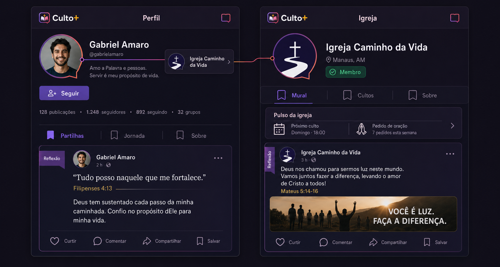
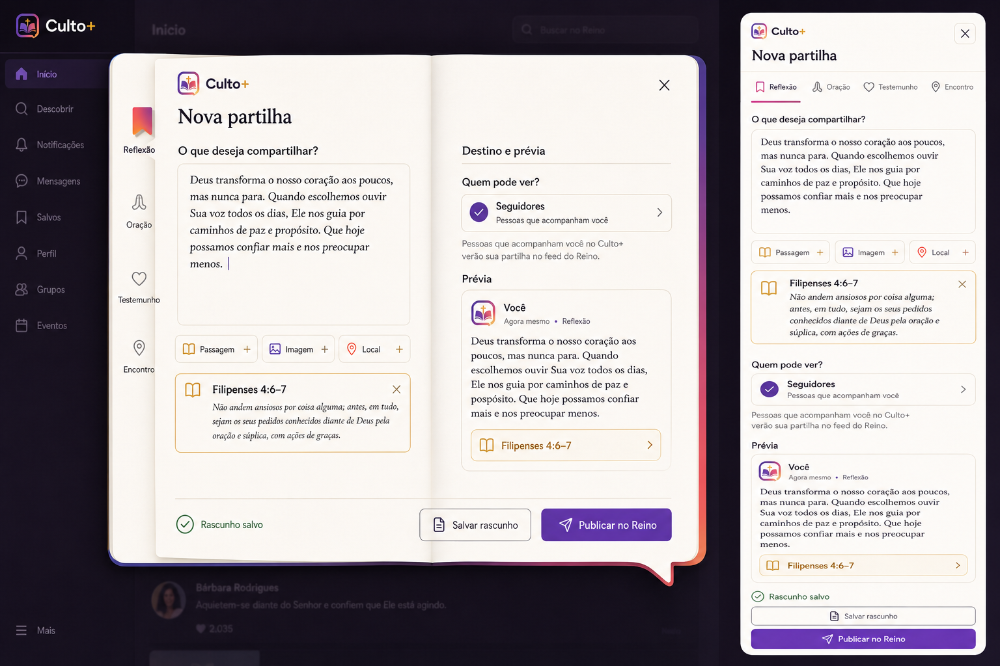

# Roadmap de refatoração UI/UX — Reino, feed, perfis, igrejas e publicação

**Status:** em execução — fundação funcional concluída; refatoração visual e consolidação das superfícies em andamento
**Data da auditoria:** 31/07/2026
**Escopo:** feed do Reino, publicação rápida, post individual, explorar, perfis, igrejas, grupos e integração com o Estúdio da Palavra
**Princípio central:** o conteúdo deve ser o protagonista; navegação, contexto e ações devem ajudá-lo, nunca competir com ele.

---

## 1. Objetivo

> **Implementação v2.8.8:** fundação funcional entregue: filtros de pertencimento, estados reais, launcher único, rascunho/audiência, tabs de igreja/grupo, post individual e persistência de salvar, ocultar, denunciar e comentar. A conclusão anterior foi corrigida: isso não representava todo o roadmap visual.
>
> **Complemento em execução:** Trama Viva aplicada com Fio da Comunhão, Pulso do Reino baseado em dados reais, rail “Seu caminho”, card editorial, Caderno de Partilha responsivo com escrita/destino/prévia, composer contextual em igreja e grupo e redirects canônicos. Perfis, busca unificada, notificações, oração/artigos, Estúdio da Palavra e hardening E2E continuam sendo acompanhados pelas fases 4–8; não devem ser marcados como concluídos sem seus gates.

Transformar a experiência social do BíbliaLM em um produto coerente, profissional e fácil de aprender, no qual uma pessoa consiga:

1. descobrir conteúdo relevante;
2. entender imediatamente quem publicou e para qual audiência;
3. navegar entre publicação, autor, igreja e grupo sem trocar de identidade visual ou se perder;
4. criar e publicar com segurança, sabendo onde o conteúdo aparecerá;
5. concluir todas as ações visíveis com feedback e persistência confiáveis;
6. usar o produto em celular, desktop, teclado, leitor de tela e zoom sem perda de funcionalidade.

Este roadmap não propõe apenas uma troca visual. A auditoria encontrou inconsistências funcionais, arquiteturais e de acessibilidade que precisam ser resolvidas antes de considerar a experiência realmente simples.

---

## 2. Resultado esperado

Ao final da refatoração, o Reino terá:

- um único shell e uma única gramática visual entre feed, post, perfis, igrejas e grupos;
- rotas canônicas e aliases previsíveis;
- um card de publicação com o mesmo comportamento em qualquer página;
- um fluxo de publicação rápida curto, acessível, recuperável e explícito quanto à audiência;
- perfis e igrejas centrados nas publicações, com informações institucionais em segundo nível;
- estados consistentes de carregamento, vazio, erro, offline, sucesso e permissão;
- métricas de usabilidade e qualidade acompanhadas antes e depois da migração;
- cobertura automatizada das jornadas reais, e não apenas de classes CSS ou presença de texto.

---

## 3. Diagnóstico da experiência atual

### 3.1 O que já é uma boa base

- O feed possui identidade própria do Reino e se comporta bem, sem overflow horizontal, nos tamanhos auditados de 390 e 1280 px.
- O serviço central de publicação (`kingdomPublishingService`) concentra contrato, audiência e envio; ele deve ser preservado.
- O modelo de publicação já contempla público, seguidores, igreja, grupo e privado.
- O Estúdio da Palavra já possui recursos importantes de conteúdo longo, como recuperação de rascunho, autosave, prévia e publicação.
- Existem tokens por módulo, componentes de post reutilizados e políticas RLS para publicações e curtidas.
- A listagem de igrejas e a busca do Explorar já permitem chegar a entidades reais.

### 3.2 Problemas funcionais prioritários

| Prioridade | Problema verificado | Impacto para a pessoa usuária | Evidência principal |
|---|---|---|---|
| P0 | Feed, Home e superfícies de intercessão enviam o estado antigo ao persistir curtida/oração | A interface parece atualizar, mas o estado salvo pode ficar invertido após recarregar | `SocialFeedPage.tsx`, `Inicio03.tsx`, `HomeDashboard.tsx`, páginas de igreja/grupo/oração e `services/supabase.ts` |
| P0 | “Salvar” aparece no card, mas não é tratado pelo feed | Controle visível sem resultado; quebra de confiança | `FeedPostCard.tsx` e `SocialFeedPage.tsx` |
| P0 | O mesmo PostCard mostra ações sem implementação em perfil e igreja | Comentário, compartilhamento ou salvamento podem não fazer nada | `PublicUserProfilePage.tsx` e `ChurchProfilePage.tsx` |
| P0 | O link do autor no feed aponta para um perfil protegido | Visitantes anônimos chegam a login/estado vazio em vez do perfil público | `/social/u/[username]` versus `/u/[username]` |
| P0 | O post individual não oferece a experiência completa de comentários e ações | A navegação interrompe a conversa iniciada no feed | `views/social/PostViewPage.tsx` |
| P0 | Existem destinos inválidos ou semanticamente errados | “Ir para o Feed”, igreja não encontrada, seguidores e líderes podem levar à página errada | `PostViewPage.tsx`, `ChurchProfilePage.tsx`, `PublicUserProfilePage.tsx` |
| P0 | “Cultos” parece uma aba, mas abre um modal | O modelo mental da navegação não corresponde ao comportamento | `ChurchProfilePage.tsx` |
| P0 | O mural da igreja conecta exclusão de post a um handler de pedido de oração | Uma ação destrutiva pode operar sobre a entidade errada | `ChurchProfilePage.tsx` |
| P0 | O estado efêmero de navegação é global e pode ser consumido pela página de origem | Retorno, destaque de post criado e handoff entre ferramentas são intermitentes | `utils/router.tsx` |
| P0 | Vínculo e papéis de igreja usam fluxos divergentes | Selecionar, trocar ou remover igreja pode não sincronizar membership; criação pode conceder gestão indevida | `CompleteProfilePage.tsx` e `services/supabase.ts` |
| P0 | Audiência, comentários e estudos privados possuem lacunas de autorização a confirmar/corrigir | Conteúdo restrito pode não herdar a mesma proteção em todas as tabelas/RPCs | migrations de posts/likes/Studio e script de comentários |
| P0 | Existem credenciais/configurações sensíveis versionadas | Bloqueia release seguro até revogação, rotação e remoção do histórico aplicável | `constants.ts` e scripts locais; valores não reproduzidos neste documento |
| P1 | Falha/resultado vazio do feed pode ser substituído silenciosamente por mocks | Conteúdo artificial pode mascarar indisponibilidade de produção | `SocialFeedPage.tsx` |
| P1 | A busca carrega conjuntos públicos inteiros no cliente a cada consulta | Custo, latência, corrida de respostas e piora progressiva com o crescimento | `views/ExplorePage.tsx` |
| P1 | Entrar em uma igreja não diferencia claramente visualizar, vincular, trocar ou sair | Ação sensível pode ser entendida como simples visita | `views/public/ChurchesListPage.tsx` |
| P1 | A feature flag do feed retorna antes de hooks declarados depois | Alterar o flag em runtime pode quebrar a ordem dos hooks | `SocialFeedPage.tsx` |

### 3.3 Problemas de arquitetura da experiência

- Somente `/social`, `/social/igrejas` e `/social/explore` usam o shell social. Ao abrir perfil, igreja, grupo ou post, a pessoa troca de cabeçalho, navegação e identidade.
- Há três endereços para perfil (`/u/:username`, `/social/u/:username` e `/:username`) com autenticação e tema diferentes.
- Igrejas e grupos também possuem caminhos duplicados.
- `/perfil` e `/minha-conta` apresentam responsabilidades sobrepostas; identidade pública e configurações privadas não estão claramente separadas.
- Feed, perfil e igreja reutilizam o visual do post, mas não um contrato único para capacidades, estado otimista e erros.
- Os aliases de grupo possuem contratos de autenticação opostos; a autorização precisa depender do conteúdo/grupo, não do endereço usado.
- O feed possui três gatilhos concorrentes para publicar: CTA do hero, campo de atalho e botão flutuante.
- Cards promocionais inseridos por frequência fixa interrompem a sequência editorial e reduzem o foco no conteúdo das pessoas.
- O contrato documentado descreve feed cronológico, enquanto o código aplica ranking por relacionamento, recência e engajamento. A pessoa precisa escolher entre **Para você**, **Seguindo** e **Recentes**, ou o produto deve declarar uma regra única.

### 3.4 Problemas visuais e responsivos

- O Reino alterna roxo, ouro bíblico, azul, verde e cores locais sem uma regra semântica clara.
- O shell duplica cores em vez de consumir uma única fonte de tokens.
- Pesos tipográficos de 600 a 900 são achatados para 500, enfraquecendo a hierarquia.
- Há textos persistentes de 8–10 px, inadequados para leitura e acessibilidade.
- Perfis usam uma grande capa decorativa vazia; igrejas colocam capa, institucional e agenda antes do mural.
- O cabeçalho da igreja usa três colunas comprimidas no celular, fazendo nome e metadados quebrarem excessivamente.
- A barra de progresso do feed assume sidebar de 256 px mesmo quando o menu está compacto em 84 px.
- Existem duas lógicas de navegação inferior, com estados ativos incompletos em aliases e páginas detalhadas.

### 3.5 Acessibilidade

Bloqueadores encontrados:

- zoom do navegador desabilitado por `maximumScale: 1` e `userScalable: false`;
- ausência de skip link;
- ausência de tratamento global para `prefers-reduced-motion`;
- composer, comentários e modais compartilhados sem semântica de diálogo, foco preso, Escape e devolução do foco;
- tabs sem `tablist`, `tab`, `aria-selected` e painel associado;
- cards clicáveis implementados como `div`, inacessíveis ao teclado;
- curtir/salvar sem `aria-pressed` e menus sem `aria-expanded`;
- alvos interativos abaixo de 44 × 44 px;
- `<main>` aninhado em algumas páginas;
- contrastes insuficientes, como ouro bíblico sobre branco (`2,46:1`), cinza 400 sobre branco (`2,54:1`) e esmeralda 600 sobre branco (`3,77:1`).

### 3.6 Integridade, permissão e segurança que condicionam a UX

Estes pontos não são “trabalho de backend separado”: a interface só pode prometer audiência, vínculo e sucesso se o servidor aplicar o mesmo contrato.

- Insert de post precisa validar membership/permissão de igreja ou grupo e derivar a identidade do autor do usuário autenticado.
- A RPC de curtida precisa confirmar que a pessoa pode visualizar o post antes de aceitar a interação.
- Comentários devem herdar `can_view_post`; uma policy pública independente do post é incompatível com audiência privada.
- O fallback que remove campos de um payload até aceitar um schema legado deve falhar fechado quando os campos removidos controlarem privacidade ou destino.
- `public_studies` precisa aplicar a visibilidade selecionada; `status = published` não equivale necessariamente a “público para todos”.
- Update/publish deve confirmar que uma linha autorizada foi realmente alterada antes de mostrar sucesso.
- A criação/seleção/saída de igreja deve passar por uma única operação transacional que sincronize perfil e membership, sem conceder papel operacional automaticamente.
- Controles de logo, liderança, cultos, grupos e gestão devem ser derivados de capabilities por papel e escopo da igreja, não de assinatura ou simples membership.
- Configurações sensíveis encontradas no código precisam ser revogadas/rotacionadas e movidas para armazenamento apropriado antes de qualquer release.

### 3.7 Regras de igreja e grupo auditadas no produto existente

Esta auditoria diferencia três relações que não podem ser tratadas como sinônimos:

1. **Seguir a página da igreja** é uma relação social leve e reversível, armazenada em `church_followers`;
2. **Ser membro da igreja** é um vínculo explícito, armazenado em `memberships`;
3. **Ter papel operacional** é uma autorização contextual, armazenada em `church_member_roles`, com igreja, papel, status e escopo.

Invariantes de produto:

- seguir não torna a pessoa membro e não concede acesso ou gestão;
- tornar-se membro não deve seguir a página automaticamente nem deixar de segui-la ao sair, salvo escolha explícita da pessoa;
- membership simples nunca concede edição de identidade, liderança, cultos, grupos ou gestão;
- perfil geral, assinatura, selo ou plano comercial não substituem papel operacional da igreja;
- criar um grupo raiz ou subgrupo exige papel operacional **ativo** de `pastor` ou `leader`, vínculo com a **mesma igreja** e escopo compatível;
- `church_manager`, `volunteer`, membro comum, pastor geral sem vínculo e líder de outra igreja não criam grupo apenas por esse estado;
- um papel pausado ou revogado deixa de autorizar novas mutações imediatamente;
- o grupo pertence a uma igreja, possui página própria e preserva o caminho navegável igreja → grupo → subgrupo;
- conteúdo, lista de membros, convites e métricas de grupo privado devem ser protegidos no banco, não apenas ocultados na interface.

Matriz normativa mínima:

| Estado da pessoa | Seguir/desseguir | Tornar-se membro | Ver conteúdo público | Entrar em grupo | Criar grupo/subgrupo | Gerir conteúdo/grupo |
|---|---:|---:|---:|---:|---:|---:|
| Visitante anônimo | login | login | sim | login | não | não |
| Autenticado sem vínculo | sim | sim, com confirmação | sim | conforme regra do grupo | não | não |
| Seguidor | sim | ação independente | sim | conforme membership/privacidade | não | não |
| Membro simples | independente | trocar/sair | sim e conteúdo de membros permitido | sim, quando elegível | **não** | somente próprio conteúdo permitido |
| Líder ativo da mesma igreja | independente | vínculo obrigatório | sim | sim | **sim, dentro do escopo** | escopo recebido |
| Pastor ativo da mesma igreja | independente | vínculo obrigatório | sim | sim | **sim** | escopo pastoral autorizado |

Para `leader`, a implementação deve resolver escopo no servidor: escopo `church` pode criar grupo raiz; escopo `group` só pode criar subgrupo sob o `scope_id`. Exceções internas de plataforma, se existirem, não aparecem como regra comum da interface e exigem trilha de auditoria.

#### Divergências confirmadas entre regra, UI e persistência

| Lacuna atual | Evidência local | Correção exigida |
|---|---|---|
| Estado inicial de “Seguir” consulta o relacionamento entre usuários | `ChurchProfilePage.tsx` chama `checkIsFollowing`; `isFollowingChurch` já existe em `services/supabase.ts` | usar a relação de igreja, testar reload e manter contadores separados |
| “Criar Grupo” aparece para qualquer membro | `ChurchProfilePage.tsx` condiciona o botão apenas a `isMember` | derivar `canCreateChurchGroup` de papel ativo, igreja e escopo |
| Qualquer autenticado pode inserir em `cells` nos scripts locais | policy de `scripts/create_churches.sql` valida apenas `created_by = auth.uid()` | migration/RLS deve exigir pastor ou líder ativo da mesma igreja |
| Membro do grupo pode criar subgrupo | `CellForumPage.tsx` usa `isCreator || isMyGroup` | aplicar a mesma capability de criação e validar o grupo pai no servidor |
| Líder pode ser pesquisado fora da igreja | buscas da criação usam o diretório global | listar somente pessoas elegíveis e revalidar membership/papel no submit |
| Qualquer membro da igreja pode convidar para grupo privado | policy e RPC de `create_group_access_invites.sql` usam apenas membership | restringir convite a capability explícita do grupo |
| Convite pendente libera o mural privado no cliente | `canViewGroupFeed` e seu teste aceitam `status = pending` | por padrão, mostrar convite e resumo; liberar conteúdo somente após aceite, salvo decisão formal contrária |
| Grupos, memberships e pedidos/mensagens possuem leitura ampla nos scripts locais | policies `using (true)` em `cells`, `memberships` e `prayer_requests` | herdar privacidade no RLS e testar acesso direto à Data API |
| Grupo privado ainda recebe “Participar” para qualquer membro da igreja | card da igreja não diferencia entrada pública de acesso por convite | mostrar “Solicitar acesso”, “Aceitar convite” ou estado bloqueado conforme regra |
| O mesmo grupo tem alias público e protegido | `/grupo/[cellSlug]` usa `ProtectedRoute`; `/social/grupo/[cellSlug]` não | uma rota canônica e acesso decidido pela privacidade, não pelo alias |
| URLs alternam ID e slug | cards e convites navegam por IDs apesar de `[cellSlug]` | adotar slug canônico, mantendo redirect seguro de IDs antigos |
| Membership possui um único `cell_id`, mas serviços falam em grupos no plural | `memberships.user_id` é chave primária; `getUserGroups` retorna coleção | decidir um grupo principal ou criar `group_memberships` para múltiplos vínculos |
| Aceite de convite pode marcar sucesso sem criar vínculo | RPC usa `on conflict do nothing` e depois aceita o convite | operação atômica, com expiração, idempotência e confirmação do vínculo |
| Controles de logo, liderança e Culto+ usam membership/assinatura ampla | página da igreja expõe ações por `isMember` ou Gold | substituir por capabilities específicas da mesma igreja |
| Gestão e exclusão de grupo mudam conforme a tela | creator/líder/admin e limite de 20 dias divergem entre UI e RLS | um único contrato de capability e lifecycle, aplicado no servidor |
| Mural do grupo usa `prayer_requests`, não o Post canônico | página própria lê/cria pedidos e não consulta posts `visibility = group` | separar publicação, oração e comentário; reutilizar o controlador canônico de post |
| Sair/trocar de igreja não encerra papéis e designações | fluxo remove membership/perfil, mas não trata roles/equipes/atribuições | transação com revogação/pausa, impacto explicado e auditoria |
| Abrir igreja externa autenticado pode importá-la | listagem resolve membership antes de apenas visualizar | separar preview, importação, reivindicação, verificação e vínculo |

As tabelas e policies acima estão sobretudo em `scripts/`, não em migrations canônicas. Portanto, são evidência do contrato local, mas o estado implantado ainda precisa ser inventariado no ambiente real. Nenhuma proteção deve ser considerada concluída até existir migration versionada e teste de RLS com contas de igrejas/grupos distintos.

### 3.8 Outras regras sociais que estavam subespecificadas

| Prioridade | Regra/lacuna | Consequência para o roadmap |
|---|---|---|
| P0 | `follows` de pessoas não possui contrato versionado de RLS completo no material local auditado | owner-only para criar/remover, impedir auto-follow e testar exposição da relação |
| P0 | Moderação pública não está completa de ponta a ponta | denúncia, bloqueio, ocultar autor/post, “não recomendar”, fila, resolução e auditoria viram gate de descoberta |
| P0 | Oração de igreja/grupo é apresentada como contextual, mas os scripts locais permitem leitura ampla | audiência e consentimento precisam ser aplicados por RLS, inclusive antes de qualquer processamento por IA |
| P0 | Culto+ ainda concede ações por membership em partes da UI/policy | criar, editar, colocar ao vivo e publicar como igreja exigem capability operacional própria |
| P1 | Seguir igreja hoje não altera claramente feed nem preferências de notificação | definir efeito em **Seguindo** e separar follow de alertas; sino só representa assinatura real |
| P1 | Perfil privado promete solicitação de follow sem modelo completo de `follow_requests` | implementar estados pendente/aceito/recusado ou retirar a promessa da UI |
| P1 | Listas e contadores de seguidores podem divergir da relação persistida | joins, contagem transacional/reconciliável, paginação e testes após reload |
| P1 | Like, comentário, follow e follow de igreja não possuem fluxo uniforme de notificação/deep link | central paginada, deduplicação, preferências e links para o objeto exato |
| P1 | Post oficial da igreja e post pessoal no mural compartilham identidade ambígua | separar ator, publisher institucional, destino, selo e auditoria |
| P1 | Não há regra explícita para conteúdo após sair/trocar de igreja ou grupo | definir retenção, audiência, edição, remoção e histórico sem reescrever autoria |
| P1 | Artigos/biblioteca podem perder autoria navegável e escopo correto | autor real, permalink, busca, paginação, salvar e filtro por audiência/igreja |

Esses itens não ampliam o visual por si só; evitam que a nova interface prometa relacionamento, privacidade, identidade institucional ou notificação que o produto ainda não consegue cumprir.

---

## 4. Princípios de produto e design

1. **Conteúdo primeiro.** Na primeira dobra devem aparecer contexto mínimo, criação compacta e conteúdo real.
2. **Uma ação, um resultado.** Nenhum controle deve ficar visível quando não puder executar sua função.
3. **Contexto persistente.** Autor, igreja, grupo, audiência e origem precisam continuar claros ao navegar.
4. **Progressive disclosure.** Informações institucionais e configurações avançadas ficam disponíveis sem ocupar a leitura principal.
5. **Audiência explícita.** Antes de publicar, a pessoa deve saber quem poderá ver o conteúdo.
6. **Padrões antes de páginas.** Shell, tabs, cabeçalhos, cards, diálogos e estados são produtos compartilhados.
7. **Acessibilidade por contrato.** Teclado, foco, zoom, contraste e leitor de tela não são uma etapa de acabamento.
8. **Mobile como contexto principal.** Ações essenciais devem funcionar com uma mão, sem duplicação de navegação.
9. **Falha honesta e recuperável.** Nunca trocar erro por mock, vazio por ausência definitiva ou perda de rascunho por fechamento silencioso.
10. **Evolução mensurável.** Cada fase possui eventos, critérios de aceite e regressões bloqueantes.

---

## 5. Arquitetura de informação e rotas

### 5.1 Mapa canônico proposto

| Função | Rota canônica | Aliases a redirecionar | Acesso |
|---|---|---|---|
| Feed | `/social` | — | público, com ações autenticadas protegidas |
| Explorar | `/social/explore` | futura compatibilidade com `/social/explorar` somente via redirect | público |
| Igrejas | `/social/igrejas` | `/social/church` | público |
| Post | `/p/:postId` | — | conforme audiência |
| Perfil público | `/u/:username` | `/social/u/:username`, `/:username` | público conforme privacidade |
| Meu perfil | `/perfil` | `/social/profile` | autenticado |
| Minha conta | `/minha-conta` | — | autenticado; somente conta e preferências |
| Igreja | `/igreja/:slug` | `/social/igreja/:slug` | público conforme visibilidade |
| Grupo | `/grupo/:slug` | `/social/grupo/:slug` | conforme visibilidade/membro |
| Publicação rápida | estado/modal acessível sobre a rota atual | CTA do feed, perfil ou igreja abre o mesmo fluxo contextual | autenticado |
| Estúdio da Palavra | `/criar-conteudo` | — | autenticado |

Regras:

- aliases devem usar redirect real para evitar conteúdo duplicado, divergência de autorização e histórico confuso;
- a política de acesso deve ser idêntica antes e depois do redirect, inclusive para grupos;
- links internos sempre apontam para a rota canônica;
- compartilhar e metadados SEO usam a rota canônica;
- o retorno preserva filtro, cursor e posição do feed quando tecnicamente possível;
- o catch-all `/:username` só deve permanecer durante uma janela de compatibilidade e não pode capturar rotas futuras.

### 5.2 Navegação global do Reino

| Área | Desktop | Mobile |
|---|---|---|
| Primária | sidebar compacta/expandida | bottom navigation única |
| Contexto da página | cabeçalho da coluna | app bar compacta |
| Filtros/tabs | abaixo do cabeçalho, sticky quando útil | barra horizontal sticky |
| Criar | um CTA persistente por viewport | um único launcher acessível |
| Voltar | histórico com fallback canônico | app bar; preserva o estado anterior |

Itens primários recomendados: **Feed**, **Explorar**, **Igrejas**, **Notificações** e **Perfil**. Criar é uma ação destacada, não mais um destino concorrente na barra.

---

## 6. Padrão de layout entre páginas

### 6.1 `KingdomShell`

O shell único deve envolver feed, post, explorar, perfis, igrejas e grupos.

- Mobile: app bar compacta; gutter de 16 px; conteúdo sem cartão externo desnecessário; uma bottom nav.
- Tablet: gutter de 24 px; coluna fluida; painéis secundários sob demanda.
- Desktop: sidebar de 84/256 px; área útil máxima de 1120 px.
- Feed/post: coluna editorial de 680–720 px e rail contextual opcional de 280–320 px.
- Perfil/igreja/grupo: `EntityHeader` compacto, tabs e corpo alinhado à mesma coluna editorial.
- Leitura longa: largura aproximada de 65–72 caracteres.
- Apenas o shell fornece `<main id="main-content">`.
- Barra de progresso e elementos fixos calculam sua posição a partir do layout, sem offsets mágicos.

### 6.2 Anatomia comum

```text
KingdomShell
├── Navegação global
├── KingdomPageHeader / EntityHeader
├── SegmentedTabs (quando necessário)
├── Feedback contextual (offline, erro, permissão)
├── Coluna de conteúdo
│   ├── ComposerLauncher contextual (quando autorizado)
│   ├── ContentCard / PostCard / listas
│   └── paginação e estado final
└── Rail contextual opcional
```

### 6.3 Escala visual

| Categoria | Escala proposta |
|---|---|
| Espaçamento | 4, 8, 12, 16, 24, 32, 48 px |
| Raios | 8, 12, 16, 24 px e `full` |
| Texto persistente mínimo | 12 px |
| Corpo | 14–16 px, conforme densidade |
| Títulos | 20–28 px |
| Pesos | 400, 500, 600 e 700 reais |
| Alvo interativo | mínimo 44 × 44 px |
| Contraste | 4,5:1 texto normal; 3:1 texto grande e componentes |
| Movimento | reduzido/desativado quando solicitado pelo sistema |

Uso de cor:

- superfícies e cards predominantemente neutros;
- roxo do Reino em navegação, seleção, foco e CTA primário;
- verde reservado a sucesso e ao contexto de Cultos;
- ouro reservado ao domínio bíblico, sem uso como texto normal de baixo contraste;
- vermelho reservado a erro, denúncia e ações destrutivas;
- estados nunca dependem apenas de cor.

### 6.4 Componentes compartilhados obrigatórios

- `KingdomShell`, `KingdomPageHeader`, `EntityHeader`, `EntityStats`;
- `AvatarLink`, `EntityLink`, `BreadcrumbBack`;
- `SegmentedTabs` acessível;
- `PostCard`, `PostActionBar`, `PostMenu`, `CommentThread`;
- `ContentCard`, `ComposerLauncher`, `PublicationComposer`, `AudiencePicker`;
- primitives `Dialog`, `Sheet`, `Menu`, `IconButton`, `Switch`;
- `Skeleton`, `EmptyState`, `ErrorState`, `PermissionState`, `OfflineState`, `InlineFeedback`.

O `PostCard` deve receber capacidades explícitas, por exemplo `canLike`, `canComment`, `canShare`, `canSave`, `canModerate`. Uma ação indisponível deve estar ausente ou desabilitada com explicação — nunca renderizada sem controlador.

---

## 7. Experiência-alvo por página

### 7.1 Feed

Ordem recomendada:

1. cabeçalho curto com título e filtro atual;
2. launcher compacto de publicação;
3. filtros úteis: Para você, Seguindo, Minha igreja e Grupos;
4. sequência de posts;
5. recomendações contextuais apenas quando relevantes, identificadas e com limite de frequência.

Mudanças:

- reduzir hero e remover CTAs duplicados;
- não usar mock como fallback silencioso;
- separar claramente “feed vazio” de “falha ao carregar”;
- paginação por cursor, skeleton, retry e preservação de posição;
- ranking e inserções promocionais não podem interromper agressivamente a leitura;
- curtida, comentário, compartilhar e salvar usam estado otimista com rollback e persistem após recarga;
- menu do post inclui ocultar, denunciar e não recomendar quando aplicável;
- conteúdo parcial ou falha de uma fonte não deve apagar as demais.

### 7.2 Post individual

- reutilizar exatamente o mesmo `PostCard` e contrato de ações do feed;
- exibir comentários reais, composição de comentário, paginação e estados;
- retornar ao feed preservando contexto; fallback sempre para `/social`;
- mostrar audiência, origem e conteúdo relacionado sem distrair da conversa;
- aplicar autorização do servidor e explicar conteúdo removido, privado ou indisponível.

### 7.3 Perfil

Cabeçalho compacto:

- avatar, nome, username, bio curta, igreja e ação principal;
- contadores acionáveis e atualizados;
- capa opcional somente quando houver conteúdo real;
- tabs: **Publicações**, **Sobre** e, se permitido, **Coleções**.

Regras:

- perfil próprio usa `/perfil`; conta, segurança, aparência e assinatura ficam em `/minha-conta`;
- perfis públicos usam `/u/:username` para visitantes e autenticados;
- seguidores/seguindo devem usar links semânticos e usernames reais;
- seguir/deixar de seguir usa feedback otimista, rollback e estado de solicitação para perfil privado;
- igreja vinculada abre o perfil canônico da igreja;
- loading não pode parecer perfil vazio;
- estado privado, bloqueado, suspenso e inexistente deve ser específico.

### 7.4 Igreja

Cabeçalho responsivo:

- mobile empilha identidade e ações, sem três colunas comprimidas;
- mostra nome, local, vínculo da pessoa e duas ações independentes: **Seguir página** e **Sou membro**;
- ações de gestão aparecem somente com permissão.

Tabs propostas:

- **Mural**: conteúdo da igreja primeiro;
- **Cultos**: agenda e cultos, como página/tab real;
- **Grupos**: diretório de grupos vinculados, privacidade, liderança e estado de participação;
- **Sobre**: liderança, endereço, doutrina e contatos;
- **Membros**: tab condicional, apenas quando a política de privacidade permitir.

Regras:

- visualizar uma igreja externa não deve automaticamente importá-la ou vincular a pessoa;
- seguir/desseguir e ser/deixar de ser membro são controles separados, com estados, contadores e persistência próprios;
- seguir nunca concede acesso de membro ou papel operacional;
- “Sou membro” exige confirmação e explica efeito; depois do vínculo, **Membro** vira estado e “Trocar de igreja”/“Sair da igreja” ficam em menu explícito, não escondidos no mesmo botão;
- entrar, trocar ou sair não altera automaticamente o estado de seguidor; a pessoa escolhe se deseja continuar seguindo;
- se o modelo continuar permitindo uma única igreja, tentar entrar em outra abre confirmação de troca e enumera os impactos;
- saída/troca trata em transação membership, papéis, equipes, designações, grupo atual e convites pendentes, sem deixar autorização órfã;
- líderes usam identificador/username, nunca nome de exibição convertido em URL;
- editar logo, liderança, cultos, grupos, diretório e workspace pastoral depende de capability explícita por igreja e escopo;
- “Solicitar gestão” e “Abrir gestão” são ações diferentes; visitar ou possuir plano Gold não autoriza edição;
- mural compartilha o mesmo controlador de post do feed;
- agenda deixa a primeira dobra do mural e passa para a tab/rail apropriada;
- igreja inexistente volta para `/social/igrejas` ou busca, nunca rota ausente.

Estados que precisam existir no cabeçalho sem ambiguidade:

- visitante: **Seguir página** e **Sou membro** abrem login preservando a rota;
- autenticado sem relação: pode seguir e iniciar o vínculo de membro separadamente;
- seguidor: vê **Seguindo**, mas continua sem permissões de membro;
- membro: vê selo **Membro** e pode seguir ou não seguir de forma independente;
- pastor/líder ativo da mesma igreja: recebe somente as ações operacionais compatíveis com o escopo;
- papel pausado/revogado ou de outra igreja: não recebe controles operacionais.

### 7.5 Grupos vinculados à igreja e página própria

#### Descoberta dentro da igreja

- a tab **Grupos** lista apenas grupos raiz; subgrupos permanecem hierárquicos dentro do grupo pai;
- cada card mostra nome, resumo, líder validado, público/privado, quantidade confiável de membros e estado **Participando**, **Convite pendente**, **Solicitar acesso** ou **Entrar**;
- grupo público pode ser descoberto conforme a política da igreja; grupo privado expõe apenas metadados aprovados, nunca mural, membros ou ranking por acidente;
- “Criar grupo” só aparece para pastor/líder ativo da mesma igreja e seu backend revalida a capability;
- participar de grupo público não equivale a criar, liderar ou moderar;
- grupo privado não oferece entrada direta sem convite/aprovação quando essa for a regra escolhida.

#### Criação de grupo e subgrupo

O fluxo usa modal/sheet acessível e curto:

1. nome e propósito;
2. grupo pai, quando for subgrupo;
3. privacidade e explicação de quem poderá encontrar/ver;
4. líder selecionado somente entre pessoas elegíveis da mesma igreja;
5. revisão da igreja, escopo, privacidade e consequências;
6. sucesso com ação **Abrir página do grupo**.

Contrato obrigatório:

- capability `group.create` somente para papel `pastor` ou `leader` ativo, associado ao `church_id` do grupo;
- líder com escopo `group` cria apenas subgrupo descendente de seu `scope_id`; líder com escopo `church` e pastor autorizado podem criar grupo raiz;
- `created_by` não mantém poder vitalício se o papel for revogado; gestão deriva do papel/escopo atual;
- assinatura, tipo geral de perfil, membership simples, `volunteer` ou `church_manager` isolado não habilitam criação;
- nome/slug deve ser único no contexto definido e o servidor sempre deriva/valida igreja, autor, pai e líder;
- falha no envio de convites não desfaz silenciosamente o grupo: apresenta resultado parcial e retry seguro;
- a mesma regra vale para grupos e subgrupos em UI, serviço, RPC e RLS.

Capabilities recomendadas, sempre resolvidas com `church_id`, status e escopo:

| Capability | Membro do grupo | Líder ativo do grupo/igreja | Pastor ativo da igreja | Observação |
|---|---:|---:|---:|---|
| `group.view_public` | sim | sim | sim | visitante segue política pública |
| `group.view_private` | após vínculo aceito | conforme escopo | conforme escopo | convite pendente não libera mural por padrão |
| `group.post` | sim | sim | conforme escopo | autoria permanece pessoal, salvo publisher oficial autorizado |
| `group.create_root` | não | somente escopo `church` | sim | regra expressa de pastor/líder vinculado |
| `group.create_subgroup` | não | dentro de `scope_id` | sim | pai e igreja validados no servidor |
| `group.invite` | não por membership simples | grupo atribuído | conforme escopo | decisão final de produto ainda deve ser registrada |
| `group.edit` / `group.moderate` | não | grupo atribuído | conforme escopo | criador histórico não basta |
| `group.manage_members` | não | grupo atribuído | conforme escopo | remover/bloquear exige motivo e auditoria |
| `group.archive` | não | conforme regra aprovada | conforme regra aprovada | preferível a exclusão física |

O frontend consome essas capabilities prontas; não reconstrói autorização a partir de `isMember`, plano, nome do cargo ou comparação isolada com `createdBy`.

#### Página canônica do grupo

Rota: `/grupo/:slug`, com aliases legados redirecionados sem alterar a política de autenticação.

Cabeçalho:

- breadcrumb navegável **Igreja → Grupo → Subgrupo**;
- nome, propósito, igreja vinculada, líder, privacidade e estado da pessoa;
- ação principal contextual: entrar, solicitar acesso, aceitar/recusar convite, sair ou abrir gestão;
- dados sensíveis e ações nunca aparecem apenas por conhecer o slug.

Tabs:

- **Mural**: posts canônicos do grupo, com oração como tipo/ação explícita e não como substituto de post;
- **Sobre**: propósito, regras, liderança e privacidade;
- **Membros**: conforme visibilidade e capability;
- **Subgrupos**: hierarquia real e criação condicionada a `group.create`;
- **Moderação**: condicional para quem possui capability;
- **Indicadores/Ranking**: secundário e somente se houver valor pastoral claro, consentimento e política de privacidade.

Lifecycle obrigatório:

- entrar, solicitar acesso, convidar, aceitar, recusar, expirar, revogar, sair, trocar de grupo, remover e bloquear possuem estados e feedback próprios;
- convite pendente mostra convite e resumo; por padrão não libera o conteúdo privado antes do aceite;
- aceite é atômico e idempotente, verifica expiração e confirma o vínculo antes de marcar sucesso;
- a menção de alguém não gera convite privado sem comunicar a consequência antes da publicação;
- moderação inclui editar dados, gerir membros, moderar/denunciar conteúdo, arquivar e registrar auditoria;
- exclusão física não depende de uma regra apenas do cliente; preferir arquivamento recuperável e confirmação reforçada;
- sair/trocar explica o impacto em conteúdo, convites e acesso.

Decisão estrutural obrigatória antes da implementação:

- se cada membro tiver somente um grupo principal, a UI usa **Trocar de grupo** e confirma a substituição;
- se puder participar de vários, criar `group_memberships` e remover a dependência de um único `memberships.cell_id`/`profile.churchData.groupId`;
- o produto não pode continuar com UI plural sobre um modelo singular.

### 7.6 Explorar e listagens

- busca unificada com categorias Pessoas, Igrejas e Conteúdos;
- sugestões iniciais úteis antes da consulta;
- endpoint paginado/limitado e cancelamento de respostas antigas;
- cards implementados como links ou botões semânticos;
- filtros mantidos ao abrir um resultado e voltar;
- resultados vazios, falha e ausência de conexão são estados diferentes;
- criação de sala, seguir, entrar ou importar não pode estar escondida em um card inteiro clicável.

### 7.7 Oração e artigos

Mesmo quando não forem redesenhados integralmente na primeira onda, devem receber imediatamente:

- o `KingdomShell`;
- navegação ativa correta;
- cabeçalho e estados compartilhados;
- rotas canônicas;
- cards semânticos;
- contrato comum de permissões e retorno.

O redesenho específico entra após feed, perfis, igrejas e grupos porque depende das mesmas fundações.

---

## 8. Refatoração de “Criar conteúdo/publicação”

### 8.1 Separar os dois trabalhos da pessoa usuária

| Intenção | Experiência | Nome recomendado |
|---|---|---|
| Compartilhar algo breve no Reino | composer rápido e contextual | **Publicar no Reino** |
| Produzir material longo e estruturado | editor dedicado em `/criar-conteudo` | **Criar estudo — Estúdio da Palavra** |

Não unir os dois em um editor gigante. Eles devem compartilhar componentes de audiência, prévia, publicação e feedback, mas preservar níveis de complexidade diferentes.

### 8.2 Lacunas atuais confirmadas na publicação rápida

- anexar imagem altera o tipo semântico para `image`; oração/reflexão deixa de ser reconhecida como tal;
- verso, local, imagem e texto podem vazar ao trocar de tipo; fechar também não limpa/recupera o estado de forma previsível;
- a extensão `.webp` pode ser usada sem conversão real do arquivo;
- busca bíblica pode sofrer corrida de respostas e deixar loading preso;
- cross-post de grupo para igreja oferece uma opção que não envia corretamente o identificador da igreja;
- menções são resolvidas por carga ampla no cliente e recebem link genérico para `/social`, não para o permalink;
- validações podem falhar silenciosamente, e o erro útil do serviço é substituído por mensagem genérica;
- mídia não pode sobrescrever a taxonomia do conteúdo: tipo editorial e anexos devem ser campos independentes.

### 8.3 Fluxo da publicação rápida

1. **Escrever** — editor principal sempre visível, com label, ajuda e contador quando necessário.
2. **Enriquecer** — passagem bíblica, imagem e localização como anexos opcionais.
3. **Definir audiência** — texto explícito, descrição do alcance e destino contextual.
4. **Revisar** — prévia compacta de como o post aparecerá.
5. **Publicar** — confirmação de envio, sucesso com link e recuperação em caso de falha.

O fluxo pode continuar em uma única superfície, sem wizard obrigatório, desde que esses cinco momentos estejam visualmente claros.

### 8.4 Requisitos do `PublicationComposer`

- diálogo/folha com nome acessível, foco preso, Escape, restauração de foco e comportamento mobile;
- rascunho automático local/servidor com status “Salvando”, “Salvo” e “Falha ao salvar”;
- confirmação antes de descartar alterações;
- sugestões inserem no cursor ou permitem substituir mediante confirmação;
- busca bíblica possui loading, nenhum resultado, erro, cancelamento de respostas antigas e referência selecionada removível;
- upload valida formato, tamanho e dimensões; mostra processamento, erro, remoção e campo de texto alternativo;
- localização só é solicitada após “Usar minha localização”; sempre há busca/manual e tratamento de negação;
- audiência usa radio group/lista textual, não uma grade de ícones sem rótulo;
- opções indisponíveis explicam como habilitar, por exemplo vincular-se a uma igreja ou selecionar um grupo;
- padrão de audiência deve ser definido por contexto e risco, não automaticamente o maior alcance sem explicação;
- publicar é idempotente, impede duplo envio e mantém o rascunho quando falhar;
- mensagens técnicas são mapeadas para orientação acionável;
- sucesso oferece “Ver publicação”, “Criar outra” e retorno ao contexto.

### 8.5 Audiência contextual

| Origem do composer | Padrão sugerido | Regra |
|---|---|---|
| Feed geral | última audiência válida ou escolha explícita | mostrar alcance antes de publicar |
| Perfil próprio | última audiência válida | não assumir público sem sinalização |
| Igreja | igreja atual | somente se a pessoa tiver permissão; exibir nome da igreja |
| Grupo | grupo atual | somente membros autorizados |
| Estúdio da Palavra | visibilidade escolhida na etapa de publicar | compartilhar no feed é uma decisão explícita |

Destino e identidade editorial são campos diferentes:

- uma pessoa autorizada pode publicar **no mural da igreja** sem publicar **em nome da igreja**;
- publicação oficial da igreja exige capability própria, identidade visual verificável, autor responsável, log de auditoria e regras de edição/revogação;
- publicação de membro mantém a pessoa como autora e identifica a igreja/grupo apenas como destino;
- sair da igreja ou grupo não pode alterar retroativamente a autoria; retenção, visibilidade e permissão de edição precisam de regra explícita;
- seguir a igreja deve ter efeito social verificável. A recomendação é incluir publicações públicas oficiais no feed **Seguindo**; alertas por push/e-mail/sino são preferência separada e nunca devem ser prometidos por um ícone sem entrega real.

### 8.6 Estúdio da Palavra

Preservar os recursos existentes de conteúdo longo e refinar a integração:

- entrada com nomenclatura clara para não ser confundida com post rápido;
- status de rascunho sempre visível;
- etapas **Criar**, **Prévia** e **Publicar** consistentes no desktop e mobile;
- `AudiencePicker` e resumo da publicação compartilhados com o composer;
- prévia real do estudo e, separadamente, do card que aparecerá no feed;
- confirmação se o estudo será apenas publicado, compartilhado no Reino ou ambos;
- link de sucesso para estudo e post gerado;
- falha no compartilhamento social não pode invalidar um estudo já publicado; mostrar recuperação parcial.

Débitos a resolver durante essa integração:

- dividir carregamento, salvar, publicar e compartilhar do componente principal, hoje excessivamente monolítico;
- renderizar loading, erro e não encontrado em vez de cair em editor vazio;
- oferecer login com handoff do rascunho para visitante, nunca retorno silencioso de “Salvar”;
- serializar autosaves e cancelar resposta antiga para que uma gravação lenta não substitua uma nova;
- mostrar usuários/grupos por nome, avatar e chips, sem pedir IDs internos separados por vírgula;
- salvar a audiência atualmente selecionada de forma atômica antes de compartilhar;
- distinguir publicação do conteúdo, recompensa/Mana e cross-post: a falha de uma etapa posterior não pode negar um sucesso já confirmado;
- confirmar alteração de linha e tratar conflito real, em vez de atribuir todo erro a slug;
- manter paridade funcional mobile para ferramentas essenciais e tornar status de autosave sempre perceptível;
- validar uploads, autoria e alt; não usar caminhos globais baseados apenas em timestamp;
- unificar o contrato de entitlement entre cliente e API para recursos de IA.

### 8.7 Taxonomia de conteúdo

Os tipos declarados incluem `image`, `prayer`, `reflection`, `devotional`, `quiz`, `feeling`, `checkin`, `cell_meeting`, `podcast`, `study` e `room`. O roadmap deve, antes de consolidar renderers:

1. mapear produtor, renderer, editor, permissões e destino para cada tipo;
2. decidir se `image` é tipo ou apenas anexo — a recomendação é tratá-lo como anexo;
3. implementar ou retirar da interface tipos sem produtor real; `cell_meeting` aparece somente em mock e não foi identificado produtor de `podcast`;
4. garantir que permalink, feed, perfil e igreja preservem a mesma semântica e CTA de cada tipo;
5. cobrir a matriz tipo × audiência × contexto nos testes.

---

## 9. Estados e feedback obrigatórios

Toda tela e ação assíncrona deve especificar:

| Estado | Comportamento mínimo |
|---|---|
| Inicial | conteúdo ou orientação clara; sem tela branca |
| Loading | skeleton compatível com o layout final; rótulo para tecnologia assistiva |
| Vazio | explica por que está vazio e oferece próxima ação relevante |
| Busca sem resultado | mantém consulta, sugere ajuste e não confunde com erro |
| Erro | mensagem contextual, retry e preservação do conteúdo/rascunho |
| Offline | informa limitação; evita prometer persistência concluída |
| Sucesso | feedback breve, link para o resultado quando útil |
| Otimista | atualização imediata, bloqueio de repetição e rollback em falha |
| Sem permissão | explica o requisito; ação inacessível não parece quebrada |
| Conteúdo removido/privado | estado específico sem revelar dados indevidos |
| Parcial | mantém o que carregou e identifica somente a seção indisponível |

---

## 10. Contratos técnicos a preservar ou criar

### Preservar

- `kingdomPublishingService` como fronteira central de publicação;
- regras de audiência e autorização no servidor/RLS;
- deduplicação/idempotência já prevista na persistência;
- módulos de conteúdo longo do Estúdio, migrando por composição e não reescrita total.

### Criar/consolidar

- `PostInteractionController` único para like, comentário, compartilhar, salvar e moderação;
- resposta normalizada das mutações com estado desejado, contadores e erro recuperável;
- capabilities vindas de autorização real, não inferidas apenas na interface;
- paginação por cursor para feed, comentários, seguidores, membros e busca;
- store de navegação do feed para cursor, filtros e posição;
- contrato de analytics sem conteúdo sensível;
- feature flags por fase e telemetria de erro por fluxo;
- inventário verificável de migrations/RLS para comentários e salvamentos antes de liberar essas ações.
- transporte de estado por URL/store de destino, sem um único evento global consumível por qualquer `useLocation` montado.

Segurança:

- esconder um botão não substitui autorização no servidor;
- toda consulta deve respeitar audiência, igreja, grupo e bloqueios;
- mídia deve validar tipo/tamanho também no servidor;
- analytics não deve registrar texto da publicação, oração, localização precisa ou conteúdo pastoral sensível;
- antes de implementar comentários/salvamentos, confirmar schema, índices e RLS no ambiente real. A auditoria local não localizou evidência suficiente para declarar esse contrato completo.
- segredos versionados devem ser revogados e rotacionados; removê-los apenas do arquivo atual não invalida credenciais já expostas.

---

## 11. Roadmap de execução

As fases são ordenadas por dependência e risco. Uma fase só avança quando seus gates forem atendidos.

### Fase 0 — baseline e estabilização funcional (P0)

**Objetivo:** interromper quebras de confiança antes do redesenho.

Entregas:

- inventariar o schema, funções, triggers e policies do ambiente implantado e transformar scripts manuais de igreja/grupo em migrations canônicas;
- publicar a matriz `follow`, `membership` e `church_member_roles`, com capabilities nominais para igreja, culto, grupo, convite, membro e moderação;
- implementar `group.create` para somente pastor/líder ativo da mesma igreja e escopo compatível, em UI, serviço/RPC e RLS;
- aplicar a mesma regra a subgrupos e restringir seleção de líder a pessoas elegíveis da igreja;
- corrigir RLS de grupos privados, membros, convites e pedidos/mensagens de igreja/grupo; guard de cliente não conta como proteção;
- tornar convite/aceite atômico, idempotente, expirável e revogável;
- corrigir a leitura inicial de “Seguir igreja” e definir seu efeito real no feed, separando alertas de seguir;
- proteger relações de follow contra leitura/mutação indevida, auto-follow e contadores divergentes;
- corrigir persistência de curtida;
- implementar salvar ou remover temporariamente a ação;
- centralizar ações do post e impedir handlers parciais;
- corrigir links de autor, feed, igreja não encontrada, seguidores e líderes;
- corrigir o handler destrutivo do mural e o estado de navegação entre ferramentas;
- tornar comentários funcionais no post individual;
- transformar Cultos em tab real;
- distinguir erro, vazio e mock; mocks somente em ambiente de desenvolvimento identificado;
- remover retorno condicional antes dos hooks;
- unificar join/leave/troca de igreja e grupo, tratar papéis/designações e impedir concessão implícita de papel;
- corrigir autorização de posts, likes, comentários e estudos privados, incluindo confirmação de linha afetada;
- corrigir cross-post grupo → igreja;
- separar publicação oficial da igreja de publicação pessoal destinada ao mural e auditar autoria delegada;
- implementar denúncia, bloqueio/ocultação e moderação mínima antes de ampliar descoberta pública;
- revogar/rotacionar credenciais expostas e remover configurações sensíveis do cliente/repositório;
- registrar eventos baseline das jornadas críticas;
- documentar rotas canônicas e mapa de redirects.

Gate:

- todas as ações visíveis funcionam e persistem após recarga;
- nenhuma rota crítica leva a destino inexistente ou login indevido para conteúdo público;
- testes de comportamento cobrem guest e autenticado;
- usuário sem membership/capability não publica nem gerencia outra igreja/grupo;
- membro comum, voluntário, gestor sem papel pastoral e líder de outra igreja não criam grupo/subgrupo;
- pastor/líder ativo da mesma igreja cria somente dentro do escopo permitido;
- conteúdo e membros de grupo privado não são legíveis por chamada direta fora da audiência;
- seguir, ser membro e possuir papel operacional continuam independentes após reload, troca e saída;
- comentário e interação não contornam a audiência do post;
- conteúdo privado do Estúdio não é legível por outra conta.

### Fase 1 — fundação visual, acessível e de navegação

**Objetivo:** construir o contrato comum antes de migrar páginas.

Entregas:

- tokens semânticos de cor, tipografia, espaçamento, raio, sombra, foco e estados;
- pesos tipográficos reais e remoção de textos abaixo do mínimo;
- primitives acessíveis de Dialog, Sheet, Menu, Tabs e IconButton;
- skip link, zoom habilitado e reduced motion;
- `KingdomShell`, navegação única e cálculo responsivo sem offsets mágicos;
- `EntityHeader`, estados de página e documentação dos componentes;
- redirects de aliases e links internos canônicos.

Gate:

- Storybook/sandbox ou rota de catálogo cobre estados e temas;
- Axe sem violações críticas nos primitives;
- teclado e foco aprovados;
- shell validado em 320, 375, 768, 1024, 1280 e 1440 px.

### Fase 2 — feed e post individual

**Objetivo:** tornar consumo e interação consistentes e focados.

Entregas:

- migrar feed para o shell;
- reduzir para um launcher de publicação por viewport;
- `PostCard` e `PostActionBar` canônicos;
- paginação por cursor, skeleton, retry e preservação de posição;
- reduzir hero e controlar recomendações/promos por relevância;
- post individual com comentários e as mesmas ações;
- menu de moderação e feedback otimista com rollback;
- estados offline e parcial.

Gate:

- abrir post/autor e voltar mantém filtro e posição;
- like/save/comentário funcionam no feed e no detalhe;
- LCP, INP e CLS dentro das metas na amostra definida.

### Fase 3 — publicação rápida

**Objetivo:** fazer a pessoa publicar com clareza e sem perder trabalho.

Entregas:

- novo `PublicationComposer`;
- rascunho e confirmação de descarte;
- passagem, imagem e localização como anexos robustos;
- `AudiencePicker` textual e contextual;
- prévia, idempotência, estados de envio e sucesso navegável;
- uso do mesmo fluxo no feed, perfil, igreja e grupo respeitando capabilities.

Gate:

- publicar somente texto, passagem, imagem e localização em mobile/desktop;
- negação de localização e falha de upload são recuperáveis;
- audiência correta confirmada no backend após recarga;
- fluxo completo por teclado e leitor de tela.

### Fase 4 — perfis

**Objetivo:** consolidar identidade, relacionamento e conteúdo do autor.

Entregas:

- migrar perfil público e próprio para shell/componentes comuns;
- separar `/perfil` de `/minha-conta`;
- cabeçalho compacto e publicações na primeira dobra;
- seguir, seguidores e seguindo funcionais, paginados e reconciliados após reload;
- solicitação de follow para perfil privado com estados pendente/aceito/recusado, ou remoção desse affordance até existir contrato completo;
- RLS owner-only para mutações de follow, bloqueio de auto-follow e deep links de notificação;
- privacidade, bloqueio, loading, vazio e erro específicos;
- igreja e posts com links canônicos.

Gate:

- visitante percorre feed → autor → igreja → voltar sem login indevido ou troca de shell;
- ações e contadores persistem;
- perfil privado nunca é apresentado como inexistente e nenhum follow pendente libera conteúdo;
- aliases convergem para a mesma página.

### Fase 5 — igrejas e grupos

**Objetivo:** priorizar conteúdo e tornar relacionamento, pertencimento e permissão inequívocos.

Entregas:

- header responsivo com **Seguir página** e membership independentes;
- estados visitante, seguidor, membro, convidado, pastor, líder, papel pausado e sem permissão;
- tabs Mural, Cultos, Grupos, Sobre e Membros condicional;
- mural com controlador canônico de post;
- publicação oficial diferenciada da publicação pessoal no mural;
- visualizar, seguir, ser membro, trocar e sair como ações distintas;
- transação de saída/troca cobrindo papéis, equipes, designações, grupo e convites;
- liderança com identificadores válidos;
- “Solicitar gestão” separado de “Abrir gestão”;
- capabilities específicas para logo, liderança, cultos, diretório, mural e gestão;
- diretório de grupos raiz com estados de participação e privacidade;
- criação de grupo/subgrupo somente por pastor/líder ativo da mesma igreja e escopo;
- página própria do grupo com breadcrumb, Mural, Sobre, Membros, Subgrupos e Moderação;
- feed canônico de grupo, preservando oração/intercessão como conteúdo/ação explícita;
- ciclo completo de convite, solicitação, aceite, recusa, expiração, revogação, entrada, troca, saída e remoção;
- decisão estrutural e migração para um grupo principal ou memberships múltiplos;
- contadores derivados de fonte confiável e privacidade de membros/ranking;
- gestão, denúncia, arquivamento e trilha de auditoria sem regras divergentes por tela.

Gate:

- nenhum vínculo é criado só por visualizar;
- seguir/desseguir não altera membership ou papel e produz o efeito de feed configurado;
- troca/saída exige confirmação e oferece recuperação quando aplicável;
- nenhum membro comum cria grupo, subgrupo, culto ou altera identidade/liderança;
- líder de outra igreja, fora do escopo ou com papel pausado/revogado recebe negação no servidor;
- grupo privado não vaza mural, membros, ranking, oração ou convite pela API;
- aliases do grupo convergem à mesma página e política;
- mural aparece na primeira dobra e todas as tabs são navegáveis por teclado;
- jornada igreja → grupo → subgrupo → igreja preserva contexto e funciona no mobile.

### Fase 6 — explorar, confiança e superfícies adjacentes

**Objetivo:** completar descoberta, segurança social e conteúdo adjacente sem reintroduzir padrões paralelos.

Entregas:

- busca paginada e categorizada;
- cancelamento/race control;
- cards semânticos e filtros persistentes;
- denúncia, bloqueio, ocultação, “não recomendar”, fila de moderação e estados de resolução/apelação;
- central de notificações paginada, deep links, deduplicação e preferências reais para pessoas, igrejas e grupos;
- oração com audiência global/igreja/grupo/privada, RLS, consentimento para IA, intercessão concorrente e moderação;
- artigos/biblioteca com autoria navegável, busca, paginação, salvar e audiência correta;
- Culto+ preservando OnePage pública, check-in, notas privadas, oração e post ligado, com criação/edição/live por papel correto;
- migração dessas superfícies para o shell;
- estados e navegação compartilhados.

Gate:

- busca permanece responsiva com volume realista;
- abrir e voltar conserva consulta/filtro;
- denúncia/bloqueio alteram imediatamente o conteúdo exibido e persistem após reload;
- notificações levam ao objeto correto e respeitam preferências;
- oração de igreja/grupo não é legível fora da audiência;
- nenhuma página do Reino troca de shell.

### Fase 7 — integração do Estúdio da Palavra

**Objetivo:** alinhar conteúdo longo ao sistema de publicação sem tornar o composer complexo.

Entregas:

- nomenclatura e entradas diferenciadas;
- `AudiencePicker` e Publish Summary compartilhados;
- prévia do estudo e do card do feed;
- publicação parcial recuperável;
- estados de rascunho e sucesso consistentes.

Gate:

- a pessoa entende, em teste de usabilidade, a diferença entre post e estudo sem ajuda;
- falhar ao compartilhar no feed não perde o estudo publicado;
- links de resultado levam ao conteúdo correto.

### Fase 8 — hardening, rollout e remoção do legado

**Objetivo:** validar qualidade e remover caminhos paralelos com segurança.

Entregas:

- testes E2E autenticados/anônimos e auditoria Axe;
- validação de leitor de tela, teclado, zoom 200%, claro/escuro e conexão instável;
- performance, imagens responsivas e virtualização onde comprovadamente necessária;
- rollout por feature flag, monitoramento e plano de rollback;
- remoção de shells, handlers e aliases legados após janela de compatibilidade;
- atualização dos roadmaps e arquitetura como fonte de verdade.

Gate:

- critérios globais de aceite atendidos;
- métricas não regrediram;
- zero erros P0/P1 abertos no escopo;
- logs não apresentam aumento de falhas de autorização/publicação.

---

## 12. Sequência sugerida de sprints

| Sprint | Foco | Dependência |
|---|---|---|
| 0 | baseline, bugs P0 e testes comportamentais | nenhuma |
| 1 | tokens, primitives acessíveis, rotas e shell | Sprint 0 |
| 2 | feed, PostCard e post individual | Sprint 1 |
| 3 | publicação rápida | Sprints 1–2 |
| 4 | perfis e conta | Sprints 1–3 |
| 5 | igrejas e grupos | Sprints 1–4 |
| 6 | explorar, confiança, notificações, oração, artigos e Culto+ | Sprints 1–5 |
| 7 | integração do Estúdio | Sprint 3 |
| 8 | hardening, rollout e limpeza | todas |

O número final de sprints deve ser ajustado após estimativa técnica. A ordem de dependência não deve ser invertida: redesenhar páginas antes de estabilizar ações e primitives tende a duplicar retrabalho.

---

## 13. Matriz mínima de validação

### 13.1 Jornadas

| Jornada | Guest | Seguidor | Membro simples | Pastor/líder ativo da mesma igreja |
|---|---:|---:|---:|---:|
| Ver feed e abrir post público | ✓ | ✓ | ✓ | ✓ |
| Feed → autor → igreja → voltar | ✓ | ✓ | ✓ | ✓ |
| Seguir/desseguir igreja | login | ✓ | independente | independente |
| Tornar-se membro/trocar/sair | login | ✓ | ✓ | ✓ |
| Ver igreja sem vínculo | ✓ | ✓ | ✓ | ✓ |
| Abrir grupo público | conforme política | ✓ | ✓ | ✓ |
| Ver mural de grupo privado | não | não | somente se participante | conforme escopo |
| Entrar em grupo público | login | membership exigida | ✓ | ✓ |
| Solicitar/aceitar convite privado | login | membership exigida | ✓ | ✓ |
| Criar grupo raiz | não | não | **não** | pastor ou líder com escopo `church` |
| Criar subgrupo | não | não | **não** | pastor/líder com escopo compatível |
| Convidar/moderar/gerir membros | não | não | não, salvo regra própria | conforme capability |
| Editar logo, liderança ou Culto+ | não | não | **não** | somente capability específica |
| Publicar pessoalmente no mural | login | não | conforme regra | conforme regra |
| Publicar oficialmente como igreja | não | não | não | somente capability auditada |
| Criar estudo e compartilhar no Reino | login | ✓ | ✓ | ✓ |

`church_manager`, `volunteer`, pastor geral sem vínculo, líder de outra igreja e papel pausado/revogado devem ser casos próprios de teste. Para criação de grupo, todos recebem negação, salvo se a mesma pessoa também possuir papel ativo de pastor/líder compatível.

### 13.2 Ambientes e estados

- larguras: 320, 375, 390, 768, 1024, 1280 e 1440 px;
- temas claro e escuro;
- zoom 200% e fonte ampliada;
- teclado, leitor de tela e toque;
- rede normal, lenta, offline e retorno da conexão;
- sessão válida, expirada e troca de conta;
- loading, vazio, parcial, erro, retry, sucesso e sem permissão;
- conteúdo com texto curto/longo, imagem ausente/quebrada e nomes extensos;
- audiência pública, seguidores, igreja, grupo e privado;
- concorrência: duplo clique, resposta fora de ordem e duas abas.

### 13.3 Automação

- testes unitários dos reducers/controladores de interação e audiência;
- testes de contrato do serviço de publicação e autorização;
- testes de componente para foco, teclado, estados e capabilities;
- Playwright para jornadas guest/autenticadas e persistência após reload;
- Axe nas páginas e primitives prioritárias;
- visual regression em breakpoints e temas;
- testes de RLS/Data API para leitura e mutação entre dois usuários, duas igrejas e dois grupos distintos;
- matriz automatizada pastor/líder/membro/voluntário/gestor, mesma igreja/outra igreja e papel ativo/pausado/revogado;
- testes de grupo raiz/subgrupo com escopo `church`/`group` e tentativa de trocar `church_id`/`parent_group_id` no payload;
- testes de grupo privado sem vínculo, convite pendente, aceito, recusado, expirado e revogado;
- testes atômicos de entrar/trocar/sair e de consistência entre membership, perfil, papéis e convites;
- testes dos aliases de grupo para garantir a mesma autenticação, privacidade e canonical URL;
- testes do estado de seguir igreja, contador e efeito no feed após reload;
- testes de autoria pessoal versus identidade oficial da igreja e trilha de auditoria.

---

## 14. Métricas de sucesso

### Usabilidade

- taxa de conclusão de publicação;
- abandono por etapa/anexo/audiência;
- tempo mediano para publicar somente texto;
- taxa de retorno após erro de upload/publicação;
- sucesso sem ajuda nas tarefas “abrir autor”, “abrir igreja” e “voltar ao feed”;
- cliques repetidos em controles sem efeito: meta zero.

### Conteúdo e navegação

- profundidade de leitura e posts vistos, sem maximizar rolagem artificialmente;
- abertura de perfil/igreja a partir do post;
- retorno ao feed preservando posição;
- comentários e salvamentos confirmados no servidor;
- proporção de recomendações ocultadas/denunciadas.

### Qualidade

- erro de publicação e interação por 1.000 operações;
- discrepância entre estado otimista e estado após reload;
- rotas 404/redirect loop;
- LCP ≤ 2,5 s, INP ≤ 200 ms e CLS ≤ 0,1 no percentil acordado;
- zero violações críticas de acessibilidade nas rotas principais;
- zero overflow horizontal a partir de 320 px e em zoom 200%.

Analytics deve registrar intenção, resultado, latência, contexto e tipo de audiência de forma categórica, nunca o texto ou dados sensíveis do conteúdo.

---

## 15. Critérios globais de aceite

- [ ] Todas as páginas do Reino usam o mesmo shell e mantêm o item de navegação correto.
- [ ] Todos os aliases convergem para a experiência canônica, sem diferenças de autenticação indevidas.
- [ ] 100% das ações visíveis executam, dão feedback e persistem após recarga.
- [ ] Feed, perfil, igreja e post individual usam o mesmo contrato de PostCard.
- [ ] Página da igreja mantém **Seguir página** e **Membro** como relações independentes e compreensíveis.
- [ ] A tab Grupos e a página própria do grupo preservam igreja, privacidade, liderança e estado de participação.
- [ ] Somente pastor/líder ativo da mesma igreja e escopo compatível cria grupo ou subgrupo.
- [ ] Membership, assinatura, plano Gold, tipo geral de perfil ou autoria histórica não concedem gestão de grupo.
- [ ] Grupo privado não expõe mural, oração, membros, ranking ou convites fora da audiência, inclusive via Data API.
- [ ] Entrar, trocar e sair de igreja/grupo não deixam papéis, designações ou convites inconsistentes.
- [ ] Publicação oficial da igreja é distinta de publicação pessoal destinada ao mural e possui auditoria.
- [ ] Abrir conteúdo, autor ou igreja e voltar preserva contexto e posição.
- [ ] O conteúdo principal aparece na primeira dobra sem três CTAs concorrentes.
- [ ] Publicação não perde rascunho em fechamento, falha de rede ou sessão expirada.
- [ ] Audiência e destino estão escritos por extenso antes de publicar.
- [ ] Nenhum texto funcional persistente tem menos de 12 px.
- [ ] Todos os alvos interativos possuem pelo menos 44 × 44 px.
- [ ] Contraste atende WCAG AA e estados não dependem somente de cor.
- [ ] Zoom 200%, teclado, leitor de tela e reduced motion funcionam.
- [ ] Modal/Sheet prende foco, fecha com Escape quando apropriado e devolve foco ao gatilho.
- [ ] Loading, vazio, parcial, erro, offline, sucesso e permissão são distinguíveis.
- [ ] Nenhum mock mascara falha em produção.
- [ ] RLS e capabilities são verificadas para posts, curtidas, comentários, salvamentos, follows, memberships, grupos, convites e orações.
- [ ] Nenhum segredo operacional permanece no bundle do cliente ou em scripts versionados ativos.
- [ ] Métricas baseline e pós-migração estão comparáveis.

---

## 16. Riscos e mitigação

| Risco | Mitigação |
|---|---|
| Reescrita ampla quebrar fluxos existentes | migração vertical por página, flags e contratos compartilhados |
| Aliases quebrarem links externos | redirects permanentes, canonical URLs e telemetria de hits |
| Otimismo esconder falha do backend | rollback, status de sincronização e teste após reload |
| Composer virar um editor complexo | manter editor principal simples e anexos progressivos |
| Unificação visual apagar identidades de Bíblia/Cultos | usar tokens semânticos por contexto dentro do shell do Reino |
| Mudanças de RLS exporem conteúdo | testes com múltiplos usuários e revisão de políticas antes do rollout |
| Métricas premiarem engajamento vazio | medir conclusão, confiança, leitura e erro, não apenas cliques |
| Legado permanecer indefinidamente | definir janela de compatibilidade e gate explícito de remoção |

---

## 17. Evidências e validação já executadas

Durante esta auditoria:

- o feed foi inspecionado em runtime em desktop (1280 px) e mobile (390 × 844 px);
- foram navegados feed, explorar, listagem de igrejas, perfil público, igreja e Estúdio da Palavra;
- foi confirmado que o feed não apresentou overflow nos dois tamanhos auditados;
- foi confirmada a divergência entre link de autor do feed e rota pública funcional;
- foi confirmada a troca de shell/identidade entre páginas da mesma jornada;
- foi confirmada a compressão do cabeçalho da igreja no mobile;
- foi confirmado que seguir igreja e membership usam relações separadas, mas o carregamento inicial de follow chama o método de seguidores entre pessoas;
- foi confirmado que membro comum recebe criação de grupo/subgrupo e controles de igreja que deveriam depender de papel operacional;
- foi confirmado que o script local de RLS permite criação ampla de grupo e leitura ampla de entidades/conteúdo marcados como privados na UI;
- foi confirmada a divergência entre as duas rotas do grupo, uma protegida e outra pública;
- foi confirmado que a página de grupo usa pedidos de oração como mural paralelo, sem o contrato canônico de Post;
- foi confirmada a contradição entre um único `memberships.cell_id` e interfaces/serviços que tratam grupos no plural;
- foi confirmado que as regras principais de `cells`, memberships e convites estão em scripts auxiliares, sem fonte canônica completa em `supabase/migrations`;
- `npm run typecheck` passou;
- o teste Playwright existente de largura do feed passou em desktop e mobile;
- a suíte unitária completa apresentou seis falhas de infraestrutura/contrato, incluindo módulos ausentes, expectativas de shell e utilitário de curtidas inexistente.

Limite desta validação: mutações autenticadas e ações com efeito externo não foram executadas sem credenciais de teste dedicadas. Elas são gates obrigatórios da Fase 0, com usuários seed e dados descartáveis.

---

## 18. Decisões e regras que precisam estar fechadas antes das Fases 3 e 5

Regra já fechada por decisão de produto: **somente pastor ou líder ativo, vinculado à mesma igreja e com escopo compatível, pode criar grupo ou subgrupo**. Essa regra não volta a ser inferida de plano, perfil geral ou membership.

1. Qual é a audiência padrão mais segura para uma nova publicação: última escolha válida, seguidores ou escolha obrigatória?
2. Uma pessoa pode pertencer a mais de uma igreja? Se não, qual é o fluxo formal de troca, histórico e revogação de papéis?
3. Uma pessoa pode participar de vários grupos ou possui um único grupo principal? Qual é o fluxo de troca?
4. Seguir uma igreja coloca quais publicações no feed **Seguindo**: somente oficiais, todo o mural público ou uma seleção? Quais alertas são opt-in?
5. Quem pode publicar no mural da igreja, quem pode publicar oficialmente em nome dela e quem modera cada classe de conteúdo?
6. Quem pode convidar para grupo privado e gerir membros, além de criar o grupo?
7. Convite pendente mostra apenas resumo ou alguma prévia de conteúdo? A recomendação de segurança é resumo sem mural.
8. Quem pode ver diretório de membros, lista de participantes, atividade e ranking de igreja/grupo?
9. Grupos são excluídos ou arquivados? O que acontece com conteúdo, links, convites e autoria após saída/troca/revogação?
10. Salvar post é privado, sincronizado e disponível em qual área?
11. Comentários aceitam threads, edição, exclusão e moderação em qual profundidade?
12. Qual conteúdo do Estúdio gera automaticamente um post e qual exige opt-in?
13. Quais dados de oração podem ser processados por IA e qual consentimento explícito é necessário?

Essas decisões não impedem o inventário e as correções seguras da Fase 0, mas devem virar regras de produto, backend, RLS e testes antes de finalizar o composer e as páginas de igreja/grupo.

---

## 19. Próxima ação recomendada

Executar primeiro a **Fase 0 como pacotes pequenos e verificáveis**, sem iniciar ainda a troca visual ampla:

1. inventariar schema/RLS implantado e congelar a matriz normativa de igreja/grupo;
2. escrever testes que provem a falha atual de `group.create`, privacidade, follow da igreja, convite e troca/saída;
3. corrigir capabilities/RLS e tornar os vínculos transacionais;
4. corrigir curtida invertida, salvar sem handler, ações parciais e links canônicos;
5. criar redirects e eliminar destinos inválidos;
6. instrumentar o baseline de publicação e navegação;
7. somente então revisar os mockups e iniciar `KingdomShell`/primitives da Fase 1.

Isso produz ganho imediato de confiança e cria uma base segura para a refatoração visual completa.

---

## 20. Direção visual v2 — Trama Viva

A direção recomendada deixa de usar a composição genérica das grandes redes sociais e passa a derivar sua linguagem diretamente da identidade Culto+: **conversa, Palavra, comunidade e igreja conectadas**.

Elementos proprietários:

- **Página que conversa:** publicações editoriais com borda de página, dobra sutil e recorte de balão no canto;
- **Fio da comunhão:** linha discreta no gradiente oficial conectando autor, igreja, conteúdo e respostas;
- **Pulso do Reino:** atividade contextual da comunidade no lugar de stories ou recomendações de seguidores;
- **Trilha de pertencimento:** relação visual contínua entre pessoa, grupos e igreja;
- **Caderno de partilha:** composer inspirado em livro aberto e conversa, com escrita, destino e prévia na mesma superfície;
- Inter para interface e Lora somente em Escrituras ou trechos contemplativos;
- gradiente violeta–magenta–coral reservado a conexão, seleção e ação; ouro à Palavra; verde a Cultos e sucesso;
- rótulos universais **Curtir**, **Comentar**, **Compartilhar** e **Salvar** preservados para manter a facilidade de uso.

As imagens são referências de direção visual e hierarquia, não especificações pixel-perfect nem substitutos dos componentes acessíveis descritos nas fases de execução. A primeira exploração permanece na pasta de assets apenas como histórico.

**Correção de cobertura após a auditoria de regras:** o mockup atual de perfil/igreja não explicita adequadamente **Seguir página** versus **Membro** e não inclui a tab **Grupos**. Portanto, ele não deve ser usado como referência de aceite. A próxima rodada visual precisa incluir:

- página da igreja nos estados visitante, seguidor, membro e pastor/líder autorizado;
- tab Grupos com card público, privado, participante e convite pendente;
- página própria do grupo em desktop/mobile, com breadcrumb para a igreja;
- criação de grupo/subgrupo com privacidade, líder elegível e resumo de permissão;
- estados de acesso negado, convite, saída/troca e moderação.

### Feed desktop — Trama Viva


### Feed mobile — Fio da comunhão


### Perfil e igreja — Trilha de pertencimento



### Nova partilha — Caderno de partilha


